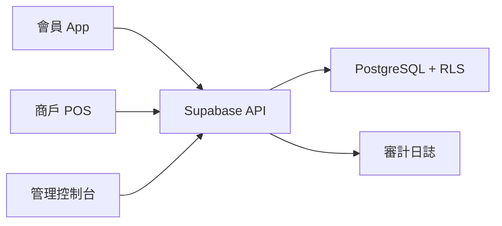
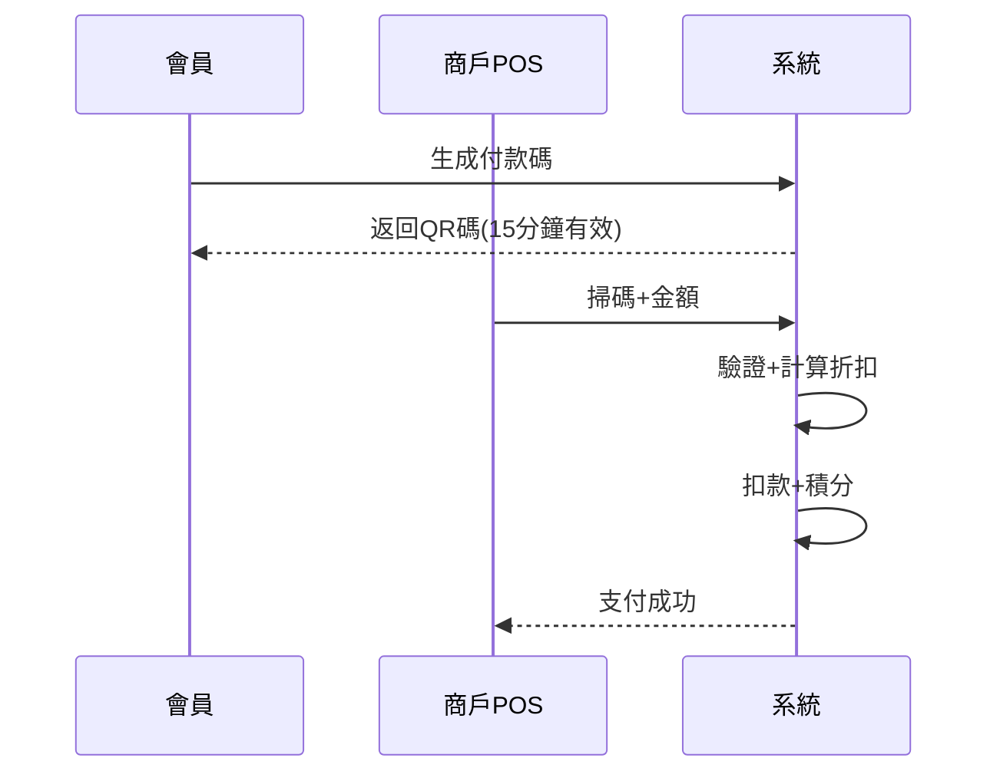
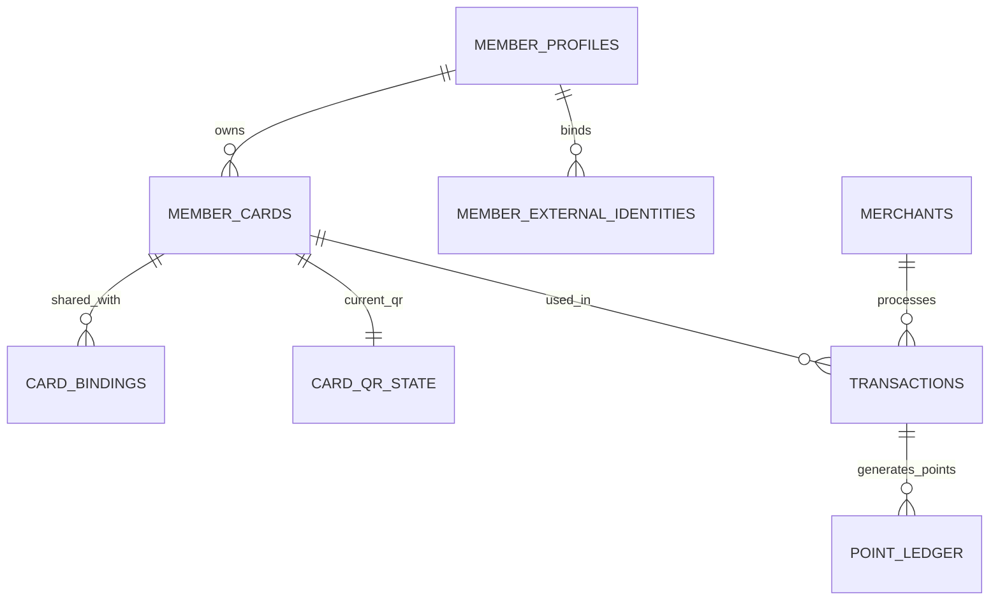

# Member Payment System (MPS) 🏪💳

一個基於 **Supabase (PostgreSQL + RLS)** 構建的**企業級會員支付系統**，支援多類型會員卡、QR 碼支付、積分等級、商戶結算等完整功能。

[](https://postgresql.org/)
[](https://supabase.com/)
[](https://python.org/)

---

## 🎯 系統概述

MPS 是一個為零售、餐飲、服務業設計的會員支付解決方案，提供：

### 🏗️ 核心架構


### 💡 核心特性

#### 🎫 多類型會員卡系統
| 卡片類型 | 特性 | 共享 | 充值 | 積分 | 使用場景 |
|---------|------|------|------|------|----------|
| **標準卡** | 個人身份卡 | ❌ | ❌ | ✅ | 個人會員 |
| **預付卡** | 儲值共享卡 | ✅ | ✅ | ✅ | 家庭卡、朋友共享 |
| **企業卡** | 企業統一卡 | ✅ | ✅ | ❌ | 公司員工、團體 |
| **優惠券卡** | 一次性優惠 | ❌ | ❌ | ❌ | 促銷活動 |

#### 📱 QR 碼支付流程


#### 🏆 積分等級體系
- **普通會員** (0-999分): 無折扣
- **銀卡會員** (1000-4999分): 95折
- **金卡會員** (5000-9999分): 9折  
- **鑽石會員** (10000+分): 85折

#### 🔐 安全設計
- **RLS 行級安全**: 所有表格預設拒絕直接寫入
- **RPC 安全**: 所有業務邏輯通過 `SECURITY DEFINER` 函數
- **密碼加密**: bcrypt 加密，QR 碼明文不存儲
- **併發控制**: PostgreSQL 諮詢鎖防止重複扣款
- **審計追蹤**: 所有敏感操作記錄完整日誌

---

## 🚀 快速開始

### 1️⃣ 環境準備

#### 創建 Supabase 專案
1. 前往 [Supabase](https://supabase.com) 創建新專案
2. 確保啟用 `pgcrypto` 擴展

#### 安裝依賴
```bash
pip install supabase
```

### 2️⃣ 部署數據庫

在 Supabase SQL Editor 中依序執行：

```sql
-- 1. 創建所有表格、類型、索引、RLS
\i schema/mps_schema.sql

-- 2. 創建所有 RPC 函數
\i rpc/mps_rpc.sql
```

> 💡 **提示**: 兩個 SQL 文件都支援重複執行，安全無副作用

### 3️⃣ Python 客戶端設置

```python
from supabase import create_client, Client

# 配置連接
SUPABASE_URL = "https://<YOUR-PROJECT>.supabase.co"
SUPABASE_KEY = "<YOUR-SERVICE-ROLE-KEY>"  # 服務端使用 service_role

supabase: Client = create_client(SUPABASE_URL, SUPABASE_KEY)

def rpc(function_name: str, params: dict):
    """調用 RPC 函數的輔助方法"""
    response = supabase.rpc(function_name, params).execute()
    return getattr(response, "data", response)
```

### 4️⃣ 基本使用示例

#### 創建會員（自動生成標準卡）
```python
# 創建新會員，自動綁定微信
member_id = rpc("create_member_profile", {
    "p_name": "張小明",
    "p_phone": "0988123456", 
    "p_email": "ming@example.com",
    "p_binding_user_org": "wechat",
    "p_binding_org_id": "wx_openid_abc123"
})
print(f"會員 ID: {member_id}")
```

#### 生成付款 QR 碼
```python
# 為會員卡生成 15 分鐘有效的 QR 碼
qr_result = rpc("rotate_card_qr", {
    "p_card_id": "<card-uuid>",
    "p_ttl_seconds": 900  # 15 分鐘
})
qr_plain = qr_result[0]["qr_plain"]
expires_at = qr_result[0]["qr_expires_at"]
print(f"QR 碼: {qr_plain}, 過期時間: {expires_at}")
```

#### 商戶掃碼收款
```python
# 商戶掃描 QR 碼進行收款
try:
    payment_result = rpc("merchant_charge_by_qr", {
        "p_merchant_code": "SHOP001",
        "p_qr_plain": qr_plain,
        "p_raw_amount": 299.00,
        "p_idempotency_key": "order-20250929-001",  # 防重複
        "p_tag": {"scene": "miniapp", "campaign": "double11"},
        "p_external_order_id": "WX20250929001"
    })
    
    print(f"交易成功!")
    print(f"交易號: {payment_result[0]['tx_no']}")
    print(f"實付金額: {payment_result[0]['final_amount']}")
    print(f"折扣: {payment_result[0]['discount']}")
    
except Exception as e:
    if "INSUFFICIENT_BALANCE" in str(e):
        print("餘額不足，請提醒用戶充值")
    elif "QR_EXPIRED_OR_INVALID" in str(e):
        print("QR 碼已過期，請重新生成")
    else:
        print(f"支付失敗: {e}")
```

#### 充值預付卡
```python
# 為預付卡充值
recharge_result = rpc("user_recharge_card", {
    "p_card_id": "<prepaid-card-uuid>",
    "p_amount": 500.00,
    "p_payment_method": "wechat",
    "p_idempotency_key": "topup-20250929-001",
    "p_tag": {"channel": "app"}
})
print(f"充值成功，交易號: {recharge_result[0]['tx_no']}")
```

#### 商戶退款
```python
# 部分退款
refund_result = rpc("merchant_refund_tx", {
    "p_merchant_code": "SHOP001", 
    "p_original_tx_no": "PAY0000000123",
    "p_refund_amount": 50.00,
    "p_tag": {"reason": "商品瑕疵"}
})
print(f"退款成功，退款單號: {refund_result[0]['refund_tx_no']}")
```

---

## 📊 系統架構

### 🗄️ 數據庫設計

#### 核心表格關係


#### 關鍵業務表格
- **`member_profiles`**: 會員基本資料
- **`member_cards`**: 多類型會員卡
- **`card_bindings`**: 卡片共享關係
- **`card_qr_state`**: QR 碼當前狀態
- **`transactions`**: 所有交易記錄
- **`merchants`**: 商戶資料
- **`settlements`**: 商戶結算
- **`audit.event_log`**: 審計日誌

### 🔧 核心 RPC 函數

#### 會員管理
- `create_member_profile()` - 創建會員（自動生成標準卡）
- `bind_member_to_card()` - 綁定共享卡
- `unbind_member_from_card()` - 解綁共享卡

#### QR 碼管理  
- `rotate_card_qr()` - 生成/刷新 QR 碼
- `validate_qr_plain()` - 驗證 QR 碼
- `revoke_card_qr()` - 撤銷 QR 碼

#### 交易處理
- `merchant_charge_by_qr()` - 掃碼支付
- `merchant_refund_tx()` - 商戶退款
- `user_recharge_card()` - 會員充值

#### 積分等級
- `update_points_and_level()` - 手動調整積分

#### 風控管理
- `freeze_card()` / `unfreeze_card()` - 凍結/解凍卡片
- `admin_suspend_member()` - 暫停會員
- `admin_suspend_merchant()` - 暫停商戶

#### 結算查詢
- `generate_settlement()` - 生成商戶結算
- `get_member_transactions()` - 會員交易記錄
- `get_merchant_transactions()` - 商戶交易記錄

---

## 🔒 安全模型

### 🛡️ 多層安全防護

#### 1. 身份認證分離
- **平台管理員**: 使用 Supabase `auth.users`
- **業務會員**: 使用 `member_profiles` + 外部身份綁定
- **商戶用戶**: `merchant_users` 關聯 `auth.users`

#### 2. 行級安全 (RLS)
```sql
-- 示例：會員只能查看自己的交易
CREATE POLICY "Members can view own transactions" ON transactions
FOR SELECT USING (
  card_id IN (
    SELECT id FROM member_cards 
    WHERE owner_member_id = get_current_member_id()
  )
);
```

#### 3. 函數級安全
- 所有 RPC 函數使用 `SECURITY DEFINER`
- 內部調用 `sec.fixed_search_path()` 防止路徑注入
- 參數驗證和業務規則檢查

#### 4. 併發安全
```sql
-- 防止重複扣款的諮詢鎖
PERFORM pg_advisory_xact_lock(sec.card_lock_key(card_id));
```

#### 5. 密碼安全
- 所有密碼使用 `bcrypt` 加密
- QR 碼明文不存儲，只存 hash
- 支持密碼輪換

### 🔑 權限角色建議

```sql
-- 創建角色並授權
CREATE ROLE platform_admin;
CREATE ROLE merchant_api; 
CREATE ROLE member_app;

-- 平台管理員：全部權限
GRANT EXECUTE ON ALL FUNCTIONS IN SCHEMA app TO platform_admin;

-- 商戶 API：支付相關
GRANT EXECUTE ON FUNCTION app.merchant_charge_by_qr TO merchant_api;
GRANT EXECUTE ON FUNCTION app.merchant_refund_tx TO merchant_api;
GRANT EXECUTE ON FUNCTION app.get_merchant_transactions TO merchant_api;

-- 會員 App：個人操作
GRANT EXECUTE ON FUNCTION app.rotate_card_qr TO member_app;
GRANT EXECUTE ON FUNCTION app.user_recharge_card TO member_app;
GRANT EXECUTE ON FUNCTION app.get_member_transactions TO member_app;
```

---

## 📈 性能與擴展

### ⚡ 性能優化

#### 1. 索引策略
```sql
-- 熱點查詢索引
CREATE INDEX idx_tx_card_time ON transactions(card_id, created_at DESC);
CREATE INDEX idx_tx_merchant_time ON transactions(merchant_id, created_at DESC);
CREATE INDEX idx_qr_state_expires ON card_qr_state(expires_at);
```

#### 2. 分區表（高併發場景）
```sql
-- 按月分區交易表
CREATE TABLE transactions_y2025m01 PARTITION OF transactions
FOR VALUES FROM ('2025-01-01') TO ('2025-02-01');
```

#### 3. 連接池配置
```python
# 生產環境建議
supabase = create_client(
    url=SUPABASE_URL,
    key=SUPABASE_KEY,
    options=ClientOptions(
        postgrest=ClientOptions.PostgRESTOptions(
            pool_timeout=30,
            pool_size=20
        )
    )
)
```

### 🚀 擴展能力

#### 水平擴展
- **讀寫分離**: 查詢走只讀副本
- **分片策略**: 按商戶或地區分片
- **緩存層**: Redis 緩存熱點數據

#### 垂直擴展
- **計算資源**: 根據 TPS 調整 CPU/內存
- **存儲優化**: SSD + 定期歸檔冷數據
- **網絡優化**: CDN + 就近部署

---

## 🧪 測試指南

### 🔍 功能測試清單

#### 支付流程測試
```python
def test_payment_flow():
    # 1. 創建會員和商戶
    member_id = create_test_member()
    merchant_id = create_test_merchant()
    
    # 2. 充值預付卡
    recharge_card(card_id, 1000.00)
    
    # 3. 生成 QR 碼
    qr = rotate_qr(card_id)
    
    # 4. 掃碼支付
    result = charge_by_qr(merchant_code, qr, 299.00)
    assert result['final_amount'] == 284.05  # 95折
    
    # 5. 驗證餘額和積分
    card = get_card_info(card_id)
    assert card['balance'] == 715.95
    assert card['points'] == 299
```

#### 併發測試
```python
import threading

def test_concurrent_payments():
    """測試同一卡片併發支付"""
    card_id = setup_test_card(balance=1000)
    
    def make_payment(amount):
        try:
            charge_by_qr(merchant_code, qr, amount)
        except Exception as e:
            print(f"Payment failed: {e}")
    
    # 10 個併發支付，總額超過餘額
    threads = []
    for i in range(10):
        t = threading.Thread(target=make_payment, args=(200,))
        threads.append(t)
        t.start()
    
    for t in threads:
        t.join()
    
    # 驗證最終餘額正確（不會超扣）
    final_balance = get_card_balance(card_id)
    assert final_balance >= 0
```

#### 冪等性測試
```python
def test_idempotency():
    """測試相同冪等鍵的重複請求"""
    idempotency_key = "test-order-001"
    
    # 第一次支付
    result1 = charge_by_qr(
        merchant_code, qr, 100.00, 
        idempotency_key=idempotency_key
    )
    
    # 重複相同請求
    result2 = charge_by_qr(
        merchant_code, qr, 100.00,
        idempotency_key=idempotency_key  
    )
    
    # 應該返回相同結果，不重複扣款
    assert result1['tx_id'] == result2['tx_id']
    assert get_card_balance(card_id) == original_balance - 100
```

### 📊 性能測試

#### 壓力測試腳本
```python
import asyncio
import aiohttp
import time

async def stress_test_payments(concurrent_users=100, duration_seconds=60):
    """壓力測試支付接口"""
    start_time = time.time()
    success_count = 0
    error_count = 0
    
    async def make_payment(session):
        nonlocal success_count, error_count
        while time.time() - start_time < duration_seconds:
            try:
                # 模擬支付請求
                async with session.post('/rpc/merchant_charge_by_qr', 
                                       json=get_test_payment_data()) as resp:
                    if resp.status == 200:
                        success_count += 1
                    else:
                        error_count += 1
            except Exception:
                error_count += 1
            
            await asyncio.sleep(0.1)  # 控制請求頻率
    
    async with aiohttp.ClientSession() as session:
        tasks = [make_payment(session) for _ in range(concurrent_users)]
        await asyncio.gather(*tasks)
    
    print(f"成功: {success_count}, 失敗: {error_count}")
    print(f"TPS: {success_count / duration_seconds:.2f}")
```

---

## 🛠️ 運維指南

### 📋 日常監控

#### 關鍵指標
```sql
-- 每日交易統計
SELECT 
    DATE(created_at) as date,
    tx_type,
    COUNT(*) as tx_count,
    SUM(final_amount) as total_amount
FROM transactions 
WHERE created_at >= CURRENT_DATE - INTERVAL '7 days'
GROUP BY DATE(created_at), tx_type
ORDER BY date DESC;

-- QR 碼使用統計
SELECT 
    DATE(issued_at) as date,
    COUNT(*) as qr_generated,
    COUNT(CASE WHEN expires_at < NOW() THEN 1 END) as qr_expired
FROM card_qr_history
WHERE issued_at >= CURRENT_DATE - INTERVAL '1 day'
GROUP BY DATE(issued_at);

-- 異常交易監控
SELECT 
    merchant_id,
    COUNT(*) as failed_count
FROM transactions 
WHERE status = 'failed' 
  AND created_at >= NOW() - INTERVAL '1 hour'
GROUP BY merchant_id
HAVING COUNT(*) > 10;
```

#### 告警設置
```python
# 監控腳本示例
def check_system_health():
    """系統健康檢查"""
    
    # 1. 檢查失敗交易率
    failed_rate = get_failed_transaction_rate(last_hour=True)
    if failed_rate > 0.05:  # 5%
        send_alert(f"交易失敗率過高: {failed_rate:.2%}")
    
    # 2. 檢查 QR 碼過期率
    qr_expire_rate = get_qr_expire_rate(last_hour=True)
    if qr_expire_rate > 0.3:  # 30%
        send_alert(f"QR 碼過期率過高: {qr_expire_rate:.2%}")
    
    # 3. 檢查數據庫連接
    if not test_db_connection():
        send_alert("數據庫連接異常")
    
    # 4. 檢查審計日誌
    audit_count = get_audit_log_count(last_hour=True)
    if audit_count == 0:
        send_alert("審計日誌可能異常")
```

### 🔄 定期任務

#### QR 碼輪換（企業卡/預付卡）
```python
# 每 5 分鐘執行
def rotate_shared_card_qr():
    """批量輪換共享卡 QR 碼"""
    try:
        affected = rpc("cron_rotate_qr_tokens", {
            "p_ttl_seconds": 300  # 5 分鐘有效期
        })
        print(f"已輪換 {affected} 張卡片的 QR 碼")
    except Exception as e:
        print(f"QR 碼輪換失敗: {e}")
```

#### 商戶結算
```python
# 每日凌晨執行
def daily_settlement():
    """每日商戶結算"""
    yesterday = datetime.now() - timedelta(days=1)
    start_time = yesterday.replace(hour=0, minute=0, second=0)
    end_time = yesterday.replace(hour=23, minute=59, second=59)
    
    merchants = get_active_merchants()
    for merchant in merchants:
        try:
            settlement_id = rpc("generate_settlement", {
                "p_merchant_id": merchant['id'],
                "p_mode": "t_plus_1",
                "p_period_start": start_time.isoformat(),
                "p_period_end": end_time.isoformat()
            })
            print(f"商戶 {merchant['code']} 結算完成: {settlement_id}")
        except Exception as e:
            print(f"商戶 {merchant['code']} 結算失敗: {e}")
```

#### 數據清理
```python
# 每週執行
def cleanup_old_data():
    """清理過期數據"""
    
    # 清理過期 QR 碼歷史（保留 30 天）
    cleanup_sql = """
    DELETE FROM app.card_qr_history 
    WHERE issued_at < NOW() - INTERVAL '30 days'
    """
    
    # 歸檔舊交易（保留 1 年）
    archive_sql = """
    INSERT INTO app.transactions_archive 
    SELECT * FROM app.transactions 
    WHERE created_at < NOW() - INTERVAL '1 year'
    """
```

### 🔧 故障排除

#### 常見問題診斷

1. **支付失敗率突增**
```sql
-- 查看失敗原因分布
SELECT 
    CASE 
        WHEN context->>'error' LIKE '%INSUFFICIENT_BALANCE%' THEN '餘額不足'
        WHEN context->>'error' LIKE '%QR_EXPIRED%' THEN 'QR碼過期'
        WHEN context->>'error' LIKE '%CARD_NOT_ACTIVE%' THEN '卡片未激活'
        ELSE '其他錯誤'
    END as error_type,
    COUNT(*) as count
FROM audit.event_log 
WHERE action = 'PAYMENT_FAILED'
  AND happened_at >= NOW() - INTERVAL '1 hour'
GROUP BY error_type;
```

2. **QR 碼驗證失敗**
```sql
-- 檢查 QR 碼狀態
SELECT 
    card_id,
    expires_at,
    CASE 
        WHEN expires_at < NOW() THEN '已過期'
        ELSE '有效'
    END as status
FROM app.card_qr_state 
WHERE card_id = '<problem-card-id>';
```

3. **併發鎖等待**
```sql
-- 查看鎖等待情況
SELECT 
    pid,
    usename,
    application_name,
    state,
    query,
    query_start,
    state_change
FROM pg_stat_activity 
WHERE state = 'active' 
  AND query LIKE '%pg_advisory%';
```

---

## 📚 文檔索引

### 📖 詳細文檔
- **[業務需求規格書](docs/business_requirements.md)** - 完整的功能需求和用例
- **[系統架構圖集](docs/system_architecture_diagrams.md)** - Mermaid 架構圖和流程圖
- **[技術架構文檔](docs/Architecture.md)** - 深度技術設計和擴展指南
- **[RPC API 手冊](docs/supabase_rpc.md)** - 所有 RPC 函數的詳細說明和 Python 示例
- **[業務流程梳理](README_BZ_FLOW.md)** - 核心業務流程和規則說明

### 🗂️ 代碼結構
```
MemberPaymentSystem/
├── schema/
│   └── mps_schema.sql          # 數據庫結構定義
├── rpc/
│   └── mps_rpc.sql            # 業務邏輯 RPC 函數
├── docs/
│   ├── Architecture.md         # 技術架構文檔
│   ├── supabase_rpc.md        # RPC API 手冊
│   ├── business_requirements.md # 業務需求規格
│   └── system_architecture_diagrams.md # 架構圖集
├── README.md                   # 本文件
└── README_BZ_FLOW.md          # 業務流程說明
```

---

## 🤝 貢獻指南

### 🔧 開發環境設置
1. Fork 本倉庫
2. 創建 Supabase 開發專案
3. 執行 SQL 文件初始化數據庫
4. 配置環境變量
5. 運行測試確保功能正常

### 📝 提交規範
- 功能開發：`feat: 添加新的 RPC 函數`
- 問題修復：`fix: 修復併發鎖問題`
- 文檔更新：`docs: 更新 API 文檔`
- 測試添加：`test: 添加支付流程測試`

### 🧪 測試要求
- 所有新功能必須包含單元測試
- 修改現有功能需要更新相關測試
- 確保測試覆蓋率不低於 80%

---

## 📄 授權協議

本專案採用 MIT 授權協議 - 詳見 [LICENSE](LICENSE) 文件

---

## 📞 技術支持

- **問題回報**: [GitHub Issues](https://github.com/your-repo/issues)
- **功能建議**: [GitHub Discussions](https://github.com/your-repo/discussions)
- **技術交流**: [Discord 社群](https://discord.gg/your-channel)

---

<div align="center">

**🎉 感謝使用 Member Payment System！**

如果這個專案對您有幫助，請給我們一個 ⭐️

[⬆️ 回到頂部](#member-payment-system-mps-)

</div>
