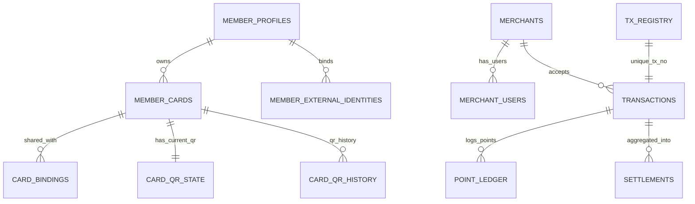
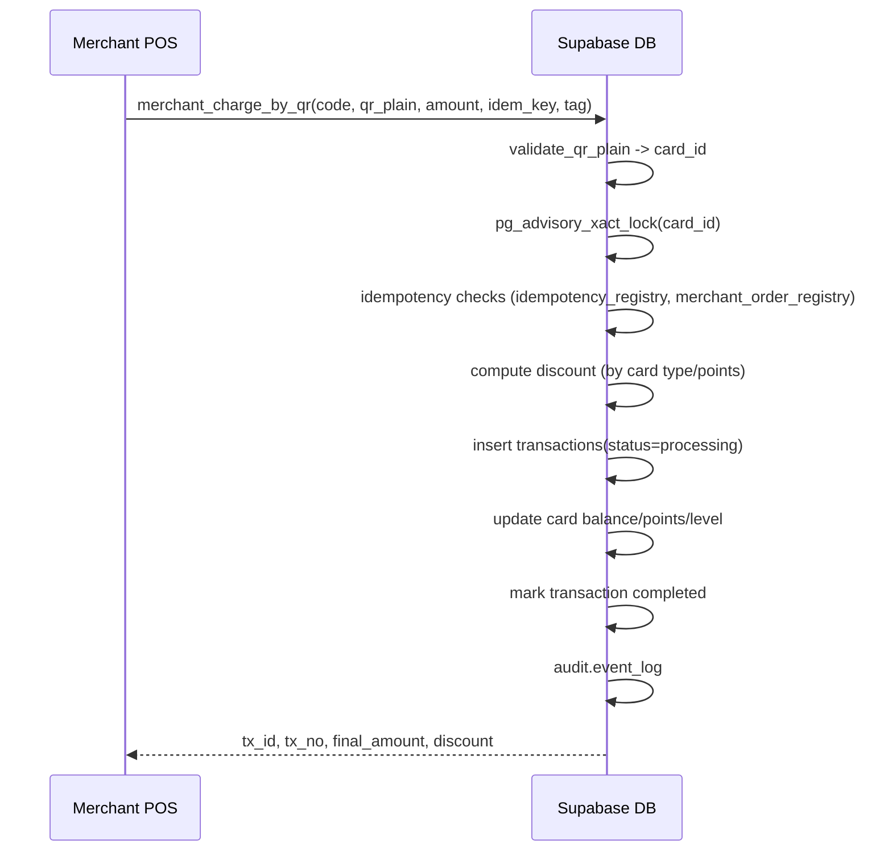

# Architecture — Member Payment System (MPS)

This document explains the **domain model, flows, security, and scalability** decisions behind MPS.

---

## 1. Logical components

- **Clients**
  - Member App / Mini‑Program (shows card, rotates QR, recharges)
  - Merchant POS / Console (scans QR, charges/refunds, views settlements)
  - Admin Console (provisioning, governance)
- **Backend**
  - Supabase Database (PostgreSQL + RLS)
  - Optional Edge Functions / cron to orchestrate scheduled tasks (QR rotation / settlements)
- **Schemas**
  - `app`: business tables & functions
  - `audit`: append‑only audit log
  - `sec`: helper routines (e.g., lock key)

---

## 2. ER overview (Mermaid)

> Tables: `member_profiles`, `member_external_identities`, `membership_levels`, `member_cards`, `card_bindings`,  
> `card_qr_state`, `card_qr_history`, `merchants`, `merchant_users`, `transactions`, `point_ledger`, `settlements`,  
> `tx_registry`, `idempotency_registry`, `merchant_order_registry`, `audit.event_log`.

---

## 3. Key lifecycles

### 3.1 QR token lifecycle

1. **Generate** — `rotate_card_qr(card_id, ttl)` gets `(plain, hash)`; store only **hash** in `card_qr_state`; append history.
2. **Present** — Member shows **plain** token on screen.
3. **Scan/Verify** — Merchant POS calls `merchant_charge_by_qr` → internally `validate_qr_plain(plain)` loops over **unexpired** hashes and bcrypt‑checks.
4. **Expire** — TTL passes or `revoke_card_qr(card_id)` sets expiry to `now()`.
5. **Cron rotation (optional)** — `cron_rotate_qr_tokens` for `prepaid/corporate` pools.

**Security**: no plain QR is persisted; hash is useless without the plain. TTL window is short.  
**Observability**: each rotation/revoke writes `audit.event_log`.

---

### 3.2 Payment lifecycle

**Idempotency**: repeat with the same `p_idempotency_key` returns the original completed transaction.  
**Concurrency**: advisory lock prevents double deductions on the same card.  
**Points**: only `standard`/`prepaid` earn points.

---

### 3.3 Refund lifecycle

- Validate merchant and original tx; compute **remaining refundable**.
- Lock the same card; create `refund` tx; **add balance back**.
- If remaining becomes 0 → mark original as `refunded`.

---

### 3.4 Recharge lifecycle

- Create `recharge` tx; add balance; mark completed; write audit.  
- Supports idempotency via `idempotency_registry` and optional `external_order_id` mapping.

---

### 3.5 Settlement lifecycle

- Aggregate payments (+) and refunds (−) in a period to `settlements` with computed payload.
- Status flow: `pending → posted` (optional, when you actually transfer funds externally).
- Modes: `realtime | t_plus_1 | monthly` recorded for SLA reporting.

---

## 4. Security & RLS

- **Writes via RPC only**: tables are RLS‑protected; direct writes are disallowed.
- **Read whitelists**: narrow SELECT policies where needed (e.g., members to their own cards/tx).
- **Advisory locks**: money movements are lock‑scoped to `card_id`.
- **Hashing**: `_password_hash` columns, and QR hashes via bcrypt; no plain persistence.
- **Audit**: append‑only `audit.event_log` for payments, refunds, QR actions, settlements, admin ops.

**GRANT strategy** (example roles):
- `platform_admin`: can execute all admin/system RPCs.
- `merchant_api`: can execute `merchant_*` and read merchant tx.
- `member_app`: rotate QR, recharge own card, read own tx.

---

## 5. Performance & scalability

- **Indexes**: btree on foreign keys + time; partial indexes for lookups by merchant/time/status.
- **Partitioning (optional)**: If monthly volume is high, partition `transactions` by month and create matching indexes per partition.
- **Hot paths**: `merchant_charge_by_qr` is IO‑light (single card row + one insert + one update) under lock.
- **JSONB `tag`**: keep small; add GIN index if you need tag‑based queries (`CREATE INDEX ... USING GIN (tag)`).
- **Background jobs**: QR rotation & settlements as scheduled tasks.

---

## 6. Extensibility

- **Card types**: add new enum and rules; extend discount resolver.
- **Wallets**: add payment methods in `app.pay_method` enum; integrate external webhooks → call `user_recharge_card` with idempotency key.
- **Voucher**: implement a dedicated voucher‑apply RPC that computes deduction first, then charges the remainder on a main card.
- **Multi‑tenant**: add `tenant_id` to top‑level tables and propagate to RLS & indexes.

---

## 7. Observability & ops

- **Audit trails**: All sensitive actions are traceable by user/time/object.
- **Metrics**: Count transactions, refunds, settlements per merchant; discount usage; QR rotation frequency.
- **Alerts**: Failed RPCs spike, repeated idempotency collisions, excessive refunds.

---

## 8. Data retention & compliance

- Keep `audit.event_log` long enough for disputes (e.g., 1–3 years).
- Delete PII in `member_profiles` per policy; keep transaction rows but pseudonymize where required.
- Backup strategy: Supabase PITR or daily snapshots.

---

## 9. Developer ergonomics

- **Re‑runnable migrations**: both SQL files are safe to re‑apply; RPCs are `DROP IF EXISTS` then `CREATE`.
- **Local testing**: use `supabase start` (Docker) or connect to staging; seed with a couple of merchants and cards.
- **Python first**: `supabase_rpc.md` contains working Python snippets for each RPC.

---

*End of Architecture.*
