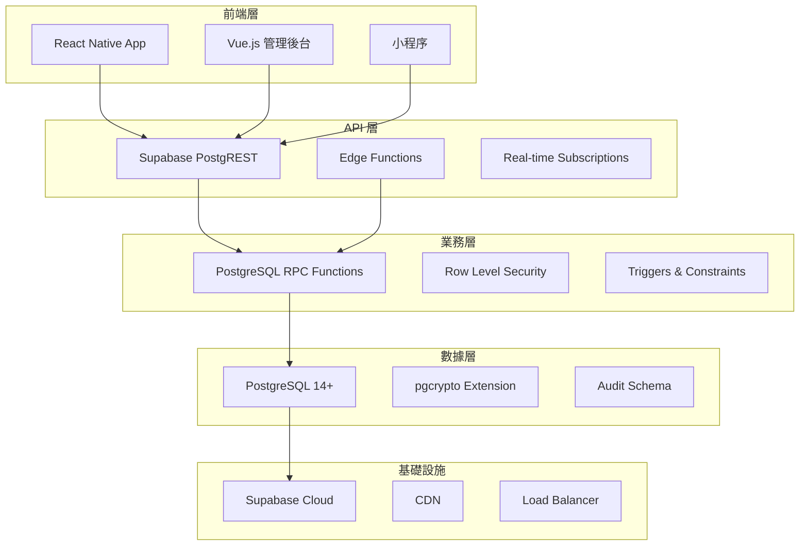
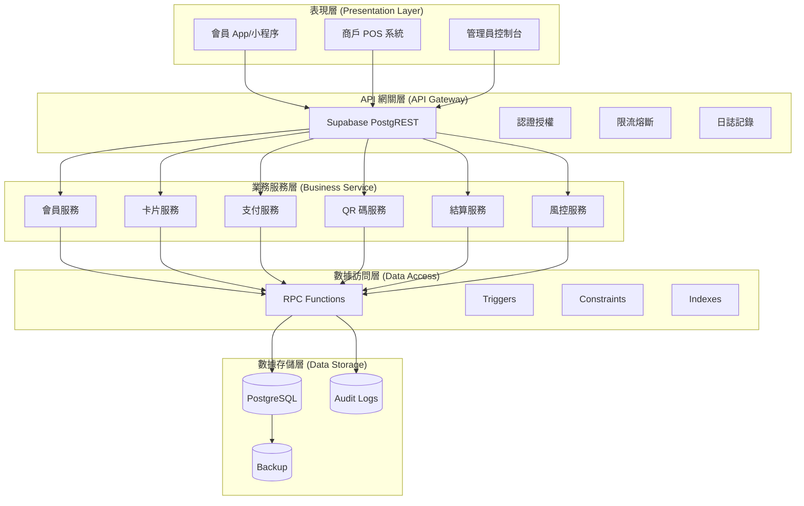
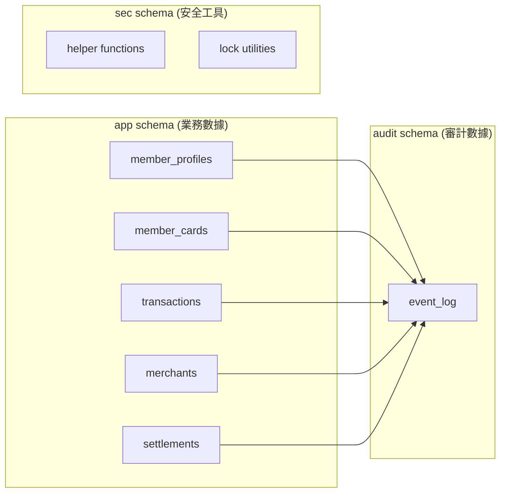
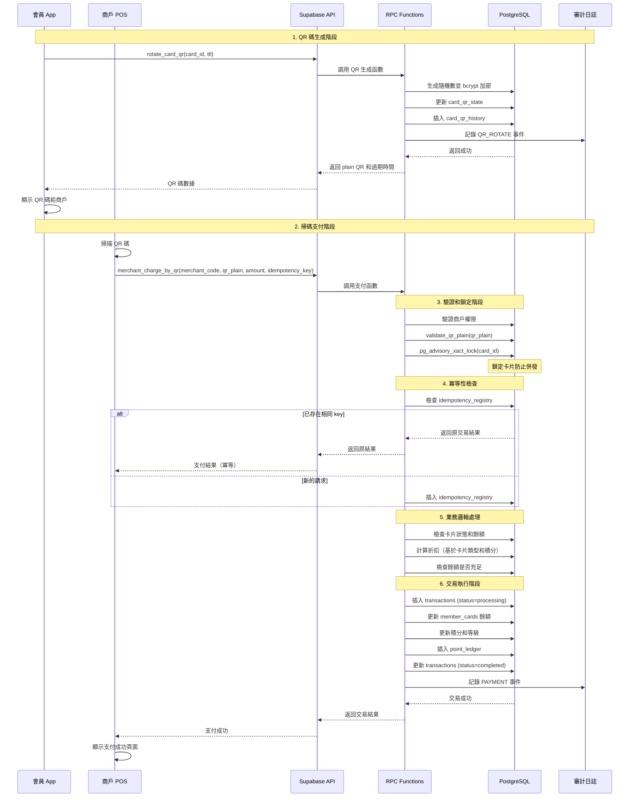
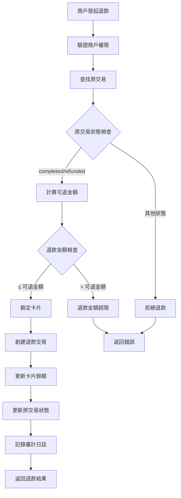
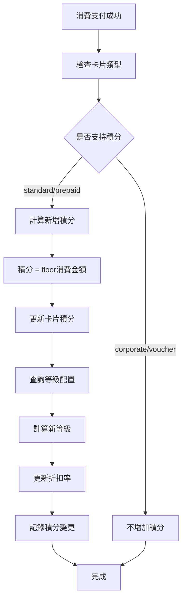
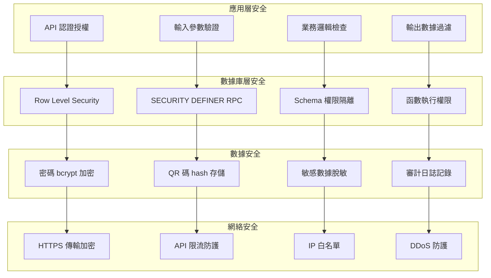
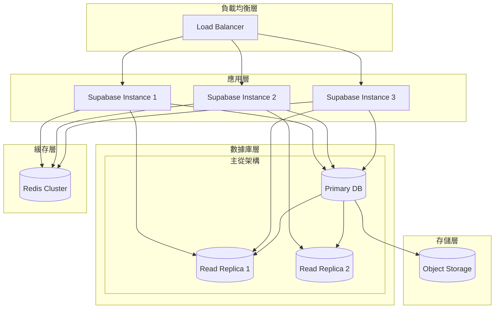
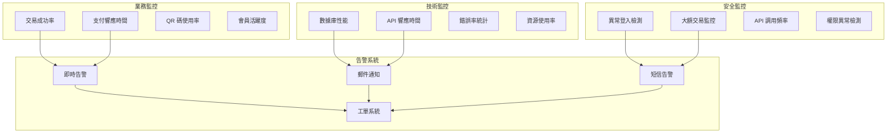
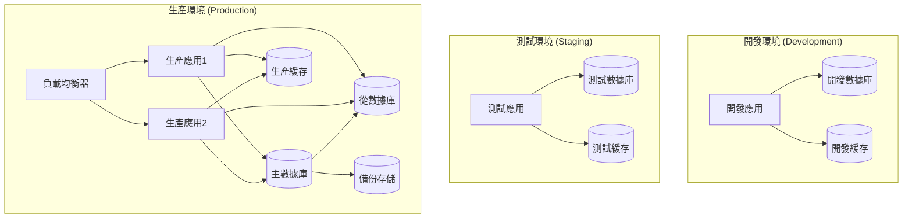

# MPS 技術架構文檔

## 📋 目錄
- [1. 架構概述](#1-架構概述)
- [2. 系統分層設計](#2-系統分層設計)
- [3. 數據庫設計](#3-數據庫設計)
- [4. 核心業務流程](#4-核心業務流程)
- [5. 安全架構](#5-安全架構)
- [6. 性能與擴展](#6-性能與擴展)
- [7. 監控與運維](#7-監控與運維)
- [8. 部署架構](#8-部署架構)

---

## 1. 架構概述

### 1.1 設計原則

**🎯 核心設計理念**
- **安全第一**: 多層安全防護，零信任架構
- **高可用性**: 99.9% 可用性目標，故障自動恢復
- **水平擴展**: 支持業務增長的彈性擴展
- **數據一致性**: ACID 事務保證，強一致性
- **審計追蹤**: 完整的操作日誌，合規要求

**🏗️ 架構特點**
- **微服務化**: 基於 RPC 的服務邊界劃分
- **事件驅動**: 審計日誌和狀態變更通知
- **冪等設計**: 所有寫操作支持安全重試
- **無狀態**: 應用層無狀態，便於水平擴展

### 1.2 技術棧選型



**技術選型理由**:
- **PostgreSQL**: 成熟的 ACID 事務支持，豐富的數據類型
- **Supabase**: 開箱即用的 BaaS，降低運維複雜度
- **RPC Functions**: 業務邏輯封裝，安全性和性能兼顧
- **RLS**: 細粒度權限控制，多租戶支持

---

## 2. 系統分層設計

### 2.1 邏輯架構



### 2.2 服務邊界劃分

#### 🧑‍💼 會員服務 (Member Service)
**職責**: 會員生命週期管理
- 會員註冊、登入、資料更新
- 外部身份綁定管理
- 會員狀態變更（激活、暫停、刪除）

**核心 RPC**:
- `create_member_profile()`
- `bind_external_identity()`
- `admin_suspend_member()`

#### 💳 卡片服務 (Card Service)  
**職責**: 多類型卡片管理
- 卡片發行、綁定、解綁
- 卡片狀態管理
- 共享權限控制

**核心 RPC**:
- `bind_member_to_card()`
- `unbind_member_from_card()`
- `freeze_card()` / `unfreeze_card()`

#### 💰 支付服務 (Payment Service)
**職責**: 交易處理和資金管理
- 掃碼支付處理
- 退款業務邏輯
- 充值業務邏輯
- 積分和等級計算

**核心 RPC**:
- `merchant_charge_by_qr()`
- `merchant_refund_tx()`
- `user_recharge_card()`
- `update_points_and_level()`

#### 📱 QR 碼服務 (QR Service)
**職責**: 動態 QR 碼管理
- QR 碼生成和輪換
- QR 碼驗證和撤銷
- 批量 QR 碼管理

**核心 RPC**:
- `rotate_card_qr()`
- `validate_qr_plain()`
- `revoke_card_qr()`
- `cron_rotate_qr_tokens()`

#### 📊 結算服務 (Settlement Service)
**職責**: 商戶結算和報表
- 結算計算和生成
- 交易查詢和統計
- 結算狀態管理

**核心 RPC**:
- `generate_settlement()`
- `list_settlements()`
- `get_merchant_transactions()`
- `get_member_transactions()`

#### 🛡️ 風控服務 (Risk Control Service)
**職責**: 風險控制和合規
- 異常交易監控
- 風控規則執行
- 合規報告生成

**核心 RPC**:
- `admin_suspend_merchant()`
- 風控規則引擎（待擴展）

---

## 3. 數據庫設計

### 3.1 Schema 架構



### 3.2 核心表設計

#### 👤 會員相關表

**member_profiles** - 會員基本資料
```sql
CREATE TABLE app.member_profiles (
    id uuid PRIMARY KEY DEFAULT gen_random_uuid(),
    member_no text UNIQUE NOT NULL DEFAULT app.gen_member_no(),
    name text NOT NULL,
    phone text UNIQUE,
    email text UNIQUE,
    status app.member_status NOT NULL DEFAULT 'active',
    created_at timestamptz NOT NULL DEFAULT app.now_utc(),
    updated_at timestamptz NOT NULL DEFAULT app.now_utc()
);
```

**member_external_identities** - 外部身份綁定
```sql
CREATE TABLE app.member_external_identities (
    id uuid PRIMARY KEY DEFAULT gen_random_uuid(),
    member_id uuid NOT NULL REFERENCES app.member_profiles(id),
    provider text NOT NULL,  -- 'wechat', 'alipay', 'line'
    external_id text NOT NULL,
    meta jsonb NOT NULL DEFAULT '{}',
    created_at timestamptz NOT NULL DEFAULT app.now_utc(),
    UNIQUE (provider, external_id),
    UNIQUE (member_id, provider)
);
```

#### 💳 卡片相關表

**member_cards** - 多類型會員卡
```sql
CREATE TABLE app.member_cards (
    id uuid PRIMARY KEY DEFAULT gen_random_uuid(),
    card_no text UNIQUE NOT NULL,
    card_type app.card_type NOT NULL,  -- 'standard', 'prepaid', 'corporate', 'voucher'
    owner_member_id uuid REFERENCES app.member_profiles(id),
    balance numeric(12,2) NOT NULL DEFAULT 0,
    points int NOT NULL DEFAULT 0,
    level int,
    discount_rate numeric(4,3) NOT NULL DEFAULT 1.000,
    fixed_discount numeric(4,3),  -- 企業卡固定折扣
    binding_password_hash text,   -- 共享卡密碼
    status app.card_status NOT NULL DEFAULT 'active',
    expires_at timestamptz,
    created_at timestamptz NOT NULL DEFAULT app.now_utc(),
    updated_at timestamptz NOT NULL DEFAULT app.now_utc()
);
```

**card_bindings** - 卡片綁定關係
```sql
CREATE TABLE app.card_bindings (
    id uuid PRIMARY KEY DEFAULT gen_random_uuid(),
    card_id uuid NOT NULL REFERENCES app.member_cards(id),
    member_id uuid NOT NULL REFERENCES app.member_profiles(id),
    role app.bind_role NOT NULL DEFAULT 'member',  -- 'owner', 'admin', 'member', 'viewer'
    created_at timestamptz NOT NULL DEFAULT app.now_utc(),
    UNIQUE (card_id, member_id)
);
```

#### 📱 QR 碼相關表

**card_qr_state** - QR 碼當前狀態
```sql
CREATE TABLE app.card_qr_state (
    card_id uuid PRIMARY KEY REFERENCES app.member_cards(id),
    qr_hash text NOT NULL,  -- bcrypt hash，不存明文
    issued_at timestamptz NOT NULL DEFAULT app.now_utc(),
    expires_at timestamptz NOT NULL,
    updated_at timestamptz NOT NULL DEFAULT app.now_utc()
);
```

**card_qr_history** - QR 碼歷史記錄
```sql
CREATE TABLE app.card_qr_history (
    id uuid PRIMARY KEY DEFAULT gen_random_uuid(),
    card_id uuid NOT NULL REFERENCES app.member_cards(id),
    qr_hash text NOT NULL,
    issued_at timestamptz NOT NULL DEFAULT app.now_utc(),
    expires_at timestamptz NOT NULL
);
```

#### 💰 交易相關表

**transactions** - 交易主表
```sql
CREATE TABLE app.transactions (
    id uuid PRIMARY KEY DEFAULT gen_random_uuid(),
    tx_no text NOT NULL UNIQUE,
    tx_type app.tx_type NOT NULL,  -- 'payment', 'refund', 'recharge'
    card_id uuid NOT NULL REFERENCES app.member_cards(id),
    merchant_id uuid REFERENCES app.merchants(id),
    raw_amount numeric(12,2) NOT NULL,
    discount_applied numeric(4,3) NOT NULL DEFAULT 1.000,
    final_amount numeric(12,2) NOT NULL,
    points_earned int NOT NULL DEFAULT 0,
    status app.tx_status NOT NULL DEFAULT 'processing',
    reason text,  -- 退款原因等
    payment_method app.pay_method DEFAULT 'balance',
    tag jsonb NOT NULL DEFAULT '{}',  -- 擴展標籤
    created_at timestamptz NOT NULL DEFAULT app.now_utc(),
    updated_at timestamptz NOT NULL DEFAULT app.now_utc()
);
```

### 3.3 索引策略

#### 🔍 查詢優化索引
```sql
-- 交易查詢熱點索引
CREATE INDEX idx_tx_card_time ON app.transactions(card_id, created_at DESC);
CREATE INDEX idx_tx_merchant_time ON app.transactions(merchant_id, created_at DESC);
CREATE INDEX idx_tx_status ON app.transactions(status);
CREATE INDEX idx_tx_type_time ON app.transactions(tx_type, created_at DESC);

-- QR 碼查詢索引
CREATE INDEX idx_qr_state_expires ON app.card_qr_state(expires_at);
CREATE INDEX idx_qr_hist_card_time ON app.card_qr_history(card_id, issued_at DESC);

-- 會員查詢索引
CREATE INDEX idx_cards_owner_type ON app.member_cards(owner_member_id, card_type);
CREATE INDEX idx_bindings_member ON app.card_bindings(member_id);

-- 審計日誌索引
CREATE INDEX idx_event_object ON audit.event_log(object_type, object_id);
CREATE INDEX idx_event_time ON audit.event_log(happened_at DESC);

-- JSONB 標籤索引（可選）
CREATE INDEX idx_tx_tag_gin ON app.transactions USING GIN(tag);
```

#### 📊 分區策略（高併發場景）
```sql
-- 按月分區交易表
CREATE TABLE app.transactions (
    -- 原有欄位...
    created_at timestamptz NOT NULL DEFAULT app.now_utc()
) PARTITION BY RANGE (created_at);

-- 創建月度分區
CREATE TABLE app.transactions_y2025m01 PARTITION OF app.transactions
FOR VALUES FROM ('2025-01-01') TO ('2025-02-01');

CREATE TABLE app.transactions_y2025m02 PARTITION OF app.transactions
FOR VALUES FROM ('2025-02-01') TO ('2025-03-01');

-- 自動創建分區的函數
CREATE OR REPLACE FUNCTION app.create_monthly_partition(target_date date)
RETURNS void AS $$
DECLARE
    start_date date := date_trunc('month', target_date);
    end_date date := start_date + interval '1 month';
    table_name text := 'transactions_y' || to_char(start_date, 'YYYY') || 'm' || to_char(start_date, 'MM');
BEGIN
    EXECUTE format('CREATE TABLE IF NOT EXISTS app.%I PARTITION OF app.transactions FOR VALUES FROM (%L) TO (%L)',
                   table_name, start_date, end_date);
END;
$$ LANGUAGE plpgsql;
```

### 3.4 數據完整性

#### 🔒 約束設計
```sql
-- 餘額非負約束
ALTER TABLE app.member_cards 
ADD CONSTRAINT ck_card_balance_nonneg CHECK (balance >= 0);

-- 積分非負約束
ALTER TABLE app.member_cards 
ADD CONSTRAINT ck_card_points_nonneg CHECK (points >= 0);

-- 折扣範圍約束
ALTER TABLE app.member_cards 
ADD CONSTRAINT ck_card_discount_range CHECK (
    discount_rate >= 0 AND discount_rate <= 1
);

-- 交易金額約束
ALTER TABLE app.transactions 
ADD CONSTRAINT ck_tx_amounts CHECK (
    raw_amount > 0 AND final_amount >= 0
);

-- 外部身份唯一性
ALTER TABLE app.member_external_identities 
ADD CONSTRAINT uq_provider_external_id UNIQUE (provider, external_id);
```

#### 🔄 觸發器邏輯
```sql
-- 自動更新 updated_at
CREATE TRIGGER trg_member_cards_updated_at
BEFORE UPDATE ON app.member_cards
FOR EACH ROW EXECUTE FUNCTION app.set_updated_at();

-- 自動生成卡號
CREATE TRIGGER trg_member_cards_fill_card_no
BEFORE INSERT ON app.member_cards
FOR EACH ROW EXECUTE FUNCTION app.before_insert_member_cards_fill_card_no();
```

---

## 4. 核心業務流程

### 4.1 支付流程詳解



### 4.2 退款流程詳解



### 4.3 積分等級計算



**等級計算邏輯**:
```sql
CREATE OR REPLACE FUNCTION app.compute_level(p_points int) 
RETURNS int AS $$
BEGIN
    RETURN (
        SELECT level 
        FROM app.membership_levels 
        WHERE p_points >= min_points 
          AND (max_points IS NULL OR p_points <= max_points)
          AND is_active = true
        ORDER BY level DESC 
        LIMIT 1
    );
END;
$$ LANGUAGE plpgsql;
```

---

## 5. 安全架構

### 5.1 多層安全模型



### 5.2 RLS 安全策略

#### 👤 會員數據隔離
```sql
-- 會員只能查看自己的資料
CREATE POLICY "Members can view own profile" ON app.member_profiles
FOR SELECT USING (id = get_current_member_id());

-- 會員只能查看自己的卡片
CREATE POLICY "Members can view own cards" ON app.member_cards
FOR SELECT USING (
    owner_member_id = get_current_member_id() OR
    id IN (
        SELECT card_id FROM app.card_bindings 
        WHERE member_id = get_current_member_id()
    )
);

-- 會員只能查看自己的交易
CREATE POLICY "Members can view own transactions" ON app.transactions
FOR SELECT USING (
    card_id IN (
        SELECT id FROM app.member_cards 
        WHERE owner_member_id = get_current_member_id()
        UNION
        SELECT card_id FROM app.card_bindings 
        WHERE member_id = get_current_member_id()
    )
);
```

#### 🏪 商戶數據隔離
```sql
-- 商戶只能查看自己的交易
CREATE POLICY "Merchants can view own transactions" ON app.transactions
FOR SELECT USING (
    merchant_id IN (
        SELECT merchant_id FROM app.merchant_users 
        WHERE user_id = auth.uid()
    )
);

-- 商戶只能查看自己的結算
CREATE POLICY "Merchants can view own settlements" ON app.settlements
FOR SELECT USING (
    merchant_id IN (
        SELECT merchant_id FROM app.merchant_users 
        WHERE user_id = auth.uid()
    )
);
```

#### 🛡️ 管理員權限
```sql
-- 平台管理員可以查看所有數據
CREATE POLICY "Platform admin can view all" ON app.member_profiles
FOR ALL USING (
    EXISTS (
        SELECT 1 FROM auth.users 
        WHERE id = auth.uid() 
          AND raw_user_meta_data->>'role' = 'platform_admin'
    )
);
```

### 5.3 併發控制

#### 🔒 諮詢鎖機制
```sql
-- 卡片鎖定函數
CREATE OR REPLACE FUNCTION sec.card_lock_key(card_id uuid) 
RETURNS bigint AS $$
BEGIN
    -- 將 UUID 轉換為 bigint 作為鎖 key
    RETURN ('x' || substr(card_id::text, 1, 15))::bit(60)::bigint;
END;
$$ LANGUAGE plpgsql;

-- 在支付函數中使用
CREATE OR REPLACE FUNCTION app.merchant_charge_by_qr(...)
RETURNS TABLE(...) AS $$
BEGIN
    -- 鎖定卡片防止併發操作
    PERFORM pg_advisory_xact_lock(sec.card_lock_key(v_card.id));
    
    -- 執行業務邏輯...
END;
$$ LANGUAGE plpgsql SECURITY DEFINER;
```

#### ⚡ 死鎖預防
```sql
-- 統一的鎖定順序：總是先鎖定 ID 較小的資源
CREATE OR REPLACE FUNCTION sec.lock_multiple_cards(card_ids uuid[])
RETURNS void AS $$
DECLARE
    card_id uuid;
BEGIN
    -- 按 ID 排序後依次鎖定
    FOR card_id IN 
        SELECT unnest(card_ids) ORDER BY unnest(card_ids)
    LOOP
        PERFORM pg_advisory_xact_lock(sec.card_lock_key(card_id));
    END LOOP;
END;
$$ LANGUAGE plpgsql;
```

### 5.4 審計追蹤

#### 📝 審計日誌設計
```sql
CREATE TABLE audit.event_log (
    id bigserial PRIMARY KEY,
    happened_at timestamptz NOT NULL DEFAULT app.now_utc(),
    actor_user_id uuid,  -- 操作者 ID
    action text NOT NULL,  -- 操作類型
    object_type text NOT NULL,  -- 對象類型
    object_id uuid,  -- 對象 ID
    context jsonb NOT NULL DEFAULT '{}'  -- 上下文信息
);

-- 審計日誌記錄函數
CREATE OR REPLACE FUNCTION audit.log(
    p_action text,
    p_object_type text,
    p_object_id uuid,
    p_context jsonb DEFAULT '{}'
) RETURNS void AS $$
BEGIN
    INSERT INTO audit.event_log(actor_user_id, action, object_type, object_id, context)
    VALUES (auth.uid(), p_action, p_object_type, p_object_id, p_context);
END;
$$ LANGUAGE plpgsql SECURITY DEFINER;
```

#### 🔍 關鍵事件追蹤
```sql
-- 支付事件
PERFORM audit.log('PAYMENT', 'transactions', v_tx_id, 
    jsonb_build_object(
        'merchant_code', p_merchant_code,
        'amount', v_final_amount,
        'card_type', v_card.card_type
    ));

-- QR 碼輪換事件
PERFORM audit.log('QR_ROTATE', 'member_cards', p_card_id,
    jsonb_build_object('ttl_seconds', p_ttl_seconds));

-- 風控事件
PERFORM audit.log('CARD_FREEZE', 'member_cards', p_card_id, '{}');
```

---

## 6. 性能與擴展

### 6.1 性能優化策略

#### 🚀 查詢優化
```sql
-- 使用 CTE 優化複雜查詢
WITH member_cards AS (
    SELECT id, balance, points 
    FROM app.member_cards 
    WHERE owner_member_id = $1
),
recent_transactions AS (
    SELECT card_id, COUNT(*) as tx_count
    FROM app.transactions 
    WHERE created_at >= NOW() - INTERVAL '30 days'
      AND card_id IN (SELECT id FROM member_cards)
    GROUP BY card_id
)
SELECT mc.*, rt.tx_count
FROM member_cards mc
LEFT JOIN recent_transactions rt ON mc.id = rt.card_id;

-- 使用部分索引優化
CREATE INDEX idx_active_cards ON app.member_cards(owner_member_id) 
WHERE status = 'active';

CREATE INDEX idx_recent_transactions ON app.transactions(card_id, created_at) 
WHERE created_at >= NOW() - INTERVAL '90 days';
```

#### 📊 統計信息優化
```sql
-- 定期更新統計信息
ANALYZE app.transactions;
ANALYZE app.member_cards;

-- 設置統計目標
ALTER TABLE app.transactions ALTER COLUMN card_id SET STATISTICS 1000;
ALTER TABLE app.transactions ALTER COLUMN merchant_id SET STATISTICS 1000;
```

### 6.2 水平擴展架構



#### 🔄 讀寫分離策略
```python
class DatabaseRouter:
    def __init__(self):
        self.write_db = create_client(WRITE_DB_URL, SERVICE_KEY)
        self.read_db = create_client(READ_DB_URL, SERVICE_KEY)
    
    def execute_rpc(self, function_name: str, params: dict, read_only: bool = False):
        """根據操作類型選擇數據庫"""
        if read_only:
            return self.read_db.rpc(function_name, params).execute()
        else:
            return self.write_db.rpc(function_name, params).execute()
    
    def get_member_transactions(self, member_id: str):
        """查詢操作使用只讀副本"""
        return self.execute_rpc('get_member_transactions', 
                               {'p_member_id': member_id}, 
                               read_only=True)
    
    def merchant_charge_by_qr(self, **params):
        """寫操作使用主庫"""
        return self.execute_rpc('merchant_charge_by_qr', params, read_only=False)
```

### 6.3 緩存策略

#### 🗄️ 多級緩存架構
```python
import redis
from functools import wraps

class CacheManager:
    def __init__(self):
        self.redis = redis.Redis(host='redis-cluster', port=6379, db=0)
        self.local_cache = {}  # 進程內緩存
    
    def cached(self, ttl: int = 300, use_local: bool = True):
        """緩存裝飾器"""
        def decorator(func):
            @wraps(func)
            def wrapper(*args, **kwargs):
                cache_key = f"{func.__name__}:{hash(str(args) + str(kwargs))}"
                
                # 1. 檢查本地緩存
                if use_local and cache_key in self.local_cache:
                    return self.local_cache[cache_key]
                
                # 2. 檢查 Redis 緩存
                cached_result = self.redis.get(cache_key)
                if cached_result:
                    result = json.loads(cached_result)
                    if use_local:
                        self.local_cache[cache_key] = result
                    return result
                
                # 3. 執行原函數
                result = func(*args, **kwargs)
                
                # 4. 寫入緩存
                self.redis.setex(cache_key, ttl, json.dumps(result))
                if use_local:
                    self.local_cache[cache_key] = result
                
                return result
            return wrapper
        return decorator

# 使用示例
cache_manager = CacheManager()

@cache_manager.cached(ttl=600)  # 緩存 10 分鐘
def get_membership_levels():
    """獲取會員等級配置（相對靜態的數據）"""
    return supabase.table('membership_levels').select('*').execute()

@cache_manager.cached(ttl=60)  # 緩存 1 分鐘
def get_merchant_info(merchant_code: str):
    """獲取商戶信息"""
    return supabase.table('merchants').select('*').eq('code', merchant_code).execute()
```

#### 🔄 緩存失效策略
```python
class CacheInvalidator:
    def __init__(self, cache_manager: CacheManager):
        self.cache = cache_manager
    
    def invalidate_member_cache(self, member_id: str):
        """會員相關緩存失效"""
        patterns = [
            f"get_member_*:{member_id}*",
            f"get_member_cards:{member_id}*",
            f"get_member_transactions:{member_id}*"
        ]
        for pattern in patterns:
            self.cache.delete_pattern(pattern)
    
    def invalidate_card_cache(self, card_id: str):
        """卡片相關緩存失效"""
        patterns = [
            f"get_card_*:{card_id}*",
            f"validate_qr_*:{card_id}*"
        ]
        for pattern in patterns:
            self.cache.delete_pattern(pattern)
```

### 6.4 分片策略

#### 🗂️ 按商戶分片
```python
class ShardingManager:
    def __init__(self):
        self.shards = {
            'shard_1': create_client(SHARD_1_URL, SERVICE_KEY),
            'shard_2': create_client(SHARD_2_URL, SERVICE_KEY),
            'shard_3': create_client(SHARD_3_URL, SERVICE_KEY),
        }
    
    def get_shard_by_merchant(self, merchant_id: str) -> str:
        """根據商戶 ID 計算分片"""
        shard_count = len(self.shards)
        shard_index = hash(merchant_id) % shard_count
        return f'shard_{shard_index + 1}'
    
    def execute_merchant_operation(self, merchant_id: str, operation: str, params: dict):
        """在對應分片執行商戶操作"""
        shard_name = self.get_shard_by_merchant(merchant_id)
        shard_client = self.shards[shard_name]
        return shard_client.rpc(operation, params).execute()
```

---

## 7. 監控與運維

### 7.1 監控體系



#### 📊 關鍵指標監控
```sql
-- 交易成功率監控
CREATE VIEW monitoring.transaction_success_rate AS
SELECT 
    DATE_TRUNC('hour', created_at) as hour,
    COUNT(*) as total_transactions,
    COUNT(CASE WHEN status = 'completed' THEN 1 END) as successful_transactions,
    ROUND(
        COUNT(CASE WHEN status = 'completed' THEN 1 END) * 100.0 / COUNT(*), 
        2
    ) as success_rate_percent
FROM app.transactions 
WHERE created_at >= NOW() - INTERVAL '24 hours'
GROUP BY DATE_TRUNC('hour', created_at)
ORDER BY hour DESC;

-- QR 碼使用效率
CREATE VIEW monitoring.qr_usage_efficiency AS
SELECT 
    DATE_TRUNC('hour', issued_at) as hour,
    COUNT(*) as qr_generated,
    COUNT(CASE WHEN expires_at < NOW() THEN 1 END) as qr_expired,
    COUNT(*) - COUNT(CASE WHEN expires_at < NOW() THEN 1 END) as qr_used,
    ROUND(
        (COUNT(*) - COUNT(CASE WHEN expires_at < NOW() THEN 1 END)) * 100.0 / COUNT(*),
        2
    ) as usage_rate_percent
FROM app.card_qr_history
WHERE issued_at >= NOW() - INTERVAL '24 hours'
GROUP BY DATE_TRUNC('hour', issued_at)
ORDER BY hour DESC;

-- 異常交易監控
CREATE VIEW monitoring.abnormal_transactions AS
SELECT 
    merchant_id,
    COUNT(*) as failed_count,
    AVG(final_amount) as avg_amount,
    MAX(final_amount) as max_amount
FROM app.transactions 
WHERE status = 'failed' 
  AND created_at >= NOW() - INTERVAL '1 hour'
GROUP BY merchant_id
HAVING COUNT(*) > 10 OR MAX(final_amount) > 10000;
```

#### 🚨 告警規則配置
```python
class AlertManager:
    def __init__(self):
        self.thresholds = {
            'transaction_success_rate': 95.0,  # 95%
            'api_response_time': 3000,  # 3秒
            'qr_usage_rate': 70.0,  # 70%
            'failed_transaction_count': 50,  # 每小時50筆
            'large_transaction_amount': 50000,  # 5萬元
        }
    
    def check_transaction_success_rate(self):
        """檢查交易成功率"""
        query = """
        SELECT success_rate_percent 
        FROM monitoring.transaction_success_rate 
        WHERE hour >= NOW() - INTERVAL '1 hour'
        ORDER BY hour DESC LIMIT 1
        """
        result = execute_query(query)
        if result and result[0]['success_rate_percent'] < self.thresholds['transaction_success_rate']:
            self.send_alert(
                level='HIGH',
                message=f"交易成功率過低: {result[0]['success_rate_percent']}%",
                channels=['email', 'sms']
            )
    
    def check_large_transactions(self):
        """檢查大額交易"""
        query = """
        SELECT * FROM app.transactions 
        WHERE final_amount > %s 
          AND created_at >= NOW() - INTERVAL '5 minutes'
          AND status = 'completed'
        """
        results = execute_query(query, [self.thresholds['large_transaction_amount']])
        for tx in results:
            self.send_alert(
                level='MEDIUM',
                message=f"大額交易告警: {tx['tx_no']}, 金額: {tx['final_amount']}",
                channels=['email']
            )
    
    def send_alert(self, level: str, message: str, channels: list):
        """發送告警"""
        alert_data = {
            'timestamp': datetime.now().isoformat(),
            'level': level,
            'message': message,
            'system': 'MPS'
        }
        
        for channel in channels:
            if channel == 'email':
                self.send_email_alert(alert_data)
            elif channel == 'sms':
                self.send_sms_alert(alert_data)
            elif channel == 'webhook':
                self.send_webhook_alert(alert_data)
```

### 7.2 日誌管理

#### 📝 結構化日誌
```python
import structlog
import json

# 配置結構化日誌
structlog.configure(
    processors=[
        structlog.stdlib.filter_by_level,
        structlog.stdlib.add_logger_name,
        structlog.stdlib.add_log_level,
        structlog.stdlib.PositionalArgumentsFormatter(),
        structlog.processors.TimeStamper(fmt="iso"),
        structlog.processors.StackInfoRenderer(),
        structlog.processors.format_exc_info,
        structlog.processors.UnicodeDecoder(),
        structlog.processors.JSONRenderer()
    ],
    context_class=dict,
    logger_factory=structlog.stdlib.LoggerFactory(),
    wrapper_class=structlog.stdlib.BoundLogger,
    cache_logger_on_first_use=True,
)

logger = structlog.get_logger()

class PaymentLogger:
    def __init__(self):
        self.logger = logger.bind(service="payment")
    
    def log_payment_start(self, merchant_code: str, amount: float, qr_plain: str):
        """記錄支付開始"""
        self.logger.info(
            "payment_started",
            merchant_code=merchant_code,
            amount=amount,
            qr_hash=hashlib.sha256(qr_plain.encode()).hexdigest()[:8]  # 只記錄 hash 前8位
        )
    
    def log_payment_success(self, tx_id: str, tx_no: str, final_amount: float):
        """記錄支付成功"""
        self.logger.info(
            "payment_completed",
            tx_id=tx_id,
            tx_no=tx_no,
            final_amount=final_amount
        )
    
    def log_payment_error(self, error_code: str, error_message: str, context: dict):
        """記錄支付錯誤"""
        self.logger.error(
            "payment_failed",
            error_code=error_code,
            error_message=error_message,
            **context
        )
```

#### 🔍 日誌分析
```python
class LogAnalyzer:
    def __init__(self, log_storage):
        self.storage = log_storage
    
    def analyze_payment_patterns(self, start_time: datetime, end_time: datetime):
        """分析支付模式"""
        query = {
            "query": {
                "bool": {
                    "must": [
                        {"term": {"event": "payment_completed"}},
                        {"range": {"timestamp": {"gte": start_time, "lte": end_time}}}
                    ]
                }
            },
            "aggs": {
                "hourly_volume": {
                    "date_histogram": {
                        "field": "timestamp",
                        "interval": "hour"
                    }
                },
                "merchant_distribution": {
                    "terms": {"field": "merchant_code"}
                },
                "amount_stats": {
                    "stats": {"field": "final_amount"}
                }
            }
        }
        return self.storage.search(query)
    
    def detect_anomalies(self):
        """檢測異常模式"""
        # 檢測異常高頻的失敗
        failed_payments = self.storage.search({
            "query": {
                "bool": {
                    "must": [
                        {"term": {"event": "payment_failed"}},
                        {"range": {"timestamp": {"gte": "now-1h"}}}
                    ]
                }
            },
            "aggs": {
                "error_codes": {
                    "terms": {"field": "error_code"}
                }
            }
        })
        
        # 檢測異常大額交易
        large_payments = self.storage.search({
            "query": {
                "bool": {
                    "must": [
                        {"term": {"event": "payment_completed"}},
                        {"range": {"final_amount": {"gte": 50000}}},
                        {"range": {"timestamp": {"gte": "now-1h"}}}
                    ]
                }
            }
        })
        
        return {
            "failed_payments": failed_payments,
            "large_payments": large_payments
        }
```

### 7.3 性能調優

#### 🔧 數據庫調優
```sql
-- 慢查詢監控
SELECT 
    query,
    calls,
    total_time,
    mean_time,
    rows
FROM pg_stat_statements 
WHERE mean_time > 1000  -- 超過1秒的查詢
ORDER BY mean_time DESC;

-- 索引使用情況
SELECT 
    schemaname,
    tablename,
    indexname,
    idx_scan,
    idx_tup_read,
    idx_tup_fetch
FROM pg_stat_user_indexes 
WHERE idx_scan = 0  -- 未使用的索引
ORDER BY schemaname, tablename;

-- 表空間使用情況
SELECT 
    schemaname,
    tablename,
    pg_size_pretty(pg_total_relation_size(schemaname||'.'||tablename)) as size,
    pg_size_pretty(pg_relation_size(schemaname||'.'||tablename)) as table_size,
    pg_size_pretty(pg_total_relation_size(schemaname||'.'||tablename) - pg_relation_size(schemaname||'.'||tablename)) as index_size
FROM pg_tables 
WHERE schemaname = 'app'
ORDER BY pg_total_relation_size(schemaname||'.'||tablename) DESC;
```

#### ⚡ 應用層調優
```python
class PerformanceOptimizer:
    def __init__(self):
        self.connection_pool = ConnectionPool(
            min_connections=5,
            max_connections=20,
            connection_timeout=30
        )
    
    async def batch_process_transactions(self, transactions: list):
        """批量處理交易"""
        batch_size = 100
        results = []
        
        for i in range(0, len(transactions), batch_size):
            batch = transactions[i:i + batch_size]
            batch_results = await asyncio.gather(*[
                self.process_single_transaction(tx) for tx in batch
            ])
            results.extend(batch_results)
        
        return results
    
    def optimize_qr_generation(self, card_ids: list):
        """批量生成 QR 碼"""
        # 使用單個數據庫連接批量處理
        with self.connection_pool.get_connection() as conn:
            results = []
            for card_id in card_ids:
                result = conn.rpc('rotate_card_qr', {
                    'p_card_id': card_id,
                    'p_ttl_seconds': 900
                })
                results.append(result)
            return results
```

---

## 8. 部署架構

### 8.1 環境規劃



### 8.2 容器化部署

#### 🐳 Docker 配置
```dockerfile
# Dockerfile
FROM node:18-alpine

WORKDIR /app

# 安裝依賴
COPY package*.json ./
RUN npm ci --only=production

# 複製應用代碼
COPY . .

# 設置環境變量
ENV NODE_ENV=production
ENV PORT=3000

# 暴露端口
EXPOSE 3000

# 健康檢查
HEALTHCHECK --interval=30s --timeout=3s --start-period=5s --retries=3 \
  CMD curl -f http://localhost:3000/health || exit 1

# 啟動應用
CMD ["npm", "start"]
```

#### 🚀 Docker Compose
```yaml
# docker-compose.yml
version: '3.8'

services:
  app:
    build: .
    ports:
      - "3000:3000"
    environment:
      - SUPABASE_URL=${SUPABASE_URL}
      - SUPABASE_ANON_KEY=${SUPABASE_ANON_KEY}
      - SUPABASE_SERVICE_ROLE_KEY=${SUPABASE_SERVICE_ROLE_KEY}
      - REDIS_URL=${REDIS_URL}
    depends_on:
      - redis
    restart: unless-stopped
    
  redis:
    image: redis:7-alpine
    ports:
      - "6379:6379"
    volumes:
      - redis_data:/data
    restart: unless-stopped
    
  nginx:
    image: nginx:alpine
    ports:
      - "80:80"
      - "443:443"
    volumes:
      - ./nginx.conf:/etc/nginx/nginx.conf
      - ./ssl:/etc/nginx/ssl
    depends_on:
      - app
    restart: unless-stopped

volumes:
  redis_data:
```

### 8.3 Kubernetes 部署

#### ⚙️ K8s 配置
```yaml
# k8s-deployment.yaml
apiVersion: apps/v1
kind: Deployment
metadata:
  name: mps-app
  labels:
    app: mps
spec:
  replicas: 3
  selector:
    matchLabels:
      app: mps
  template:
    metadata:
      labels:
        app: mps
    spec:
      containers:
      - name: mps-app
        image: mps:latest
        ports:
        - containerPort: 3000
        env:
        - name: SUPABASE_URL
          valueFrom:
            secretKeyRef:
              name: mps-secrets
              key: supabase-url
        - name: SUPABASE_SERVICE_ROLE_KEY
          valueFrom:
            secretKeyRef:
              name: mps-secrets
              key: supabase-service-key
        resources:
          requests:
            memory: "256Mi"
            cpu: "250m"
          limits:
            memory: "512Mi"
            cpu: "500m"
        livenessProbe:
          httpGet:
            path: /health
            port: 3000
          initialDelaySeconds: 30
          periodSeconds: 10
        readinessProbe:
          httpGet:
            path: /ready
            port: 3000
          initialDelaySeconds: 5
          periodSeconds: 5

---
apiVersion: v1
kind: Service
metadata:
  name: mps-service
spec:
  selector:
    app: mps
  ports:
    - protocol: TCP
      port: 80
      targetPort: 3000
  type: LoadBalancer

---
apiVersion: v1
kind: Secret
metadata:
  name: mps-secrets
type: Opaque
data:
  supabase-url: <base64-encoded-url>
  supabase-service-key: <base64-encoded-key>
```

### 8.4 CI/CD 流水線

#### 🔄 GitHub Actions
```yaml
# .github/workflows/deploy.yml
name: Deploy MPS

on:
  push:
    branches: [main]
  pull_request:
    branches: [main]

jobs:
  test:
    runs-on: ubuntu-latest
    steps:
    - uses: actions/checkout@v3
    
    - name: Setup Node.js
      uses: actions/setup-node@v3
      with:
        node-version: '18'
        cache: 'npm'
    
    - name: Install dependencies
      run: npm ci
    
    - name: Run tests
      run: npm test
    
    - name: Run linting
      run: npm run lint
    
    - name: Run security audit
      run: npm audit

  build:
    needs: test
    runs-on: ubuntu-latest
    if: github.ref == 'refs/heads/main'
    
    steps:
    - uses: actions/checkout@v3
    
    - name: Build Docker image
      run: |
        docker build -t mps:${{ github.sha }} .
        docker tag mps:${{ github.sha }} mps:latest
    
    - name: Push to registry
      run: |
        echo ${{ secrets.DOCKER_PASSWORD }} | docker login -u ${{ secrets.DOCKER_USERNAME }} --password-stdin
        docker push mps:${{ github.sha }}
        docker push mps:latest

  deploy:
    needs: build
    runs-on: ubuntu-latest
    if: github.ref == 'refs/heads/main'
    
    steps:
    - name: Deploy to production
      run: |
        kubectl set image deployment/mps-app mps-app=mps:${{ github.sha }}
        kubectl rollout status deployment/mps-app
```

### 8.5 備份與災難恢復

#### 💾 備份策略
```bash
#!/bin/bash
# backup.sh

# 數據庫備份
pg_dump $DATABASE_URL > backup_$(date +%Y%m%d_%H%M%S).sql

# 壓縮備份文件
gzip backup_*.sql

# 上傳到雲存儲
aws s3 cp backup_*.sql.gz s3://mps-backups/$(date +%Y/%m/%d)/

# 清理本地文件
find . -name "backup_*.sql.gz" -mtime +7 -delete

# 清理雲端舊備份（保留30天）
aws s3 ls s3://mps-backups/ --recursive | \
  awk '$1 < "'$(date -d '30 days ago' '+%Y-%m-%d')'" {print $4}' | \
  xargs -I {} aws s3 rm s3://mps-backups/{}
```

#### 🔄 災難恢復計劃
```python
class DisasterRecoveryManager:
    def __init__(self):
        self.backup_storage = S3BackupStorage()
        self.monitoring = MonitoringSystem()
    
    def detect_disaster(self):
        """災難檢測"""
        checks = [
            self.check_database_connectivity(),
            self.check_api_responsiveness(),
            self.check_transaction_processing(),
        ]
        return not all(checks)
    
    def initiate_recovery(self):
        """啟動災難恢復"""
        self.monitoring.send_alert("災難恢復程序啟動", level="CRITICAL")
        
        # 1. 切換到備用系統
        self.switch_to_backup_system()
        
        # 2. 恢復最新備份
        latest_backup = self.backup_storage.get_latest_backup()
        self.restore_database(latest_backup)
        
        # 3. 驗證系統功能
        if self.verify_system_health():
            self.monitoring.send_alert("災難恢復完成", level="INFO")
        else:
            self.monitoring.send_alert("災難恢復失敗", level="CRITICAL")
    
    def verify_system_health(self):
        """驗證系統健康狀態"""
        test_cases = [
            self.test_member_creation(),
            self.test_payment_processing(),
            self.test_qr_generation(),
        ]
        return all(test_cases)
```

---

## 📚 總結

MPS 技術架構採用現代化的微服務設計理念，基於 Supabase 平台構建了一個安全、可擴展、高性能的會員支付系統。

### 🎯 架構優勢
- **安全性**: 多層安全防護，RLS + RPC 雙重保障
- **可擴展性**: 水平擴展設計，支持業務快速增長
- **高可用性**: 主從架構 + 災難恢復，確保系統穩定
- **開發效率**: 基於 Supabase BaaS，降低運維複雜度
- **監控完善**: 全方位監控體系，及時發現和解決問題

### 🚀 未來擴展方向
- **微服務拆分**: 按業務域進一步拆分服務
- **多租戶支持**: 支持多商戶平台模式
- **國際化**: 支持多語言和多幣種
- **AI 風控**: 引入機器學習進行風險控制
- **區塊鏈集成**: 支持數字貨幣支付

這個架構為 MPS 系統提供了堅實的技術基礎，能夠滿足當前業務需求並支持未來的業務擴展。
