# MPS 業務流程圖集

## 📋 目錄
- [1. 核心業務流程](#1-核心業務流程)
- [2. 數據流程圖](#2-數據流程圖)
- [3. 用戶旅程圖](#3-用戶旅程圖)
- [4. 異常處理流程](#4-異常處理流程)
- [5. 系統集成流程](#5-系統集成流程)

---

## 1. 核心業務流程

### 1.1 會員註冊完整流程

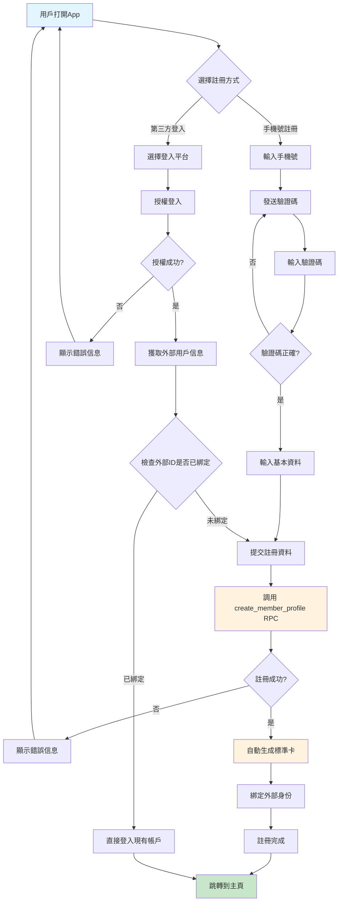
```mermaid
flowchart TD
    A[用戶打開App] --> B{選擇註冊方式}
    B -->|手機號註冊| C[輸入手機號]
    B -->|第三方登入| D[選擇登入平台]
    
    C --> E[發送驗證碼]
    E --> F[輸入驗證碼]
    F --> G{驗證碼正確?}
    G -->|否| E
    G -->|是| H[輸入基本資料]
    
    D --> I[授權登入]
    I --> J{授權成功?}
    J -->|否| K[顯示錯誤信息]
    J -->|是| L[獲取外部用戶信息]
    
    H --> M[提交註冊資料]
    L --> N{檢查外部ID是否已綁定}
    N -->|已綁定| O[直接登入現有帳戶]
    N -->|未綁定| M
    
    M --> P[調用 create_member_profile RPC]
    P --> Q{註冊成功?}
    Q -->|否| R[顯示錯誤信息]
    Q -->|是| S[自動生成標準卡]
    S --> T[綁定外部身份]
    T --> U[註冊完成]
    U --> V[跳轉到主頁]
    
    K --> A
    R --> A
    O --> V
    
    style A fill:#e1f5fe
    style V fill:#c8e6c9
    style P fill:#fff3e0
    style S fill:#fff3e0
```

### 1.2 掃碼支付完整流程

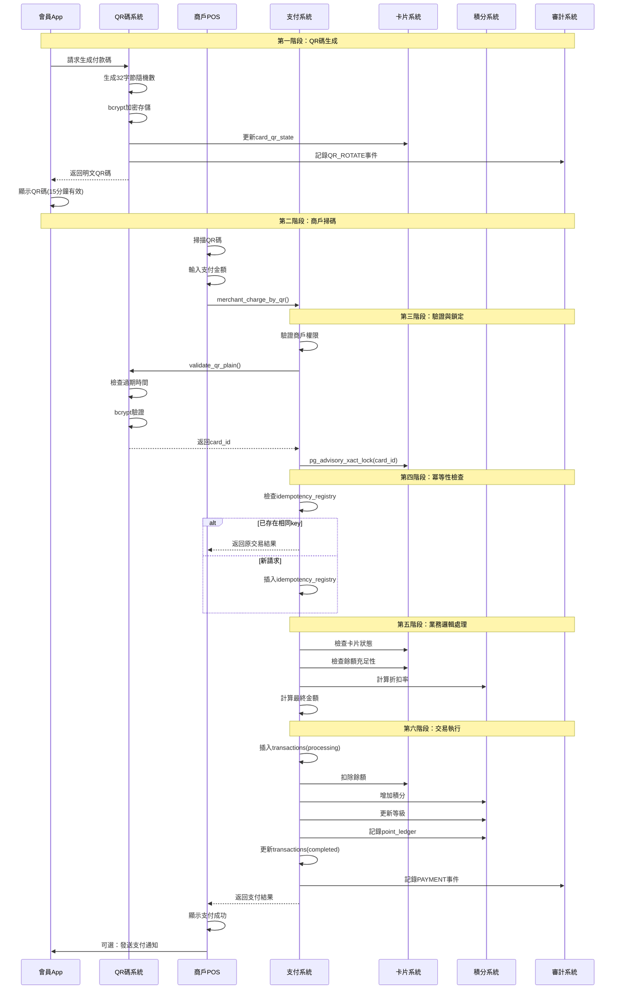
```mermaid
sequenceDiagram
    participant Member as 會員App
    participant QR as QR碼系統
    participant POS as 商戶POS
    participant Payment as 支付系統
    participant Card as 卡片系統
    participant Points as 積分系統
    participant Audit as 審計系統
    
    Note over Member, Audit: 第一階段：QR碼生成
    Member->>QR: 請求生成付款碼
    QR->>QR: 生成32字節隨機數
    QR->>QR: bcrypt加密存儲
    QR->>Card: 更新card_qr_state
    QR->>Audit: 記錄QR_ROTATE事件
    QR-->>Member: 返回明文QR碼
    Member->>Member: 顯示QR碼(15分鐘有效)
    
    Note over Member, Audit: 第二階段：商戶掃碼
    POS->>POS: 掃描QR碼
    POS->>POS: 輸入支付金額
    POS->>Payment: merchant_charge_by_qr()
    
    Note over Payment, Audit: 第三階段：驗證與鎖定
    Payment->>Payment: 驗證商戶權限
    Payment->>QR: validate_qr_plain()
    QR->>QR: 檢查過期時間
    QR->>QR: bcrypt驗證
    QR-->>Payment: 返回card_id
    Payment->>Card: pg_advisory_xact_lock(card_id)
    
    Note over Payment, Audit: 第四階段：冪等性檢查
    Payment->>Payment: 檢查idempotency_registry
    alt 已存在相同key
        Payment-->>POS: 返回原交易結果
    else 新請求
        Payment->>Payment: 插入idempotency_registry
    end
    
    Note over Payment, Audit: 第五階段：業務邏輯處理
    Payment->>Card: 檢查卡片狀態
    Payment->>Card: 檢查餘額充足性
    Payment->>Points: 計算折扣率
    Payment->>Payment: 計算最終金額
    
    Note over Payment, Audit: 第六階段：交易執行
    Payment->>Payment: 插入transactions(processing)
    Payment->>Card: 扣除餘額
    Payment->>Points: 增加積分
    Payment->>Points: 更新等級
    Payment->>Points: 記錄point_ledger
    Payment->>Payment: 更新transactions(completed)
    Payment->>Audit: 記錄PAYMENT事件
    
    Payment-->>POS: 返回支付結果
    POS->>POS: 顯示支付成功
    POS->>Member: 可選：發送支付通知
```

### 1.3 退款業務流程

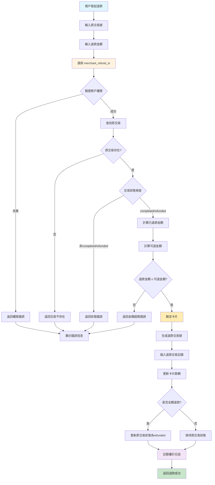
```mermaid
flowchart TD
    A[商戶發起退款] --> B[輸入原交易號]
    B --> C[輸入退款金額]
    C --> D[調用 merchant_refund_tx]
    
    D --> E{驗證商戶權限}
    E -->|失敗| F[返回權限錯誤]
    E -->|成功| G[查找原交易]
    
    G --> H{原交易存在?}
    H -->|否| I[返回交易不存在]
    H -->|是| J{交易狀態檢查}
    
    J -->|非completed/refunded| K[返回狀態錯誤]
    J -->|completed/refunded| L[計算已退款金額]
    
    L --> M[計算可退金額]
    M --> N{退款金額 ≤ 可退金額?}
    N -->|否| O[返回金額超限錯誤]
    N -->|是| P[鎖定卡片]
    
    P --> Q[生成退款交易號]
    Q --> R[插入退款交易記錄]
    R --> S[更新卡片餘額]
    S --> T{是否全額退款?}
    
    T -->|是| U[更新原交易狀態為refunded]
    T -->|否| V[保持原交易狀態]
    
    U --> W[記錄審計日誌]
    V --> W
    W --> X[返回退款成功]
    
    F --> Y[顯示錯誤信息]
    I --> Y
    K --> Y
    O --> Y
    
    style A fill:#e1f5fe
    style X fill:#c8e6c9
    style D fill:#fff3e0
    style P fill:#ffecb3
    style W fill:#f3e5f5
```

### 1.4 卡片共享綁定流程

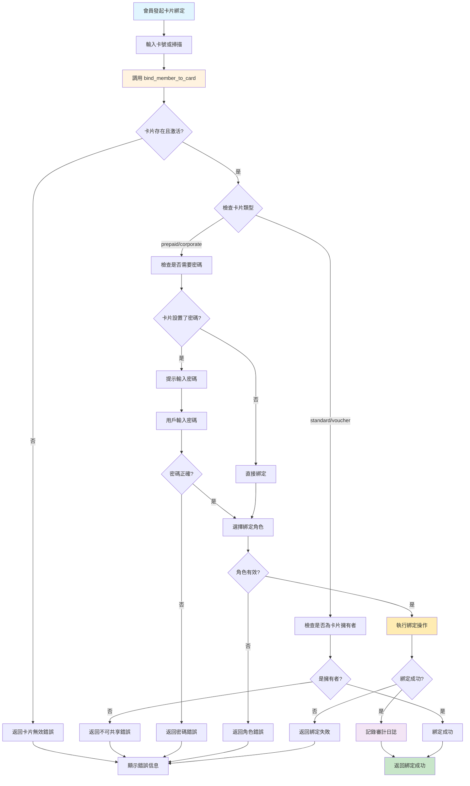
```mermaid
flowchart TD
    A[會員發起卡片綁定] --> B[輸入卡號或掃描]
    B --> C[調用 bind_member_to_card]
    
    C --> D{卡片存在且激活?}
    D -->|否| E[返回卡片無效錯誤]
    D -->|是| F{檢查卡片類型}
    
    F -->|standard/voucher| G[檢查是否為卡片擁有者]
    F -->|prepaid/corporate| H[檢查是否需要密碼]
    
    G --> I{是擁有者?}
    I -->|否| J[返回不可共享錯誤]
    I -->|是| K[綁定成功]
    
    H --> L{卡片設置了密碼?}
    L -->|否| M[直接綁定]
    L -->|是| N[提示輸入密碼]
    
    N --> O[用戶輸入密碼]
    O --> P{密碼正確?}
    P -->|否| Q[返回密碼錯誤]
    P -->|是| R[選擇綁定角色]
    
    M --> R
    R --> S{角色有效?}
    S -->|否| T[返回角色錯誤]
    S -->|是| U[執行綁定操作]
    
    U --> V{綁定成功?}
    V -->|否| W[返回綁定失敗]
    V -->|是| X[記錄審計日誌]
    X --> Y[返回綁定成功]
    
    E --> Z[顯示錯誤信息]
    J --> Z
    Q --> Z
    T --> Z
    W --> Z
    
    K --> Y
    
    style A fill:#e1f5fe
    style Y fill:#c8e6c9
    style C fill:#fff3e0
    style U fill:#ffecb3
    style X fill:#f3e5f5
```

---

## 2. 數據流程圖

### 2.1 支付數據流

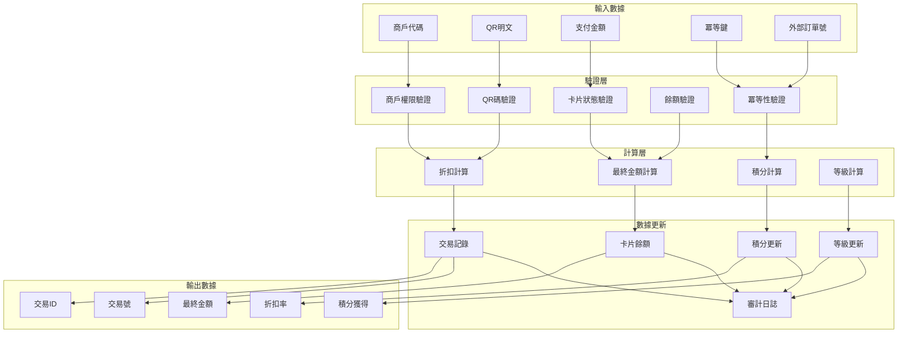
```mermaid
graph TD
    subgraph "輸入數據"
        A1[商戶代碼]
        A2[QR明文]
        A3[支付金額]
        A4[冪等鍵]
        A5[外部訂單號]
    end
    
    subgraph "驗證層"
        B1[商戶權限驗證]
        B2[QR碼驗證]
        B3[卡片狀態驗證]
        B4[餘額驗證]
        B5[冪等性驗證]
    end
    
    subgraph "計算層"
        C1[折扣計算]
        C2[最終金額計算]
        C3[積分計算]
        C4[等級計算]
    end
    
    subgraph "數據更新"
        D1[交易記錄]
        D2[卡片餘額]
        D3[積分更新]
        D4[等級更新]
        D5[審計日誌]
    end
    
    subgraph "輸出數據"
        E1[交易ID]
        E2[交易號]
        E3[最終金額]
        E4[折扣率]
        E5[積分獲得]
    end
    
    A1 --> B1
    A2 --> B2
    A3 --> B3
    A4 --> B5
    A5 --> B5
    
    B1 --> C1
    B2 --> C1
    B3 --> C2
    B4 --> C2
    B5 --> C3
    
    C1 --> D1
    C2 --> D2
    C3 --> D3
    C4 --> D4
    
    D1 --> E1
    D1 --> E2
    D2 --> E3
    D3 --> E4
    D4 --> E5
    
    D1 --> D5
    D2 --> D5
    D3 --> D5
    D4 --> D5
```

### 2.2 積分等級數據流

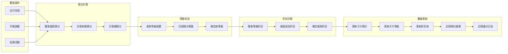
```mermaid
graph LR
    subgraph "觸發事件"
        A1[支付完成]
        A2[手動調整]
        A3[促銷活動]
    end
    
    subgraph "積分計算"
        B1[獲取當前積分]
        B2[計算新增積分]
        B3[計算總積分]
    end
    
    subgraph "等級判定"
        C1[查詢等級配置]
        C2[匹配積分範圍]
        C3[確定新等級]
    end
    
    subgraph "折扣計算"
        D1[獲取等級折扣]
        D2[檢查固定折扣]
        D3[確定最終折扣]
    end
    
    subgraph "數據更新"
        E1[更新卡片積分]
        E2[更新卡片等級]
        E3[更新折扣率]
        E4[記錄積分變更]
        E5[記錄審計日誌]
    end
    
    A1 --> B1
    A2 --> B1
    A3 --> B1
    
    B1 --> B2
    B2 --> B3
    
    B3 --> C1
    C1 --> C2
    C2 --> C3
    
    C3 --> D1
    D1 --> D2
    D2 --> D3
    
    D3 --> E1
    E1 --> E2
    E2 --> E3
    E3 --> E4
    E4 --> E5
```

### 2.3 QR碼生命週期數據流

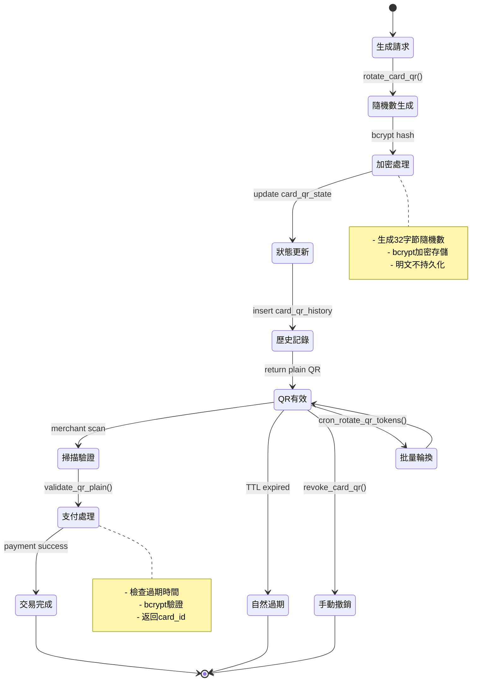
```mermaid
stateDiagram-v2
    [*] --> 生成請求
    
    生成請求 --> 隨機數生成 : rotate_card_qr()
    隨機數生成 --> 加密處理 : bcrypt hash
    加密處理 --> 狀態更新 : update card_qr_state
    狀態更新 --> 歷史記錄 : insert card_qr_history
    歷史記錄 --> QR有效 : return plain QR
    
    QR有效 --> 掃描驗證 : merchant scan
    掃描驗證 --> 支付處理 : validate_qr_plain()
    支付處理 --> 交易完成 : payment success
    
    QR有效 --> 自然過期 : TTL expired
    QR有效 --> 手動撤銷 : revoke_card_qr()
    QR有效 --> 批量輪換 : cron_rotate_qr_tokens()
    
    自然過期 --> [*]
    手動撤銷 --> [*]
    批量輪換 --> QR有效
    交易完成 --> [*]
    
    note right of 加密處理
        - 生成32字節隨機數
        - bcrypt加密存儲
        - 明文不持久化
    end note
    
    note right of 支付處理
        - 檢查過期時間
        - bcrypt驗證
        - 返回card_id
    end note
```

---

## 3. 用戶旅程圖

### 3.1 會員用戶旅程

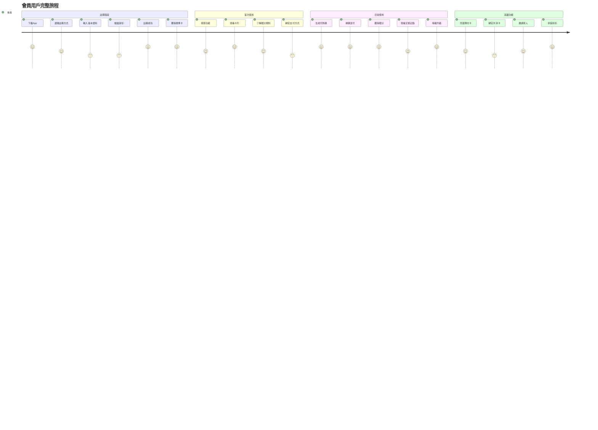
```mermaid
journey
    title 會員用戶完整旅程
    section 註冊階段
      下載App: 5: 會員
      選擇註冊方式: 4: 會員
      輸入基本資料: 3: 會員
      驗證身份: 3: 會員
      註冊成功: 5: 會員
      獲得標準卡: 5: 會員
    
    section 首次使用
      探索功能: 4: 會員
      查看卡片: 5: 會員
      了解積分規則: 4: 會員
      綁定支付方式: 3: 會員
    
    section 日常使用
      生成付款碼: 5: 會員
      掃碼支付: 5: 會員
      獲得積分: 5: 會員
      查看交易記錄: 4: 會員
      等級升級: 5: 會員
    
    section 高級功能
      充值預付卡: 4: 會員
      綁定共享卡: 3: 會員
      邀請家人: 4: 會員
      享受折扣: 5: 會員
```

### 3.2 商戶用戶旅程

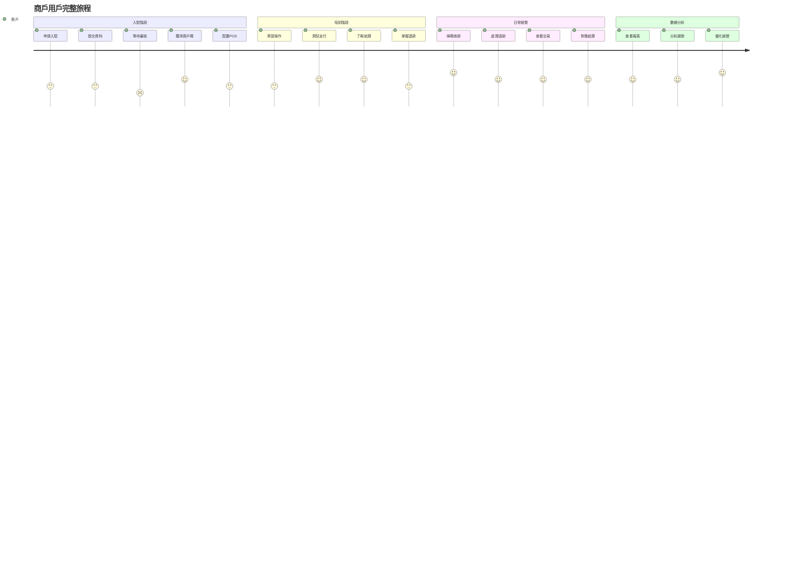
```mermaid
journey
    title 商戶用戶完整旅程
    section 入駐階段
      申請入駐: 3: 商戶
      提交資料: 3: 商戶
      等待審核: 2: 商戶
      獲得商戶碼: 4: 商戶
      配置POS: 3: 商戶
    
    section 培訓階段
      學習操作: 3: 商戶
      測試支付: 4: 商戶
      了解結算: 4: 商戶
      掌握退款: 3: 商戶
    
    section 日常經營
      掃碼收款: 5: 商戶
      處理退款: 4: 商戶
      查看交易: 4: 商戶
      對賬結算: 4: 商戶
    
    section 數據分析
      查看報表: 4: 商戶
      分析趨勢: 4: 商戶
      優化經營: 5: 商戶
```

### 3.3 管理員用戶旅程

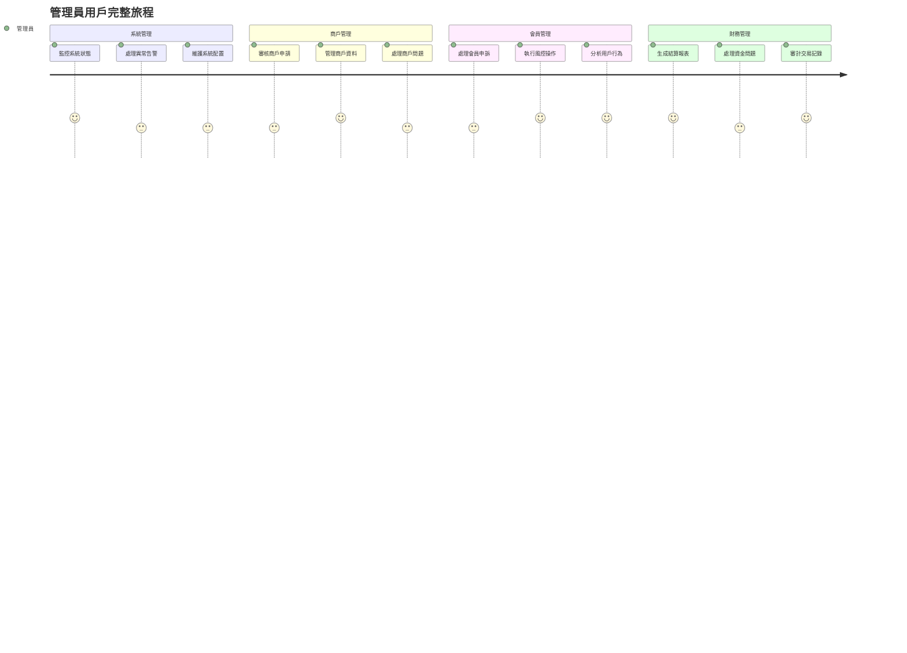
```mermaid
journey
    title 管理員用戶完整旅程
    section 系統管理
      監控系統狀態: 4: 管理員
      處理異常告警: 3: 管理員
      維護系統配置: 3: 管理員
    
    section 商戶管理
      審核商戶申請: 3: 管理員
      管理商戶資料: 4: 管理員
      處理商戶問題: 3: 管理員
    
    section 會員管理
      處理會員申訴: 3: 管理員
      執行風控操作: 4: 管理員
      分析用戶行為: 4: 管理員
    
    section 財務管理
      生成結算報表: 4: 管理員
      處理資金問題: 3: 管理員
      審計交易記錄: 4: 管理員
```

---

## 4. 異常處理流程

### 4.1 支付異常處理

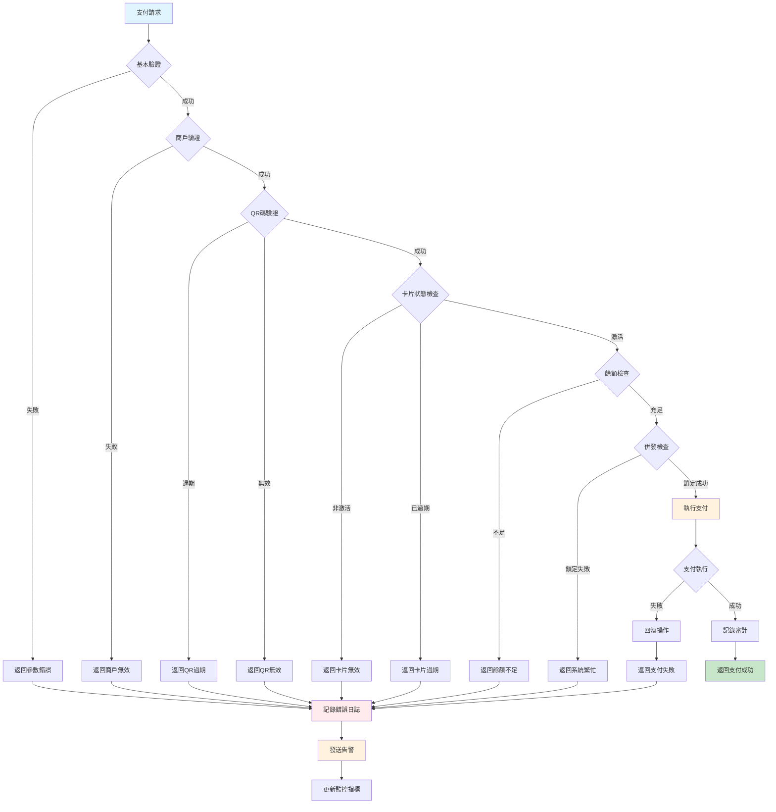
```mermaid
flowchart TD
    A[支付請求] --> B{基本驗證}
    B -->|失敗| C[返回參數錯誤]
    B -->|成功| D{商戶驗證}
    
    D -->|失敗| E[返回商戶無效]
    D -->|成功| F{QR碼驗證}
    
    F -->|過期| G[返回QR過期]
    F -->|無效| H[返回QR無效]
    F -->|成功| I{卡片狀態檢查}
    
    I -->|非激活| J[返回卡片無效]
    I -->|已過期| K[返回卡片過期]
    I -->|激活| L{餘額檢查}
    
    L -->|不足| M[返回餘額不足]
    L -->|充足| N{併發檢查}
    
    N -->|鎖定失敗| O[返回系統繁忙]
    N -->|鎖定成功| P[執行支付]
    
    P --> Q{支付執行}
    Q -->|失敗| R[回滾操作]
    Q -->|成功| S[記錄審計]
    
    R --> T[返回支付失敗]
    S --> U[返回支付成功]
    
    C --> V[記錄錯誤日誌]
    E --> V
    G --> V
    H --> V
    J --> V
    K --> V
    M --> V
    O --> V
    T --> V
    
    V --> W[發送告警]
    W --> X[更新監控指標]
    
    style A fill:#e1f5fe
    style U fill:#c8e6c9
    style P fill:#fff3e0
    style V fill:#ffebee
    style W fill:#fff3e0
```

### 4.2 系統故障恢復流程

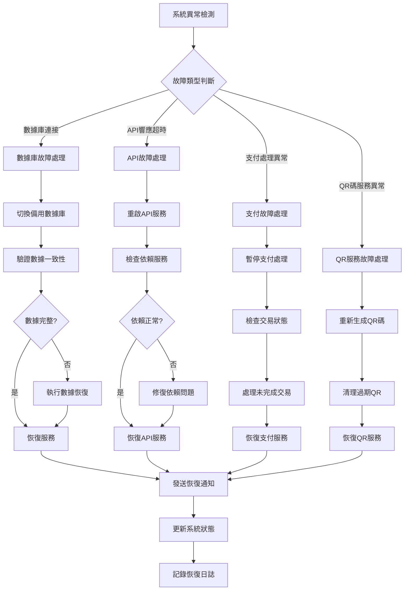
```mermaid
flowchart TD
    A[系統異常檢測] --> B{故障類型判斷}
    
    B -->|數據庫連接| C[數據庫故障處理]
    B -->|API響應超時| D[API故障處理]
    B -->|支付處理異常| E[支付故障處理]
    B -->|QR碼服務異常| F[QR服務故障處理]
    
    C --> G[切換備用數據庫]
    G --> H[驗證數據一致性]
    H --> I{數據完整?}
    I -->|否| J[執行數據恢復]
    I -->|是| K[恢復服務]
    
    D --> L[重啟API服務]
    L --> M[檢查依賴服務]
    M --> N{依賴正常?}
    N -->|否| O[修復依賴問題]
    N -->|是| P[恢復API服務]
    
    E --> Q[暫停支付處理]
    Q --> R[檢查交易狀態]
    R --> S[處理未完成交易]
    S --> T[恢復支付服務]
    
    F --> U[重新生成QR碼]
    U --> V[清理過期QR]
    V --> W[恢復QR服務]
    
    J --> K
    O --> P
    K --> X[發送恢復通知]
    P --> X
    T --> X
    W --> X
    
    X --> Y[更新系統狀態]
    Y --> Z[記錄恢復日誌]
```

### 4.3 數據一致性檢查流程

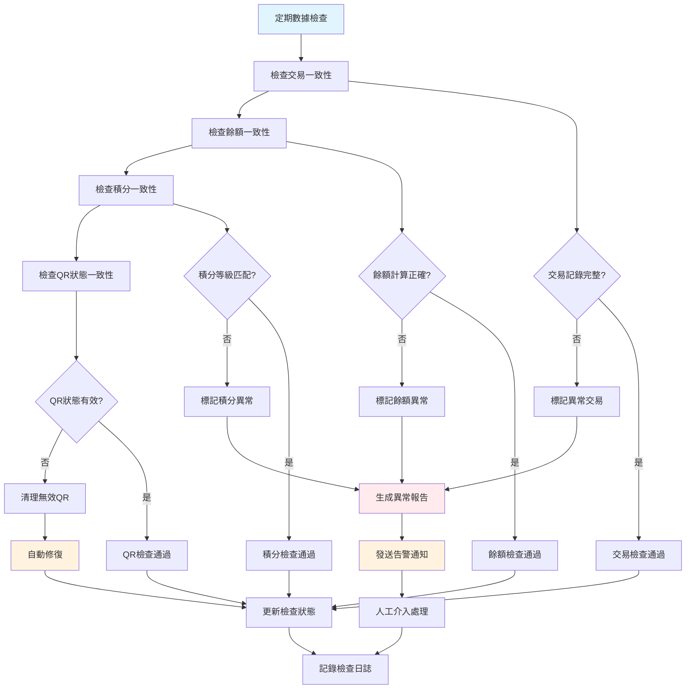
```mermaid
flowchart TD
    A[定期數據檢查] --> B[檢查交易一致性]
    B --> C[檢查餘額一致性]
    C --> D[檢查積分一致性]
    D --> E[檢查QR狀態一致性]
    
    B --> F{交易記錄完整?}
    F -->|否| G[標記異常交易]
    F -->|是| H[交易檢查通過]
    
    C --> I{餘額計算正確?}
    I -->|否| J[標記餘額異常]
    I -->|是| K[餘額檢查通過]
    
    D --> L{積分等級匹配?}
    L -->|否| M[標記積分異常]
    L -->|是| N[積分檢查通過]
    
    E --> O{QR狀態有效?}
    O -->|否| P[清理無效QR]
    O -->|是| Q[QR檢查通過]
    
    G --> R[生成異常報告]
    J --> R
    M --> R
    P --> S[自動修復]
    
    H --> T[更新檢查狀態]
    K --> T
    N --> T
    Q --> T
    S --> T
    
    R --> U[發送告警通知]
    U --> V[人工介入處理]
    
    T --> W[記錄檢查日誌]
    V --> W
    
    style A fill:#e1f5fe
    style R fill:#ffebee
    style S fill:#fff3e0
    style U fill:#fff3e0
```

---

## 5. 系統集成流程

### 5.1 第三方支付集成

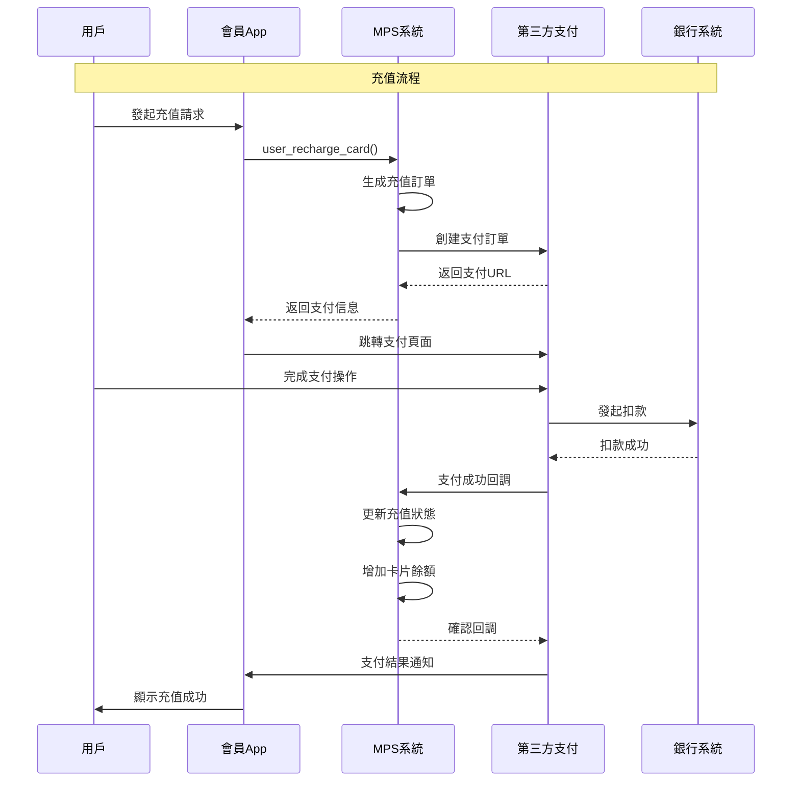
```mermaid
sequenceDiagram
    participant User as 用戶
    participant App as 會員App
    participant MPS as MPS系統
    participant Payment as 第三方支付
    participant Bank as 銀行系統
    
    Note over User, Bank: 充值流程
    User->>App: 發起充值請求
    App->>MPS: user_recharge_card()
    MPS->>MPS: 生成充值訂單
    MPS->>Payment: 創建支付訂單
    Payment-->>MPS: 返回支付URL
    MPS-->>App: 返回支付信息
    App->>Payment: 跳轉支付頁面
    User->>Payment: 完成支付操作
    Payment->>Bank: 發起扣款
    Bank-->>Payment: 扣款成功
    Payment->>MPS: 支付成功回調
    MPS->>MPS: 更新充值狀態
    MPS->>MPS: 增加卡片餘額
    MPS-->>Payment: 確認回調
    Payment->>App: 支付結果通知
    App->>User: 顯示充值成功
```

### 5.2 外部身份認證集成

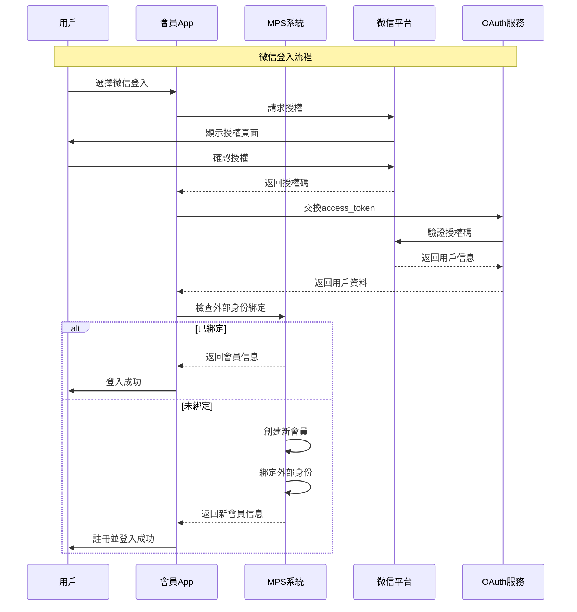
```mermaid
sequenceDiagram
    participant User as 用戶
    participant App as 會員App
    participant MPS as MPS系統
    participant WeChat as 微信平台
    participant OAuth as OAuth服務
    
    Note over User, OAuth: 微信登入流程
    User->>App: 選擇微信登入
    App->>WeChat: 請求授權
    WeChat->>User: 顯示授權頁面
    User->>WeChat: 確認授權
    WeChat-->>App: 返回授權碼
    App->>OAuth: 交換access_token
    OAuth->>WeChat: 驗證授權碼
    WeChat-->>OAuth: 返回用戶信息
    OAuth-->>App: 返回用戶資料
    App->>MPS: 檢查外部身份綁定
    
    alt 已綁定
        MPS-->>App: 返回會員信息
        App->>User: 登入成功
    else 未綁定
        MPS->>MPS: 創建新會員
        MPS->>MPS: 綁定外部身份
        MPS-->>App: 返回新會員信息
        App->>User: 註冊並登入成功
    end
```

### 5.3 商戶POS系統集成

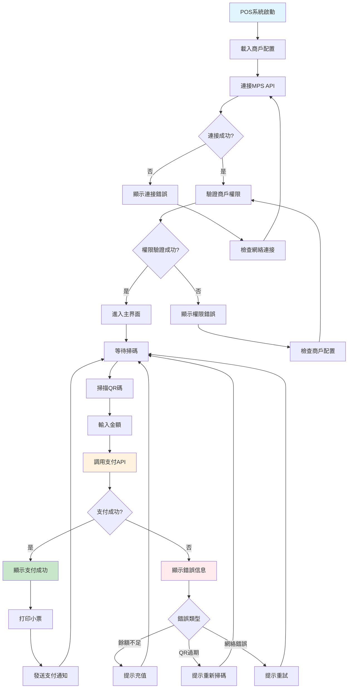
```mermaid
flowchart TD
    A[POS系統啟動] --> B[載入商戶配置]
    B --> C[連接MPS API]
    C --> D{連接成功?}
    
    D -->|否| E[顯示連接錯誤]
    D -->|是| F[驗證商戶權限]
    
    F --> G{權限驗證成功?}
    G -->|否| H[顯示權限錯誤]
    G -->|是| I[進入主界面]
    
    I --> J[等待掃碼]
    J --> K[掃描QR碼]
    K --> L[輸入金額]
    L --> M[調用支付API]
    
    M --> N{支付成功?}
    N -->|是| O[顯示支付成功]
    N -->|否| P[顯示錯誤信息]
    
    O --> Q[打印小票]
    Q --> R[發送支付通知]
    R --> J
    
    P --> S{錯誤類型}
    S -->|餘額不足| T[提示充值]
    S -->|QR過期| U[提示重新掃碼]
    S -->|網絡錯誤| V[提示重試]
    
    T --> J
    U --> J
    V --> J
    
    E --> W[檢查網絡連接]
    H --> X[檢查商戶配置]
    W --> C
    X --> F
    
    style A fill:#e1f5fe
    style O fill:#c8e6c9
    style M fill:#fff3e0
    style P fill:#ffebee
```

### 5.4 數據同步流程

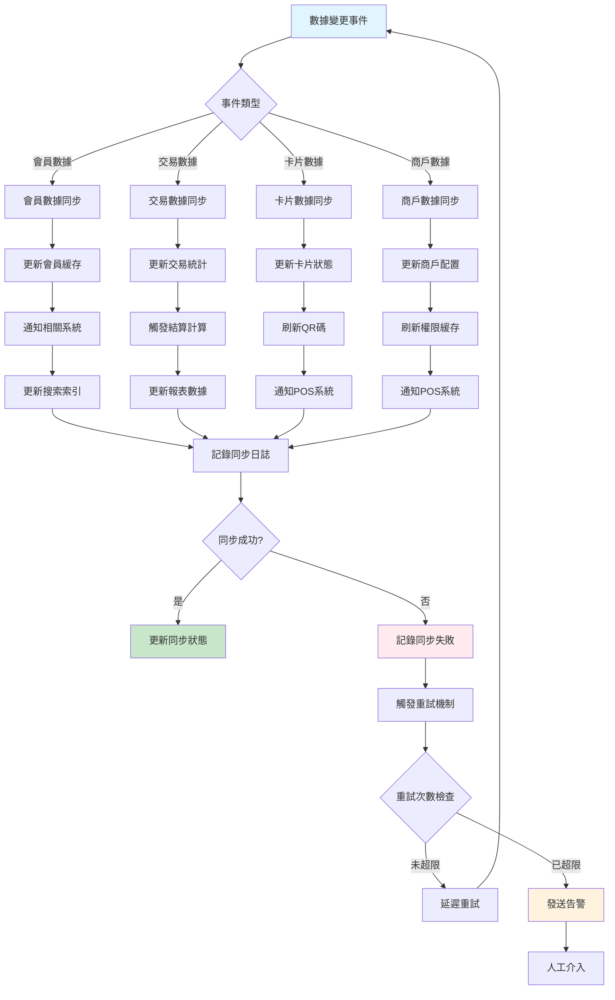
```mermaid
flowchart TD
    A[數據變更事件] --> B{事件類型}
    
    B -->|會員數據| C[會員數據同步]
    B -->|交易數據| D[交易數據同步]
    B -->|卡片數據| E[卡片數據同步]
    B -->|商戶數據| F[商戶數據同步]
    
    C --> G[更新會員緩存]
    G --> H[通知相關系統]
    H --> I[更新搜索索引]
    
    D --> J[更新交易統計]
    J --> K[觸發結算計算]
    K --> L[更新報表數據]
    
    E --> M[更新卡片狀態]
    M --> N[刷新QR碼]
    N --> O[通知POS系統]
    
    F --> P[更新商戶配置]
    P --> Q[刷新權限緩存]
    Q --> R[通知POS系統]
    
    I --> S[記錄同步日誌]
    L --> S
    O --> S
    R --> S
    
    S --> T{同步成功?}
    T -->|是| U[更新同步狀態]
    T -->|否| V[記錄同步失敗]
    
    V --> W[觸發重試機制]
    W --> X{重試次數檢查}
    X -->|未超限| Y[延遲重試]
    X -->|已超限| Z[發送告警]
    
    Y --> A
    Z --> AA[人工介入]
    
    style A fill:#e1f5fe
    style U fill:#c8e6c9
    style V fill:#ffebee
    style Z fill:#fff3e0
```

---

## 📊 流程指標監控

### 關鍵業務指標

| 流程 | 關鍵指標 | 目標值 | 監控方式 |
|------|----------|--------|----------|
| 會員註冊 | 註冊成功率 | >95% | 實時監控 |
| 掃碼支付 | 支付成功率 | >99% | 實時監控 |
| QR碼生成 | 生成響應時間 | <1秒 | 實時監控 |
| 退款處理 | 退款處理時間 | <30秒 | 實時監控 |
| 數據同步 | 同步延遲 | <5秒 | 實時監控 |

### 異常處理指標

| 異常類型 | 檢測方式 | 處理時間目標 | 恢復策略 |
|----------|----------|--------------|----------|
| 支付失敗 | 錯誤率監控 | <1分鐘 | 自動重試 |
| 系統故障 | 健康檢查 | <5分鐘 | 自動切換 |
| 數據不一致 | 定期檢查 | <1小時 | 自動修復 |
| 網絡異常 | 連接監控 | <30秒 | 重新連接 |

這些業務流程圖為 MPS 系統提供了完整的業務邏輯視圖，幫助開發團隊和產品經理理解系統的運作方式，並為系統優化和問題排查提供指導。