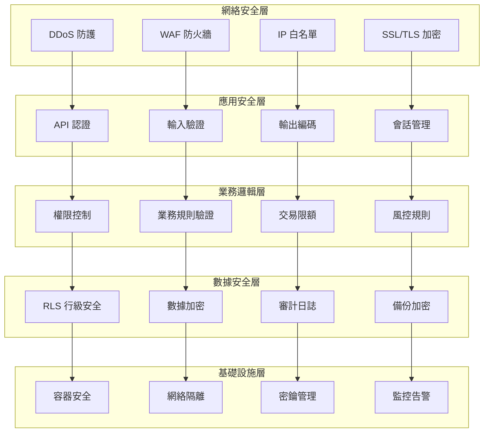
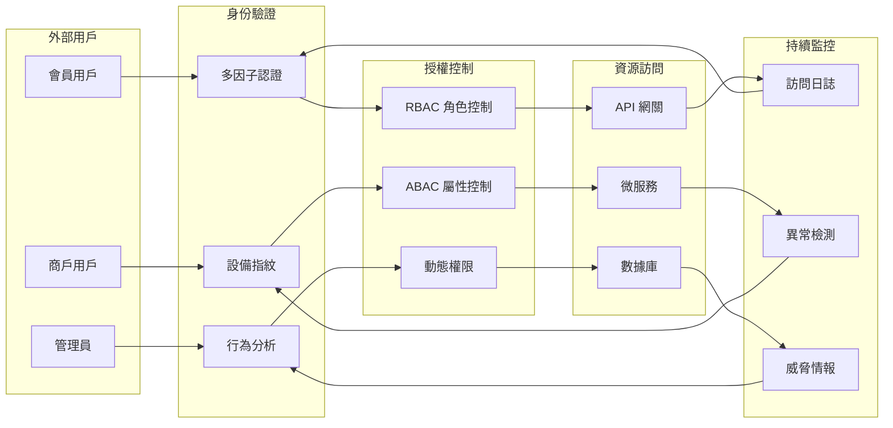
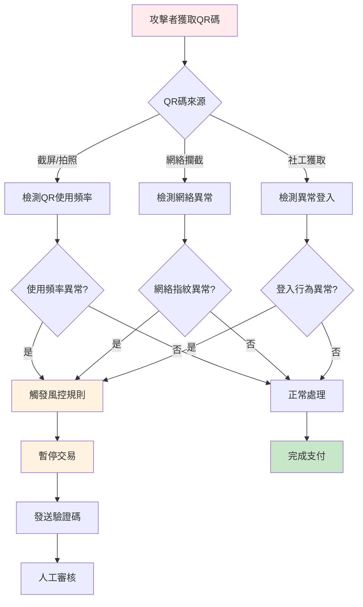
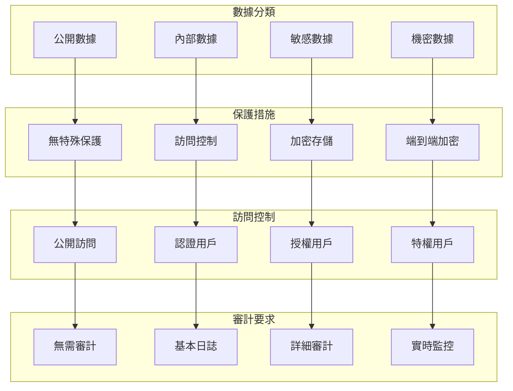
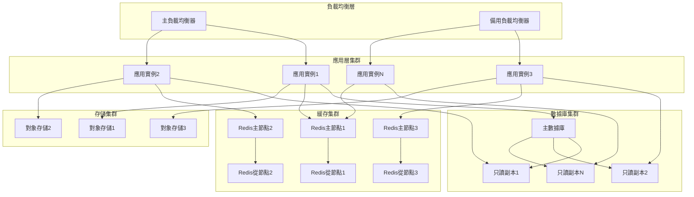
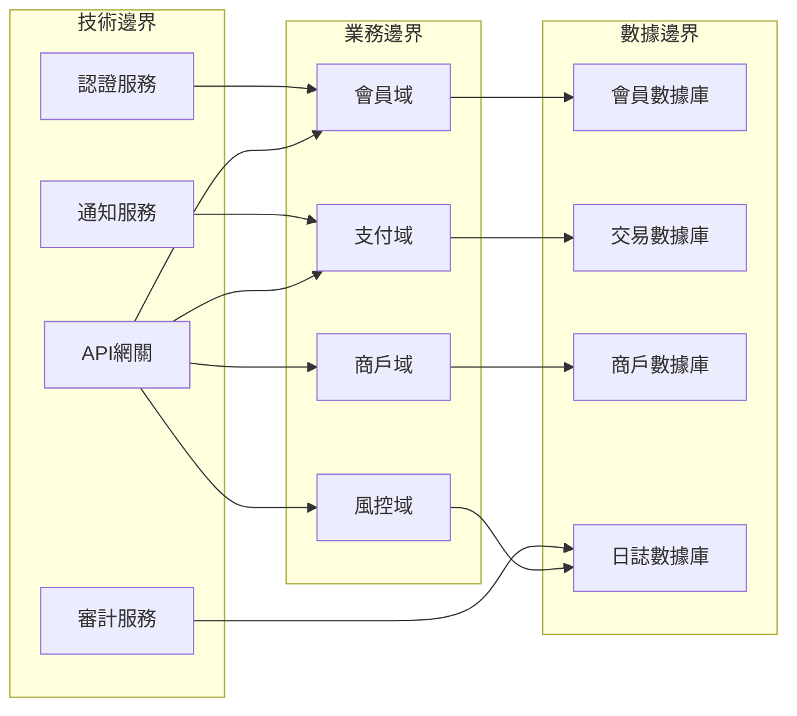
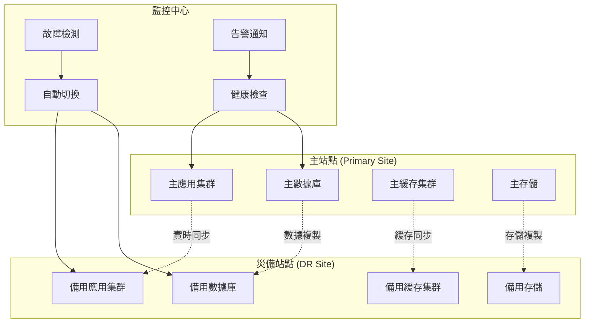

# MPS 安全性與擴展性分析

## 📋 目錄
- [1. 安全架構分析](#1-安全架構分析)
- [2. 威脅模型與防護](#2-威脅模型與防護)
- [3. 數據安全策略](#3-數據安全策略)
- [4. 擴展性設計](#4-擴展性設計)
- [5. 性能優化策略](#5-性能優化策略)
- [6. 容災與備份](#6-容災與備份)
- [7. 合規性要求](#7-合規性要求)

---

## 1. 安全架構分析

### 1.1 多層安全防護模型



### 1.2 零信任安全架構



### 1.3 安全控制矩陣

| 安全域 | 控制措施 | 實現方式 | 風險等級 | 監控指標 |
|--------|----------|----------|----------|----------|
| **網絡安全** | DDoS 防護 | CDN + WAF | 高 | 攻擊次數/成功率 |
| | SSL/TLS 加密 | HTTPS 強制 | 高 | 加密覆蓋率 |
| | IP 白名單 | 管理後台限制 | 中 | 異常 IP 訪問 |
| **身份認證** | 多因子認證 | SMS + TOTP | 高 | 認證成功率 |
| | 會話管理 | JWT + 過期控制 | 中 | 會話劫持檢測 |
| | 設備指紋 | 瀏覽器指紋 | 中 | 異常設備登入 |
| **授權控制** | RBAC 權限 | 角色基礎控制 | 高 | 權限違規次數 |
| | RLS 行級安全 | PostgreSQL RLS | 高 | 數據訪問違規 |
| | API 限流 | 令牌桶算法 | 中 | API 調用頻率 |
| **數據保護** | 敏感數據加密 | AES-256 | 高 | 加密覆蓋率 |
| | 審計日誌 | 完整操作記錄 | 高 | 日誌完整性 |
| | 數據脫敏 | 生產數據保護 | 中 | 脫敏覆蓋率 |

---

## 2. 威脅模型與防護

### 2.1 STRIDE 威脅分析

#### 🎭 Spoofing (身份偽造)
**威脅場景**:
- 攻擊者偽造會員身份進行支付
- 惡意商戶偽造其他商戶進行收款
- 管理員身份被冒用進行系統操作

**防護措施**:
```sql
-- 強化身份驗證
CREATE OR REPLACE FUNCTION sec.verify_member_identity(
    p_member_id uuid,
    p_device_fingerprint text,
    p_ip_address inet
) RETURNS boolean AS $$
DECLARE
    v_last_login_ip inet;
    v_device_count int;
BEGIN
    -- 檢查設備指紋
    SELECT COUNT(*) INTO v_device_count
    FROM app.member_login_history 
    WHERE member_id = p_member_id 
      AND device_fingerprint = p_device_fingerprint
      AND created_at >= NOW() - INTERVAL '30 days';
    
    -- 檢查 IP 地址變化
    SELECT ip_address INTO v_last_login_ip
    FROM app.member_login_history
    WHERE member_id = p_member_id
    ORDER BY created_at DESC LIMIT 1;
    
    -- 異常檢測
    IF v_device_count = 0 AND v_last_login_ip != p_ip_address THEN
        -- 觸發額外驗證
        PERFORM sec.trigger_additional_verification(p_member_id);
        RETURN FALSE;
    END IF;
    
    RETURN TRUE;
END;
$$ LANGUAGE plpgsql SECURITY DEFINER;
```

#### 🔧 Tampering (數據篡改)
**威脅場景**:
- 交易金額被惡意修改
- QR 碼被篡改指向惡意卡片
- 積分餘額被非法修改

**防護措施**:
```sql
-- 數據完整性檢查
CREATE OR REPLACE FUNCTION sec.verify_transaction_integrity(
    p_tx_id uuid
) RETURNS boolean AS $$
DECLARE
    v_tx app.transactions%ROWTYPE;
    v_calculated_hash text;
    v_stored_hash text;
BEGIN
    SELECT * INTO v_tx FROM app.transactions WHERE id = p_tx_id;
    
    -- 計算交易數據哈希
    v_calculated_hash := encode(
        digest(
            v_tx.card_id::text || 
            v_tx.raw_amount::text || 
            v_tx.final_amount::text || 
            v_tx.created_at::text,
            'sha256'
        ),
        'hex'
    );
    
    -- 比較存儲的哈希值
    SELECT integrity_hash INTO v_stored_hash 
    FROM app.transaction_integrity 
    WHERE tx_id = p_tx_id;
    
    RETURN v_calculated_hash = v_stored_hash;
END;
$$ LANGUAGE plpgsql SECURITY DEFINER;
```

#### 🔍 Repudiation (否認)
**威脅場景**:
- 用戶否認進行過某筆交易
- 商戶否認收到過退款
- 管理員否認執行過風控操作

**防護措施**:
```sql
-- 不可否認性審計
CREATE TABLE audit.non_repudiation_log (
    id bigserial PRIMARY KEY,
    actor_id uuid NOT NULL,
    action_type text NOT NULL,
    resource_id uuid,
    digital_signature text NOT NULL,
    timestamp_signature text NOT NULL,
    ip_address inet,
    user_agent text,
    created_at timestamptz NOT NULL DEFAULT app.now_utc()
);

-- 數字簽名函數
CREATE OR REPLACE FUNCTION audit.create_digital_signature(
    p_actor_id uuid,
    p_action_type text,
    p_resource_id uuid,
    p_data jsonb
) RETURNS text AS $$
DECLARE
    v_signature_data text;
    v_signature text;
BEGIN
    -- 構建簽名數據
    v_signature_data := p_actor_id::text || 
                       p_action_type || 
                       COALESCE(p_resource_id::text, '') ||
                       p_data::text ||
                       extract(epoch from now())::text;
    
    -- 生成 HMAC 簽名
    v_signature := encode(
        hmac(v_signature_data, current_setting('app.signature_key'), 'sha256'),
        'hex'
    );
    
    RETURN v_signature;
END;
$$ LANGUAGE plpgsql SECURITY DEFINER;
```

#### 📊 Information Disclosure (信息洩露)
**威脅場景**:
- 會員個人信息被非法訪問
- 交易記錄被未授權查看
- 商戶敏感數據洩露

**防護措施**:
```sql
-- 數據脫敏視圖
CREATE VIEW app.member_profiles_masked AS
SELECT 
    id,
    member_no,
    CASE 
        WHEN current_setting('app.user_role') = 'platform_admin' THEN name
        ELSE left(name, 1) || '***'
    END as name,
    CASE 
        WHEN current_setting('app.user_role') = 'platform_admin' THEN phone
        ELSE left(phone, 3) || '****' || right(phone, 4)
    END as phone,
    CASE 
        WHEN current_setting('app.user_role') = 'platform_admin' THEN email
        ELSE left(split_part(email, '@', 1), 2) || '***@' || split_part(email, '@', 2)
    END as email,
    status,
    created_at
FROM app.member_profiles;

-- 敏感數據訪問控制
CREATE POLICY "Sensitive data access control" ON app.member_profiles
FOR SELECT USING (
    -- 只有本人或管理員可以查看完整信息
    id = get_current_member_id() OR
    EXISTS (
        SELECT 1 FROM auth.users 
        WHERE id = auth.uid() 
          AND raw_user_meta_data->>'role' = 'platform_admin'
    )
);
```

#### 🚫 Denial of Service (拒絕服務)
**威脅場景**:
- 大量無效支付請求導致系統癱瘓
- QR 碼生成接口被惡意調用
- 數據庫連接池被耗盡

**防護措施**:
```python
# API 限流實現
import redis
import time
from functools import wraps

class RateLimiter:
    def __init__(self, redis_client):
        self.redis = redis_client
    
    def limit(self, key: str, limit: int, window: int):
        """限流裝飾器"""
        def decorator(func):
            @wraps(func)
            def wrapper(*args, **kwargs):
                current_time = int(time.time())
                window_start = current_time - (current_time % window)
                
                # 滑動窗口計數
                pipe = self.redis.pipeline()
                pipe.zremrangebyscore(key, 0, current_time - window)
                pipe.zadd(key, {str(current_time): current_time})
                pipe.zcard(key)
                pipe.expire(key, window)
                results = pipe.execute()
                
                request_count = results[2]
                
                if request_count > limit:
                    raise Exception(f"Rate limit exceeded: {request_count}/{limit}")
                
                return func(*args, **kwargs)
            return wrapper
        return decorator

# 使用示例
rate_limiter = RateLimiter(redis.Redis())

@rate_limiter.limit("payment_api", limit=100, window=60)  # 每分鐘100次
def process_payment(merchant_code, qr_plain, amount):
    return rpc("merchant_charge_by_qr", {
        "p_merchant_code": merchant_code,
        "p_qr_plain": qr_plain,
        "p_raw_amount": amount
    })
```

#### ⬆️ Elevation of Privilege (權限提升)
**威脅場景**:
- 普通會員獲得管理員權限
- 商戶用戶訪問其他商戶數據
- SQL 注入導致權限繞過

**防護措施**:
```sql
-- 權限檢查函數
CREATE OR REPLACE FUNCTION sec.check_privilege_escalation(
    p_user_id uuid,
    p_requested_action text,
    p_resource_id uuid
) RETURNS boolean AS $$
DECLARE
    v_current_role text;
    v_required_role text;
    v_resource_owner uuid;
BEGIN
    -- 獲取當前用戶角色
    SELECT role INTO v_current_role 
    FROM app.user_roles 
    WHERE user_id = p_user_id;
    
    -- 獲取操作所需角色
    SELECT required_role INTO v_required_role
    FROM app.action_permissions
    WHERE action_name = p_requested_action;
    
    -- 檢查資源所有權
    SELECT owner_id INTO v_resource_owner
    FROM app.resource_ownership
    WHERE resource_id = p_resource_id;
    
    -- 權限檢查邏輯
    IF v_current_role = 'platform_admin' THEN
        RETURN TRUE;
    ELSIF v_current_role = v_required_role AND v_resource_owner = p_user_id THEN
        RETURN TRUE;
    ELSE
        -- 記錄權限提升嘗試
        INSERT INTO audit.privilege_escalation_attempts(
            user_id, attempted_action, resource_id, current_role, required_role
        ) VALUES (
            p_user_id, p_requested_action, p_resource_id, v_current_role, v_required_role
        );
        RETURN FALSE;
    END IF;
END;
$$ LANGUAGE plpgsql SECURITY DEFINER;
```

### 2.2 攻擊場景與應對

#### 💳 支付欺詐攻擊


#### 🔐 密碼攻擊防護
```python
class PasswordSecurity:
    def __init__(self):
        self.failed_attempts = {}
        self.lockout_duration = 900  # 15分鐘
        self.max_attempts = 5
    
    def check_password_policy(self, password: str) -> bool:
        """密碼策略檢查"""
        if len(password) < 8:
            return False
        
        # 檢查複雜度
        has_upper = any(c.isupper() for c in password)
        has_lower = any(c.islower() for c in password)
        has_digit = any(c.isdigit() for c in password)
        has_special = any(c in "!@#$%^&*" for c in password)
        
        return sum([has_upper, has_lower, has_digit, has_special]) >= 3
    
    def check_brute_force(self, user_id: str, ip_address: str) -> bool:
        """暴力破解檢測"""
        key = f"{user_id}:{ip_address}"
        current_time = time.time()
        
        if key in self.failed_attempts:
            attempts, last_attempt = self.failed_attempts[key]
            
            # 檢查鎖定時間
            if current_time - last_attempt < self.lockout_duration:
                if attempts >= self.max_attempts:
                    return False
        
        return True
    
    def record_failed_attempt(self, user_id: str, ip_address: str):
        """記錄失敗嘗試"""
        key = f"{user_id}:{ip_address}"
        current_time = time.time()
        
        if key in self.failed_attempts:
            attempts, _ = self.failed_attempts[key]
            self.failed_attempts[key] = (attempts + 1, current_time)
        else:
            self.failed_attempts[key] = (1, current_time)
        
        # 發送告警
        if self.failed_attempts[key][0] >= self.max_attempts:
            self.send_security_alert(user_id, ip_address)
```

---

## 3. 數據安全策略

### 3.1 數據分類與保護



#### 📊 數據分類表

| 數據類型 | 分類級別 | 示例 | 保護措施 | 保留期限 |
|----------|----------|------|----------|----------|
| **公開數據** | 公開 | 商戶名稱、產品信息 | 基本訪問控制 | 永久 |
| **內部數據** | 內部 | 交易統計、系統配置 | 身份認證 | 3年 |
| **敏感數據** | 敏感 | 會員手機、交易記錄 | 加密+授權 | 7年 |
| **機密數據** | 機密 | 密碼哈希、密鑰 | 端到端加密 | 永久 |

### 3.2 加密策略

#### 🔐 多層加密架構
```sql
-- 敏感數據加密函數
CREATE OR REPLACE FUNCTION sec.encrypt_sensitive_data(
    p_data text,
    p_data_type text
) RETURNS text AS $$
DECLARE
    v_key text;
    v_encrypted text;
BEGIN
    -- 根據數據類型選擇密鑰
    CASE p_data_type
        WHEN 'phone' THEN v_key := current_setting('app.phone_encryption_key');
        WHEN 'email' THEN v_key := current_setting('app.email_encryption_key');
        WHEN 'card_no' THEN v_key := current_setting('app.card_encryption_key');
        ELSE v_key := current_setting('app.default_encryption_key');
    END CASE;
    
    -- AES-256-GCM 加密
    v_encrypted := encode(
        encrypt_iv(p_data::bytea, v_key::bytea, gen_random_bytes(16), 'aes-gcm'),
        'base64'
    );
    
    RETURN v_encrypted;
END;
$$ LANGUAGE plpgsql SECURITY DEFINER;

-- 解密函數
CREATE OR REPLACE FUNCTION sec.decrypt_sensitive_data(
    p_encrypted_data text,
    p_data_type text
) RETURNS text AS $$
DECLARE
    v_key text;
    v_decrypted text;
BEGIN
    -- 權限檢查
    IF NOT sec.has_decryption_permission(auth.uid(), p_data_type) THEN
        RAISE EXCEPTION 'INSUFFICIENT_DECRYPTION_PERMISSION';
    END IF;
    
    -- 獲取對應密鑰
    CASE p_data_type
        WHEN 'phone' THEN v_key := current_setting('app.phone_encryption_key');
        WHEN 'email' THEN v_key := current_setting('app.email_encryption_key');
        WHEN 'card_no' THEN v_key := current_setting('app.card_encryption_key');
        ELSE v_key := current_setting('app.default_encryption_key');
    END CASE;
    
    -- 解密
    v_decrypted := convert_from(
        decrypt_iv(decode(p_encrypted_data, 'base64'), v_key::bytea, 'aes-gcm'),
        'UTF8'
    );
    
    -- 記錄解密操作
    PERFORM audit.log('DATA_DECRYPT', 'sensitive_data', NULL, 
                     jsonb_build_object('data_type', p_data_type));
    
    RETURN v_decrypted;
END;
$$ LANGUAGE plpgsql SECURITY DEFINER;
```

#### 🔑 密鑰管理
```python
class KeyManagement:
    def __init__(self):
        self.key_rotation_interval = 90 * 24 * 3600  # 90天
        self.key_versions = {}
    
    def rotate_encryption_keys(self):
        """定期輪換加密密鑰"""
        current_time = time.time()
        
        for key_type in ['phone', 'email', 'card_no']:
            last_rotation = self.get_last_rotation_time(key_type)
            
            if current_time - last_rotation > self.key_rotation_interval:
                # 生成新密鑰
                new_key = self.generate_new_key()
                
                # 保存舊密鑰版本
                self.archive_old_key(key_type, self.get_current_key(key_type))
                
                # 更新當前密鑰
                self.update_current_key(key_type, new_key)
                
                # 重新加密數據
                self.re_encrypt_data_with_new_key(key_type, new_key)
                
                # 記錄密鑰輪換
                self.log_key_rotation(key_type)
    
    def generate_new_key(self) -> str:
        """生成新的加密密鑰"""
        return secrets.token_urlsafe(32)
    
    def re_encrypt_data_with_new_key(self, key_type: str, new_key: str):
        """使用新密鑰重新加密數據"""
        # 批量重新加密敏感數據
        batch_size = 1000
        offset = 0
        
        while True:
            records = self.get_encrypted_records(key_type, batch_size, offset)
            if not records:
                break
            
            for record in records:
                # 使用舊密鑰解密
                decrypted_data = self.decrypt_with_old_key(record['encrypted_data'], key_type)
                
                # 使用新密鑰加密
                new_encrypted_data = self.encrypt_with_new_key(decrypted_data, new_key)
                
                # 更新數據庫
                self.update_encrypted_record(record['id'], new_encrypted_data)
            
            offset += batch_size
```

### 3.3 數據脫敏策略

#### 🎭 動態數據脫敏
```sql
-- 動態脫敏函數
CREATE OR REPLACE FUNCTION sec.mask_data(
    p_data text,
    p_data_type text,
    p_user_role text
) RETURNS text AS $$
BEGIN
    -- 管理員可以看到完整數據
    IF p_user_role = 'platform_admin' THEN
        RETURN p_data;
    END IF;
    
    -- 根據數據類型進行脫敏
    CASE p_data_type
        WHEN 'phone' THEN
            RETURN left(p_data, 3) || '****' || right(p_data, 4);
        WHEN 'email' THEN
            RETURN left(split_part(p_data, '@', 1), 2) || '***@' || split_part(p_data, '@', 2);
        WHEN 'card_no' THEN
            RETURN left(p_data, 4) || '****' || right(p_data, 4);
        WHEN 'name' THEN
            RETURN left(p_data, 1) || repeat('*', length(p_data) - 1);
        WHEN 'amount' THEN
            -- 金額脫敏：只顯示範圍
            CASE 
                WHEN p_data::numeric < 100 THEN RETURN '< 100'
                WHEN p_data::numeric < 1000 THEN RETURN '100-1000'
                WHEN p_data::numeric < 10000 THEN RETURN '1000-10000'
                ELSE RETURN '> 10000'
            END;
        ELSE
            RETURN '***';
    END CASE;
END;
$$ LANGUAGE plpgsql SECURITY DEFINER;

-- 脫敏視圖
CREATE VIEW app.transactions_masked AS
SELECT 
    id,
    tx_no,
    tx_type,
    card_id,
    merchant_id,
    sec.mask_data(raw_amount::text, 'amount', current_setting('app.user_role')) as raw_amount_masked,
    sec.mask_data(final_amount::text, 'amount', current_setting('app.user_role')) as final_amount_masked,
    status,
    created_at
FROM app.transactions;
```

---

## 4. 擴展性設計

### 4.1 水平擴展架構



### 4.2 微服務拆分策略

#### 🔧 服務拆分原則


#### 📊 服務拆分計劃

| 階段 | 拆分服務 | 拆分原因 | 預期收益 | 風險評估 |
|------|----------|----------|----------|----------|
| **第一階段** | 認證服務 | 獨立擴展需求 | 提升安全性 | 低 |
| | 通知服務 | 非核心業務 | 降低耦合度 | 低 |
| **第二階段** | 支付服務 | 高併發需求 | 性能提升 | 中 |
| | 風控服務 | 獨立算法迭代 | 快速響應 | 中 |
| **第三階段** | 會員服務 | 數據隔離需求 | 數據安全 | 高 |
| | 商戶服務 | 多租戶支持 | 業務擴展 | 高 |

### 4.3 數據庫擴展策略

#### 🗄️ 分片策略
```python
class DatabaseSharding:
    def __init__(self):
        self.shards = {
            'shard_1': {'host': 'db1.example.com', 'weight': 30},
            'shard_2': {'host': 'db2.example.com', 'weight': 30},
            'shard_3': {'host': 'db3.example.com', 'weight': 40}
        }
    
    def get_shard_by_member_id(self, member_id: str) -> str:
        """根據會員ID進行分片"""
        hash_value = hashlib.md5(member_id.encode()).hexdigest()
        shard_key = int(hash_value[:8], 16) % 100
        
        if shard_key < 30:
            return 'shard_1'
        elif shard_key < 60:
            return 'shard_2'
        else:
            return 'shard_3'
    
    def get_shard_by_merchant_id(self, merchant_id: str) -> str:
        """根據商戶ID進行分片"""
        # 商戶數據按地區分片
        merchant_region = self.get_merchant_region(merchant_id)
        
        region_shard_mapping = {
            'north': 'shard_1',
            'south': 'shard_2',
            'central': 'shard_3'
        }
        
        return region_shard_mapping.get(merchant_region, 'shard_1')
    
    def execute_cross_shard_query(self, query: str, params: dict):
        """跨分片查詢"""
        results = []
        
        for shard_name, shard_config in self.shards.items():
            try:
                shard_client = self.get_shard_client(shard_name)
                result = shard_client.execute(query, params)
                results.extend(result)
            except Exception as e:
                logger.error(f"Shard {shard_name} query failed: {e}")
        
        return self.merge_results(results)
```

#### 📈 分區策略
```sql
-- 按時間分區的交易表
CREATE TABLE app.transactions (
    id uuid DEFAULT gen_random_uuid(),
    tx_no text NOT NULL,
    tx_type app.tx_type NOT NULL,
    card_id uuid NOT NULL,
    merchant_id uuid,
    raw_amount numeric(12,2) NOT NULL,
    final_amount numeric(12,2) NOT NULL,
    status app.tx_status NOT NULL DEFAULT 'processing',
    created_at timestamptz NOT NULL DEFAULT app.now_utc(),
    updated_at timestamptz NOT NULL DEFAULT app.now_utc()
) PARTITION BY RANGE (created_at);

-- 創建月度分區
CREATE TABLE app.transactions_y2025m01 PARTITION OF app.transactions
FOR VALUES FROM ('2025-01-01') TO ('2025-02-01');

CREATE TABLE app.transactions_y2025m02 PARTITION OF app.transactions
FOR VALUES FROM ('2025-02-01') TO ('2025-03-01');

-- 自動分區管理
CREATE OR REPLACE FUNCTION app.create_monthly_partitions()
RETURNS void AS $$
DECLARE
    start_date date;
    end_date date;
    table_name text;
BEGIN
    -- 創建未來3個月的分區
    FOR i IN 0..2 LOOP
        start_date := date_trunc('month', CURRENT_DATE + (i || ' months')::interval);
        end_date := start_date + interval '1 month';
        table_name := 'transactions_y' || to_char(start_date, 'YYYY') || 'm' || to_char(start_date, 'MM');
        
        EXECUTE format(
            'CREATE TABLE IF NOT EXISTS app.%I PARTITION OF app.transactions FOR VALUES FROM (%L) TO (%L)',
            table_name, start_date, end_date
        );
    END LOOP;
END;
$$ LANGUAGE plpgsql;

-- 定期清理舊分區
CREATE OR REPLACE FUNCTION app.cleanup_old_partitions()
RETURNS void AS $$
DECLARE
    partition_name text;
    cutoff_date date := CURRENT_DATE - interval '2 years';
BEGIN
    FOR partition_name IN
        SELECT schemaname||'.'||tablename 
        FROM pg_tables 
        WHERE schemaname = 'app' 
          AND tablename LIKE 'transactions_y%'
          AND tablename < 'transactions_y' || to_char(cutoff_date, 'YYYY') || 'm' || to_char(cutoff_date, 'MM')
    LOOP
        EXECUTE 'DROP TABLE IF EXISTS ' || partition_name;
    END LOOP;
END;
$$ LANGUAGE plpgsql;
```

### 4.4 緩存擴展策略

#### 🗄️ 多級緩存架構
```python
class MultiLevelCache:
    def __init__(self):
        self.l1_cache = {}  # 本地緩存
        self.l2_cache = redis.Redis(host='redis-cluster')  # 分布式緩存
        self.l3_cache = memcached.Client(['memcached-cluster'])  # 大容量緩存
    
    def get(self, key: str, cache_level: int = 3):
        """多級緩存獲取"""
        # L1: 本地緩存
        if cache_level >= 1 and key in self.l1_cache:
            return self.l1_cache[key]
        
        # L2: Redis 緩存
        if cache_level >= 2:
            value = self.l2_cache.get(key)
            if value:
                # 回填 L1 緩存
                self.l1_cache[key] = json.loads(value)
                return self.l1_cache[key]
        
        # L3: Memcached 緩存
        if cache_level >= 3:
            value = self.l3_cache.get(key)
            if value:
                # 回填 L2 和 L1 緩存
                self.l2_cache.setex(key, 300, json.dumps(value))
                self.l1_cache[key] = value
                return value
        
        return None
    
    def set(self, key: str, value: any, ttl: int = 300):
        """多級緩存設置"""
        # 設置所有級別的緩存
        self.l1_cache[key] = value
        self.l2_cache.setex(key, ttl, json.dumps(value))
        self.l3_cache.set(key, value, time=ttl)
    
    def invalidate(self, key: str):
        """緩存失效"""
        if key in self.l1_cache:
            del self.l1_cache[key]
        self.l2_cache.delete(key)
        self.l3_cache.delete(key)
    
    def invalidate_pattern(self, pattern: str):
        """模式匹配失效"""
        # L1 緩存模式匹配
        keys_to_delete = [k for k in self.l1_cache.keys() if fnmatch.fnmatch(k, pattern)]
        for key in keys_to_delete:
            del self.l1_cache[key]
        
        # L2 緩存模式匹配
        for key in self.l2_cache.scan_iter(match=pattern):
            self.l2_cache.delete(key)
```

---

## 5. 性能優化策略

### 5.1 數據庫性能優化

#### 🔍 查詢優化
```sql
-- 複合索引優化
CREATE INDEX CONCURRENTLY idx_transactions_composite 
ON app.transactions(merchant_id, status, created_at DESC)
WHERE status IN ('completed', 'processing');

-- 部分索引優化
CREATE INDEX CONCURRENTLY idx_active_cards 
ON app.member_cards(owner_member_id, card_type)
WHERE status = 'active';

-- 表達式索引
CREATE INDEX CONCURRENTLY idx_transactions_date_trunc 
ON app.transactions(date_trunc('day', created_at));

-- 查詢重寫優化
CREATE OR REPLACE VIEW app.merchant_daily_stats AS
WITH daily_transactions AS (
    SELECT 
        merchant_id,
        date_trunc('day', created_at) as transaction_date,
        COUNT(*) as transaction_count,
        SUM(CASE WHEN tx_type = 'payment' THEN final_amount ELSE 0 END) as payment_amount,
        SUM(CASE WHEN tx_type = 'refund' THEN final_amount ELSE 0 END) as refund_amount
    FROM app.transactions
    WHERE status = 'completed'
      AND created_at >= CURRENT_DATE - INTERVAL '30 days'
    GROUP BY merchant_id, date_trunc('day', created_at)
)
SELECT 
    merchant_id,
    transaction_date,
    transaction_count,
    payment_amount,
    refund_amount,
    payment_amount - refund_amount as net_amount
FROM daily_transactions;
```

#### 📊 統計信息優化
```sql
-- 自動統計信息更新
CREATE OR REPLACE FUNCTION app.update_table_statistics()
RETURNS void AS $$
BEGIN
    -- 更新核心表統計信息
    ANALYZE app.transactions;
    ANALYZE app.member_cards;
    ANALYZE app.merchants;
    ANALYZE app.card_qr_state;
    
    -- 更新統計目標
    ALTER TABLE app.transactions ALTER COLUMN merchant_id SET STATISTICS 1000;
    ALTER TABLE app.transactions ALTER COLUMN card_id SET STATISTICS 1000;
    ALTER TABLE app.transactions ALTER COLUMN created_at SET STATISTICS 1000;
END;
$$ LANGUAGE plpgsql;

-- 定期執行統計更新
SELECT cron.schedule('update-statistics', '0 2 * * *', 'SELECT app.update_table_statistics();');
```

### 5.2 應用層性能優化

#### ⚡ 連接池優化
```python
class OptimizedConnectionPool:
    def __init__(self):
        self.pools = {}
        self.pool_config = {
            'read_pool': {
                'min_connections': 5,
                'max_connections': 20,
                'connection_timeout': 30,
                'idle_timeout': 300
            },
            'write_pool': {
                'min_connections': 3,
                'max_connections': 10,
                'connection_timeout': 30,
                'idle_timeout': 300
            }
        }
    
    def get_connection(self, operation_type: str = 'read'):
        """獲取數據庫連接"""
        pool_name = f"{operation_type}_pool"
        
        if pool_name not in self.pools:
            self.pools[pool_name] = self.create_pool(pool_name)
        
        return self.pools[pool_name].get_connection()
    
    def execute_with_retry(self, query: str, params: dict, max_retries: int = 3):
        """帶重試的查詢執行"""
        for attempt in range(max_retries):
            try:
                with self.get_connection('write') as conn:
                    return conn.execute(query, params)
            except Exception as e:
                if attempt == max_retries - 1:
                    raise e
                time.sleep(2 ** attempt)  # 指數退避
```

#### 🔄 批處理優化
```python
class BatchProcessor:
    def __init__(self, batch_size: int = 100):
        self.batch_size = batch_size
        self.pending_operations = []
    
    def add_operation(self, operation: dict):
        """添加批處理操作"""
        self.pending_operations.append(operation)
        
        if len(self.pending_operations) >= self.batch_size:
            self.flush()
    
    def flush(self):
        """執行批處理"""
        if not self.pending_operations:
            return
        
        # 按操作類型分組
        operations_by_type = {}
        for op in self.pending_operations:
            op_type = op['type']
            if op_type not in operations_by_type:
                operations_by_type[op_type] = []
            operations_by_type[op_type].append(op)
        
        # 批量執行
        for op_type, operations in operations_by_type.items():
            if op_type == 'qr_rotation':
                self.batch_rotate_qr(operations)
            elif op_type == 'point_update':
                self.batch_update_points(operations)
            elif op_type == 'audit_log':
                self.batch_insert_audit_logs(operations)
        
        self.pending_operations.clear()
    
    def batch_rotate_qr(self, operations: list):
        """批量QR碼輪換"""
        card_ids = [op['card_id'] for op in operations]
        
        # 使用單個RPC調用處理多個卡片
        result = supabase.rpc('batch_rotate_qr_tokens', {
            'p_card_ids': card_ids,
            'p_ttl_seconds': 900
        }).execute()
        
        return result
```

### 5.3 網絡性能優化

#### 🌐 CDN 配置
```python
class CDNOptimization:
    def __init__(self):
        self.cdn_config = {
            'static_assets': {
                'cache_ttl': 86400,  # 24小時
                'compression': True,
                'minification': True
            },
            'api_responses': {
                'cache_ttl': 300,    # 5分鐘
                'cache_key_rules': [
                    'merchant_info',
                    'membership_levels',
                    'system_config'
                ]
            }
        }
    
    def should_cache_response(self, endpoint: str, params: dict) -> bool:
        """判斷響應是否應該緩存"""
        # 只讀操作可以緩存
        readonly_endpoints = [
            'get_merchant_info',
            'get_membership_levels',
            'get_member_transactions',
            'list_settlements'
        ]
        
        return endpoint in readonly_endpoints
    
    def generate_cache_key(self, endpoint: str, params: dict) -> str:
        """生成緩存鍵"""
        # 排除敏感參數
        safe_params = {k: v for k, v in params.items() 
                      if k not in ['password', 'token', 'key']}
        
        param_string = json.dumps(safe_params, sort_keys=True)
        return f"{endpoint}:{hashlib.md5(param_string.encode()).hexdigest()}"
```

---

## 6. 容災與備份

### 6.1 災難恢復架構



### 6.2 備份策略

#### 💾 多層備份方案
```python
class BackupStrategy:
    def __init__(self):
        self.backup_types = {
            'full': {'frequency': 'weekly', 'retention': '3 months'},
            'incremental': {'frequency': 'daily', 'retention': '1 month'},
            'transaction_log': {'frequency': 'hourly', 'retention': '1 week'},
            'snapshot': {'frequency': 'real-time', 'retention': '7 days'}
        }
    
    def create_full_backup(self):
        """創建完整備份"""
        timestamp = datetime.now().strftime('%Y%m%d_%H%M%S')
        backup_name = f"mps_full_backup_{timestamp}"
        
        # 數據庫備份
        db_backup_cmd = f"""
        pg_dump {DATABASE_URL} \
            --format=custom \
            --compress=9 \
            --file={backup_name}.dump
        """
        
        # 執行備份
        result = subprocess.run(db_backup_cmd, shell=True, capture_output=True)
        
        if result.returncode == 0:
            # 上傳到雲存儲
            self.upload_to_cloud_storage(f"{backup_name}.dump")
            
            # 加密備份文件
            self.encrypt_backup_file(f"{backup_name}.dump")
            
            # 記錄備份日誌
            self.log_backup_operation('full', backup_name, 'success')
        else:
            self.log_backup_operation('full', backup_name, 'failed', result.stderr)
    
    def create_incremental_backup(self):
        """創建增量備份"""
        last_backup_time = self.get_last_backup_time('incremental')
        timestamp = datetime.now().strftime('%Y%m%d_%H%M%S')
        backup_name = f"mps_incremental_backup_{timestamp}"
        
        # WAL 歸檔備份
        wal_backup_cmd = f"""
        pg_receivewal -D /backup/wal/{backup_name} \
            --host={DB_HOST} \
            --port={DB_PORT} \
            --username={DB_USER} \
            --compress=9
        """
        
        subprocess.run(wal_backup_cmd, shell=True)
    
    def verify_backup_integrity(self, backup_file: str) -> bool:
        """驗證備份完整性"""
        try:
            # 計算校驗和
            with open(backup_file, 'rb') as f:
                file_hash = hashlib.sha256(f.read()).hexdigest()
            
            # 與存儲的校驗和比較
            stored_hash = self.get_stored_checksum(backup_file)
            
            return file_hash == stored_hash
        except Exception as e:
            logger.error(f"Backup verification failed: {e}")
            return False
    
    def restore_from_backup(self, backup_file: str, target_time: datetime = None):
        """從備份恢復"""
        try:
            # 停止應用服務
            self.stop_application_services()
            
            # 恢復數據庫
            if target_time:
                # 點時間恢復
                self.point_in_time_recovery(backup_file, target_time)
            else:
                # 完整恢復
                restore_cmd = f"pg_restore -d {DATABASE_URL} {backup_file}"
                subprocess.run(restore_cmd, shell=True, check=True)
            
            # 驗證數據完整性
            if self.verify_data_integrity():
                # 重啟應用服務
                self.start_application_services()
                self.log_restore_operation(backup_file, 'success')
            else:
                raise Exception("Data integrity check failed")
                
        except Exception as e:
            self.log_restore_operation(backup_file, 'failed', str(e))
            raise e
```

### 6.3 故障切換機制

#### 🔄 自動故障切換
```python
class FailoverManager:
    def __init__(self):
        self.health_check_interval = 30  # 30秒
        self.failure_threshold = 3
        self.recovery_threshold = 5
        self.current_failures = 0
        self.is_failed_over = False
    
    def monitor_primary_health(self):
        """監控主站點健康狀態"""
        while True:
            try:
                health_status = self.check_primary_health()
                
                if health_status:
                    self.current_failures = 0
                    if self.is_failed_over:
                        self.check_failback_conditions()
                else:
                    self.current_failures += 1
                    if self.current_failures >= self.failure_threshold:
                        self.initiate_failover()
                
                time.sleep(self.health_check_interval)
                
            except Exception as e:
                logger.error(f"Health monitoring error: {e}")
    
    def check_primary_health(self) -> bool:
        """檢查主站點健康狀態"""
        checks = [
            self.check_database_connectivity(),
            self.check_api_responsiveness(),
            self.check_transaction_processing(),
            self.check_qr_service_availability()
        ]
        
        # 所有檢查都必須通過
        return all(checks)
    
    def initiate_failover(self):
        """啟動故障切換"""
        if self.is_failed_over:
            return
        
        logger.critical("Initiating failover to DR site")
        
        try:
            # 1. 停止主站點流量
            self.redirect_traffic_to_dr()
            
            # 2. 提升備用數據庫為主庫
            self.promote_standby_database()
            
            # 3. 啟動備用應用服務
            self.start_dr_application_services()
            
            # 4. 更新DNS指向
            self.update_dns_records()
            
            # 5. 通知相關人員
            self.send_failover_notification()
            
            self.is_failed_over = True
            logger.info("Failover completed successfully")
            
        except Exception as e:
            logger.error(f"Failover failed: {e}")
            self.send_failover_failure_notification(str(e))
    
    def check_failback_conditions(self):
        """檢查故障恢復條件"""
        if not self.is_failed_over:
            return
        
        # 檢查主站點是否已恢復
        primary_healthy = True
        for _ in range(self.recovery_threshold):
            if not self.check_primary_health():
                primary_healthy = False
                break
            time.sleep(10)
        
        if primary_healthy:
            self.initiate_failback()
    
    def initiate_failback(self):
        """啟動故障恢復"""
        logger.info("Initiating failback to primary site")
        
        try:
            # 1. 同步數據到主站點
            self.sync_data_to_primary()
            
            # 2. 切換流量回主站點
            self.redirect_traffic_to_primary()
            
            # 3. 停止備用站點服務
            self.stop_dr_services()
            
            # 4. 恢復DNS記錄
            self.restore_dns_records()
            
            self.is_failed_over = False
            logger.info("Failback completed successfully")
            
        except Exception as e:
            logger.error(f"Failback failed: {e}")
```

---

## 7. 合規性要求

### 7.1 數據保護法規遵循

#### 🛡️ GDPR 合規
```python
class GDPRCompliance:
    def __init__(self):
        self.data_retention_periods = {
            'member_profiles': 7 * 365,  # 7年
            'transactions': 7 * 365,     # 7年
            'audit_logs': 10 * 365,      # 10年
            'qr_history': 90,            # 90天
        }
    
    def handle_data_subject_request(self, request_type: str, member_id: str):
        """處理數據主體請求"""
        if request_type == 'access':
            return self.export_member_data(member_id)
        elif request_type == 'rectification':
            return self.update_member_data(member_id)
        elif request_type == 'erasure':
            return self.delete_member_data(member_id)
        elif request_type == 'portability':
            return self.export_portable_data(member_id)
        elif request_type == 'restriction':
            return self.restrict_member_data(member_id)
    
    def export_member_data(self, member_id: str) -> dict:
        """導出會員數據"""
        member_data = {
            'profile': self.get_member_profile(member_id),
            'cards': self.get_member_cards(member_id),
            'transactions': self.get_member_transactions(member_id),
            'external_identities': self.get_external_identities(member_id),
            'audit_logs': self.get_member_audit_logs(member_id)
        }
        
        # 記錄數據導出操作
        self.log_gdpr_operation('data_export', member_id)
        
        return member_data
    
    def delete_member_data(self, member_id: str) -> bool:
        """刪除會員數據（右被遺忘）"""
        try:
            # 檢查是否有法律義務保留數據
            if self.has_legal_retention_requirement(member_id):
                # 匿名化而非刪除
                self.anonymize_member_data(member_id)
            else:
                # 完全刪除
                self.hard_delete_member_data(member_id)
            
            self.log_gdpr_operation('data_erasure', member_id)
            return True
            
        except Exception as e:
            logger.error(f"Data deletion failed: {e}")
            return False
    
    def anonymize_member_data(self, member_id: str):
        """匿名化會員數據"""
        anonymized_data = {
            'name': f'Anonymous_{member_id[:8]}',
            'phone': None,
            'email': None,
            'status': 'anonymized'
        }
        
        # 更新會員資料
        supabase.table('member_profiles').update(anonymized_data).eq('id', member_id).execute()
        
        # 匿名化交易記錄中的敏感信息
        supabase.table('transactions').update({
            'tag': {}
        }).eq('card_id', f'SELECT id FROM member_cards WHERE owner_member_id = {member_id}').execute()
```

#### 📋 PCI DSS 合規
```python
class PCIDSSCompliance:
    def __init__(self):
        self.security_requirements = {
            'network_security': True,
            'data_encryption': True,
            'access_control': True,
            'monitoring': True,
            'vulnerability_management': True,
            'security_policies': True
        }
    
    def validate_pci_compliance(self) -> dict:
        """驗證PCI DSS合規性"""
        compliance_status = {}
        
        # 需求1: 安裝和維護防火牆配置
        compliance_status['firewall'] = self.check_firewall_configuration()
        
        # 需求2: 不使用供應商提供的默認密碼
        compliance_status['default_passwords'] = self.check_default_passwords()
        
        # 需求3: 保護存儲的持卡人數據
        compliance_status['data_protection'] = self.check_data_encryption()
        
        # 需求4: 加密在公共網絡上傳輸的持卡人數據
        compliance_status['transmission_encryption'] = self.check_transmission_security()
        
        # 需求5: 保護所有系統免受惡意軟件侵害
        compliance_status['malware_protection'] = self.check_malware_protection()
        
        # 需求6: 開發和維護安全的系統和應用程序
        compliance_status['secure_development'] = self.check_secure_development()
        
        return compliance_status
    
    def check_data_encryption(self) -> bool:
        """檢查數據加密狀態"""
        # 檢查敏感數據是否加密
        encrypted_fields = [
            'member_profiles.phone',
            'member_profiles.email',
            'member_cards.card_no'
        ]
        
        for field in encrypted_fields:
            if not self.is_field_encrypted(field):
                return False
        
        return True
    
    def generate_compliance_report(self) -> str:
        """生成合規報告"""
        compliance_status = self.validate_pci_compliance()
        
        report = {
            'timestamp': datetime.now().isoformat(),
            'compliance_status': compliance_status,
            'overall_compliant': all(compliance_status.values()),
            'recommendations': self.get_compliance_recommendations(compliance_status)
        }
        
        return json.dumps(report, indent=2)
```

### 7.2 審計要求

#### 📊 審計日誌標準
```sql
-- 增強審計日誌表
CREATE TABLE audit.enhanced_event_log (
    id bigserial PRIMARY KEY,
    event_id uuid NOT NULL DEFAULT gen_random_uuid(),
    happened_at timestamptz NOT NULL DEFAULT app.now_utc(),
    actor_user_id uuid,
    actor_type text NOT NULL, -- 'member', 'merchant', 'admin', 'system'
    action text NOT NULL,
    object_type text NOT NULL,
    object_id uuid,
    object_before jsonb,
    object_after jsonb,
    context jsonb NOT NULL DEFAULT '{}',
    ip_address inet,
    user_agent text,
    session_id text,
    risk_score numeric(3,2),
    compliance_tags text[],
    retention_until timestamptz,
    created_at timestamptz NOT NULL DEFAULT app.now_utc()
);

-- 審計日誌索引
CREATE INDEX idx_audit_enhanced_time ON audit.enhanced_event_log(happened_at DESC);
CREATE INDEX idx_audit_enhanced_actor ON audit.enhanced_event_log(actor_user_id, actor_type);
CREATE INDEX idx_audit_enhanced_object ON audit.enhanced_event_log(object_type, object_id);
CREATE INDEX idx_audit_enhanced_action ON audit.enhanced_event_log(action);
CREATE INDEX idx_audit_enhanced_compliance ON audit.enhanced_event_log USING GIN(compliance_tags);

-- 增強審計函數
CREATE OR REPLACE FUNCTION audit.enhanced_log(
    p_actor_type text,
    p_action text,
    p_object_type text,
    p_object_id uuid,
    p_object_before jsonb DEFAULT NULL,
    p_object_after jsonb DEFAULT NULL,
    p_context jsonb DEFAULT '{}',
    p_compliance_tags text[] DEFAULT ARRAY[]::text[]
) RETURNS uuid AS $$
DECLARE
    v_event_id uuid := gen_random_uuid();
    v_risk_score numeric(3,2);
    v_retention_until timestamptz;
BEGIN
    -- 計算風險分數
    v_risk_score := audit.calculate_risk_score(p_action, p_object_type, p_context);
    
    -- 計算保留期限
    v_retention_until := audit.calculate_retention_period(p_object_type, p_compliance_tags);
    
    INSERT INTO audit.enhanced_event_log(
        event_id, actor_user_id, actor_type, action, object_type, object_id,
        object_before, object_after, context, ip_address, user_agent, session_id,
        risk_score, compliance_tags, retention_until
    ) VALUES (
        v_event_id, auth.uid(), p_actor_type, p_action, p_object_type, p_object_id,
        p_object_before, p_object_after, p_context,
        inet_client_addr(), current_setting('request.headers', true)::jsonb->>'user-agent',
        current_setting('request.headers', true)::jsonb->>'session-id',
        v_risk_score, p_compliance_tags, v_retention_until
    );
    
    RETURN v_event_id;
END;
$$ LANGUAGE plpgsql SECURITY DEFINER;
```

這個安全性與擴展性分析文檔為 MPS 系統提供了全面的安全防護策略和擴展性設計指導，確保系統能夠安全、穩定地支持業務增長。