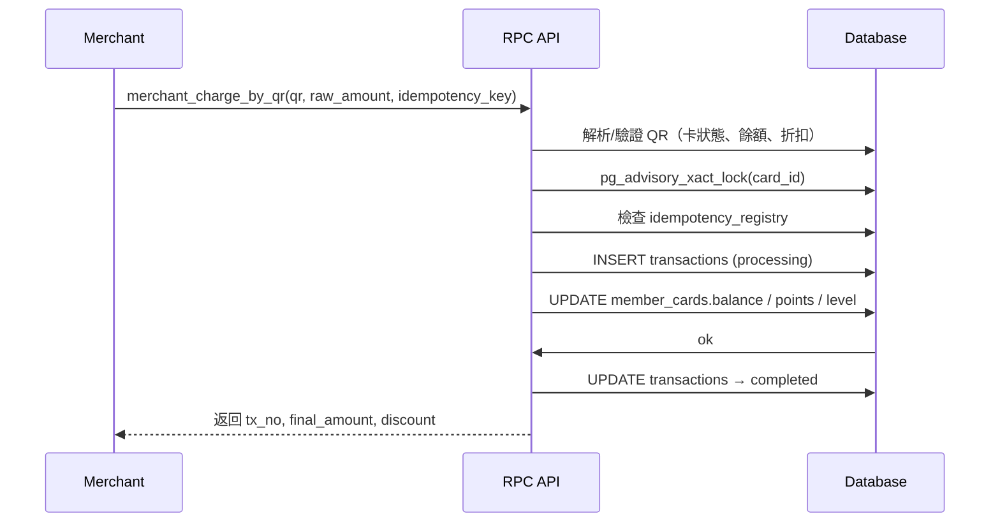

# Supabase RPC Functions 規劃

> 註：目前 schema 僅有基礎表結構，RPC 尚未實作。以下為設計藍圖與審查清單。

---

## 功能分類圖（Mermaid）

```mermaid
flowchart TD
  A[RPC Functions] --> A1[Admin]
  A --> A2[Member]
  A --> A3[Merchant]
  A --> A4[System]

  A1 --> A1a[admin_create_member]
  A1 --> A1b[admin_update_member]
  A1 --> A1c[admin_create_card]
  A1 --> A1d[admin_update_card_status]
  A1 --> A1e[admin_create_merchant]
  A1 --> A1f[admin_add_merchant_user]

  A2 --> A2a[user_get_cards]
  A2 --> A2b[user_rotate_card_qr]
  A2 --> A2c[user_recharge_card]
  A2 --> A2d[user_refund_request]

  A3 --> A3a[merchant_charge_by_qr]
  A3 --> A3b[merchant_refund_tx]
  A3 --> A3c[merchant_get_transactions]
  A3 --> A3d[merchant_get_settlements]

  A4 --> A4a[cron_rotate_qr_codes]
  A4 --> A4b[cron_settlement_daily]
  A4 --> A4c[cron_settlement_monthly]
  A4 --> A4d[cron_expire_cards]
```

---

## 1. Admin Functions

| Function | 功能 | 角色 | 資料表 | 備註 |
|----------|------|------|--------|------|
| **admin_create_member** | 建立新會員（含標準卡） | super_admin, admin | member_profiles, member_cards | 建卡時預設 card_type=standard |
| **admin_update_member** | 更新會員資料 | super_admin, admin | member_profiles | 僅營運可改 |
| **admin_create_card** | 為會員發行新卡（預充/企業/優惠） | super_admin, admin | member_cards | 支援 owner 指定 |
| **admin_update_card_status** | 停用/啟用卡片 | super_admin, admin | member_cards | 支援 lost/suspended/closed |
| **admin_create_merchant** | 建立商戶 | super_admin | merchants | |
| **admin_add_merchant_user** | 綁定商戶操作員 | super_admin | merchant_users | auth.users → merchant_users |

---

## 2. Member Functions

| Function | 功能 | 角色 | 資料表 | 備註 |
|----------|------|------|--------|------|
| **user_get_cards** | 查詢本人卡片 | member | member_cards | 遵守 RLS |
| **user_rotate_card_qr** | 產生卡片支付 QR Code | member | member_cards, card_qr_history | standard: 即時；prepaid/corporate: 允許覆寫 |
| **user_recharge_card** | 為卡片充值 | member | transactions, member_cards | idempotency_key + advisory lock |
| **user_refund_request** | 申請退款 | member | transactions | 產生待審核請求（由 merchant/admin 執行） |

---

## 3. Merchant Functions

| Function | 功能 | 角色 | 資料表 | 備註 |
|----------|------|------|--------|------|
| **merchant_charge_by_qr** | 掃描卡片收款 | merchant | transactions, member_cards | 僅對綁定商戶可見 |
| **merchant_refund_tx** | 執行退款 | merchant | transactions | original_tx_id 關聯 |
| **merchant_get_transactions** | 查詢商戶交易紀錄 | merchant | transactions | 支援時間/狀態篩選 |
| **merchant_get_settlements** | 查詢商戶結算 | merchant | settlements | 支援 Realtime/T+1/Monthly |

---

## 4. System Functions

| Function | 功能 | 說明 | 頻率 |
|----------|------|------|------|
| **cron_rotate_qr_codes** | 自動更新預充/企業卡 QR Code | 防止重用 | 每 5 分鐘 |
| **cron_settlement_daily** | 每日結算（T+1 模式） | 匯總交易 → settlements | 每日 |
| **cron_settlement_monthly** | 每月結算（月結模式） | 匯總交易 → settlements | 每月 |
| **cron_expire_cards** | 定期過期檢查 | 將過期卡設置 expired | 每日 |

---

## 核心交易時序（Mermaid）
> 供 RPC 設計參考：商戶收款

---

## MVP vs 擴充

- **MVP 必備**
  - `admin_create_member`
  - `user_get_cards`
  - `user_rotate_card_qr`
  - `merchant_charge_by_qr`
  - `merchant_refund_tx`

- **擴充功能**
  - `admin_create_merchant`
  - `user_recharge_card`
  - `cron_settlement_daily`
  - `cron_expire_cards`
