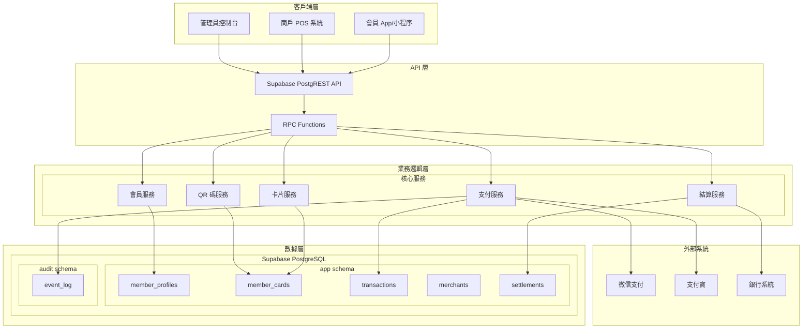
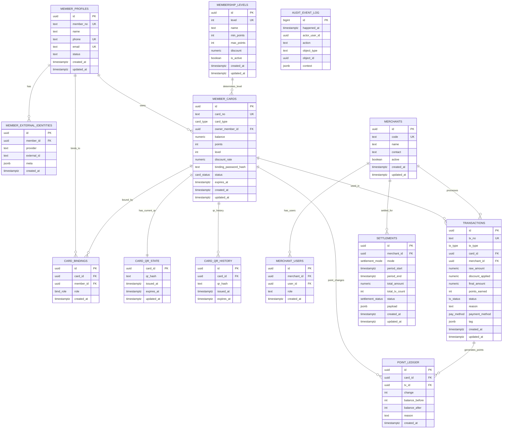
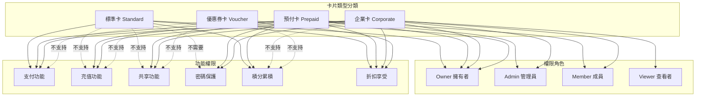
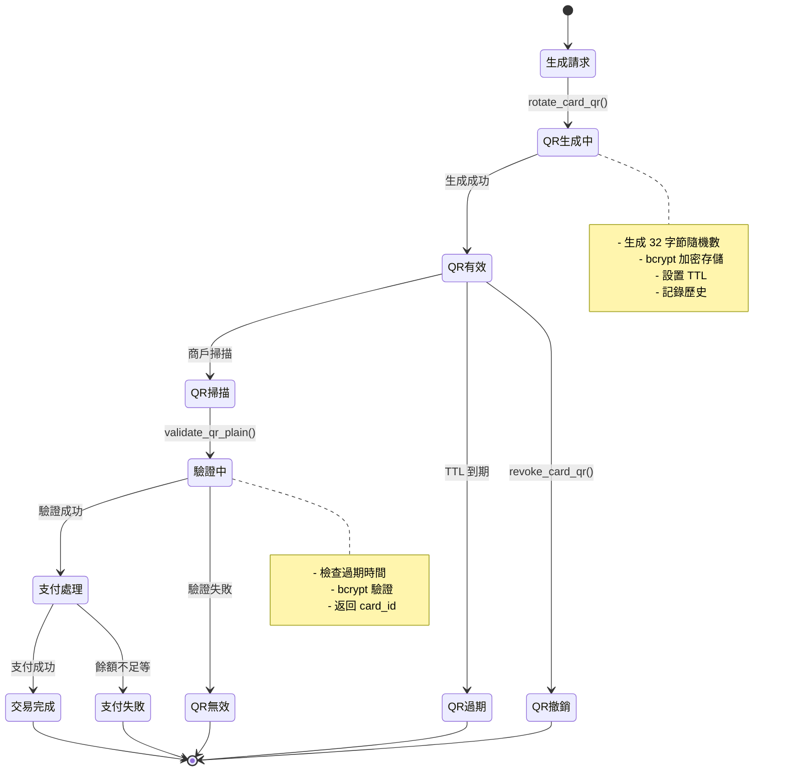

# MPS 系統架構圖集

## 1. 整體系統架構圖



## 2. 數據庫 ER 關係圖



## 3. 卡片類型與權限矩陣



## 4. QR 碼生命週期圖



## 5. 支付流程序列圖

```mermaid
sequenceDiagram
    participant Member as 會員 App
    participant POS as 商戶 POS
    participant API as Supabase API
    participant DB as PostgreSQL
    participant Audit as 審計日誌
    
    Member->>API: rotate_card_qr(card_id, ttl)
    API->>DB: 生成 QR hash 並存儲
    DB-->>API: 返回 plain QR
    API-->>Member: QR 碼數據
    Member->>Member: 顯示 QR 碼
    
    POS->>POS: 掃描 QR 碼
    POS->>API: merchant_charge_by_qr(merchant_code, qr_plain, amount)
    
    API->>DB: validate_qr_plain(qr_plain)
    DB-->>API: 返回 card_id
    
    API->>DB: pg_advisory_xact_lock(card_id)
    Note over DB: 鎖定卡片防止並發
    
    API->>DB: 檢查商戶權限
    API->>DB: 檢查卡片狀態和餘額
    API->>DB: 計算折扣和最終金額
    
    API->>DB: 插入交易記錄 (processing)
    API->>DB: 更新卡片餘額和積分
    API->>DB: 更新交易狀態 (completed)
    API->>Audit: 記錄支付事件
    
    DB-->>API: 交易成功
    API-->>POS: 返回交易結果
    POS->>POS: 顯示支付成功