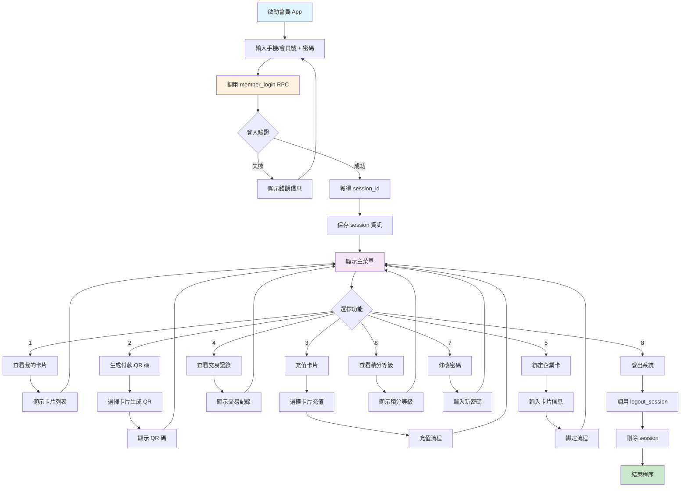
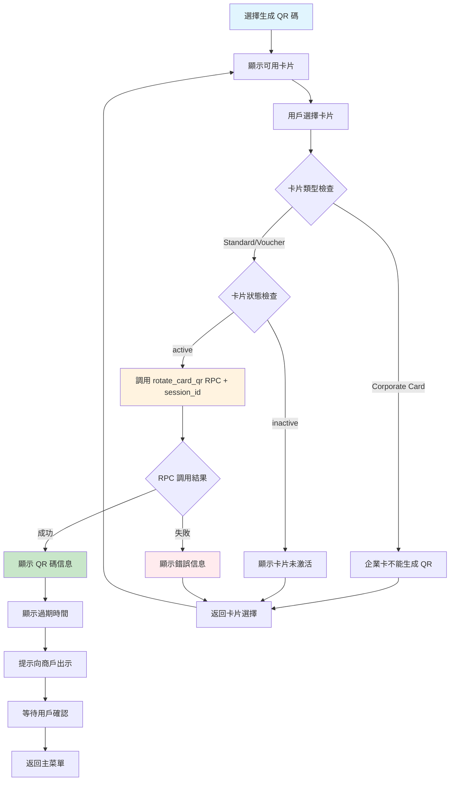
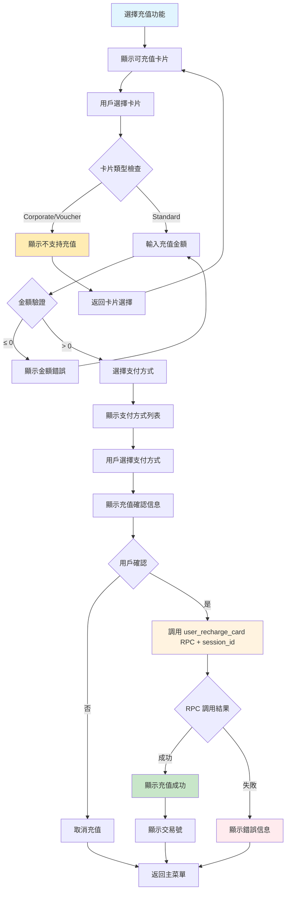
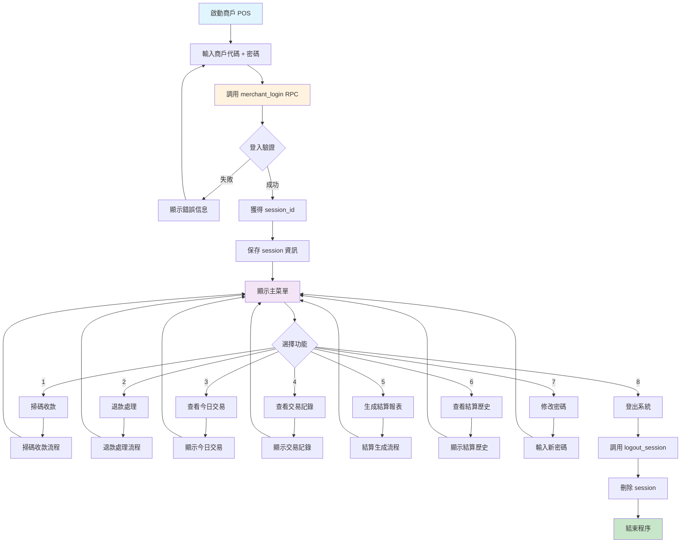
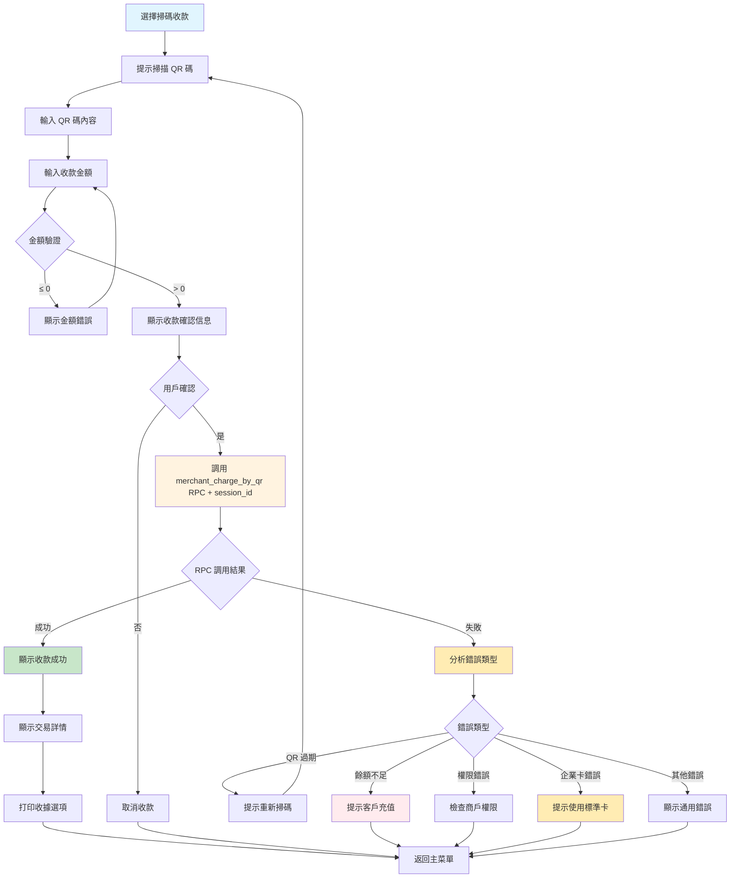
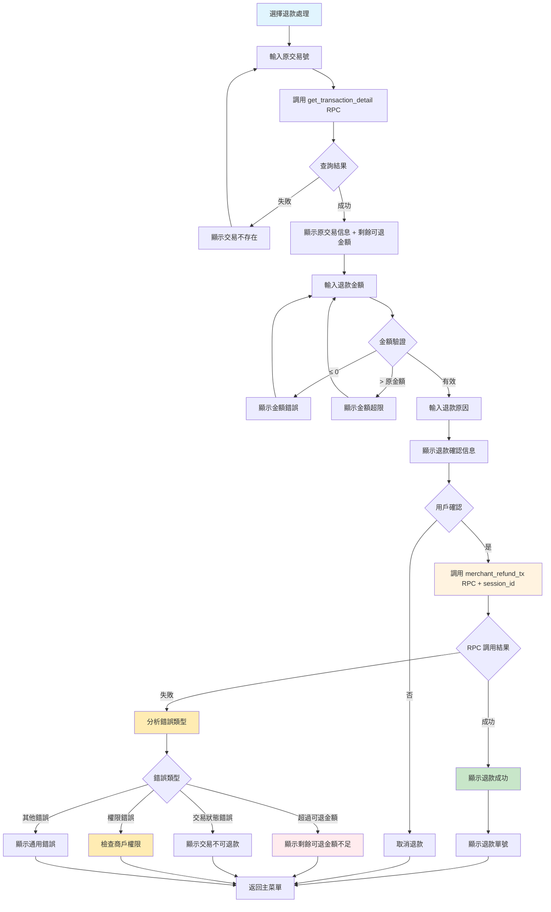
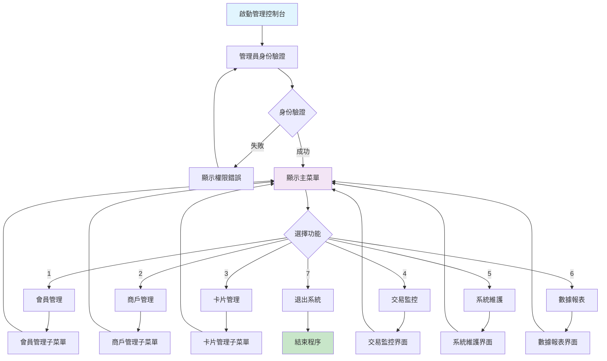
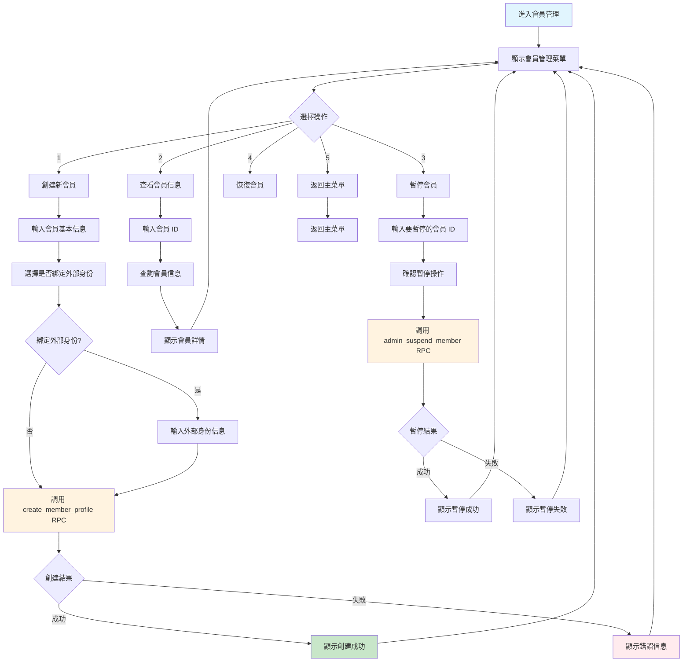
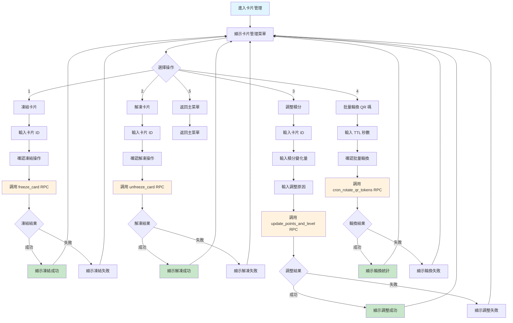

# MPS Python UI 流程圖

## 📋 三個角色的詳細 UI 流程設計

### 👤 會員用戶 UI 流程

#### 登入與主菜單流程


#### 生成 QR 碼詳細流程


#### 充值流程（只支持 Standard Card）


---

### 🏪 商戶用戶 UI 流程

#### 登入與主菜單流程


#### 掃碼收款詳細流程


#### 退款處理詳細流程（支持多次部分退款）


---

### 👨‍💼 管理員 UI 流程

#### 主菜單流程


#### 會員管理詳細流程


#### 卡片管理詳細流程


---

## 🎨 UI 界面設計模板

### 📱 會員界面模板

#### 主菜單界面
```
╔═══════════════════════════════════════╗
║            MPS 會員系統               ║
╠═══════════════════════════════════════╣
║ 會員: 張小明 (M00000001)              ║
║ 登入時間: 2025-01-15 14:30:25         ║
╠═══════════════════════════════════════╣
║ 1. 查看我的卡片                       ║
║ 2. 生成付款 QR 碼                     ║
║ 3. 充值卡片                           ║
║ 4. 查看交易記錄                       ║
║ 5. 綁定新卡片                         ║
║ 6. 查看積分等級                       ║
║ 7. 退出系統                           ║
╚═══════════════════════════════════════╝
請選擇功能 (1-7): _
```

#### 卡片列表界面
```
╔═══════════════════════════════════════════════════════════════╗
║                          我的卡片                             ║
╠═══════════════════════════════════════════════════════════════╣
║ 序號 │ 卡號        │ 類型   │ 餘額      │ 積分   │ 等級   │ 狀態 ║
╠═══════════════════════════════════════════════════════════════╣
║  1   │ STD00000001 │ 標準卡 │  ¥1,250.50│  1,250 │   1    │ 激活 ║
║  2   │ PPD00000123 │ 預付卡 │    ¥500.00│    500 │   0    │ 激活 ║
║  3   │ COR00000456 │ 企業卡 │  ¥2,000.00│      0 │   -    │ 激活 ║
╚═══════════════════════════════════════════════════════════════╝
請選擇卡片 (1-3) 或按 0 返回: _
```

#### QR 碼顯示界面
```
╔═══════════════════════════════════════╗
║              付款 QR 碼               ║
╠═══════════════════════════════════════╣
║ 卡片: STD00000001 (標準卡)            ║
║ 餘額: ¥1,250.50                       ║
╠═══════════════════════════════════════╣
║ QR 碼: ABC123XYZ789...                ║
║ 生成時間: 2025-01-15 14:35:12         ║
║ 過期時間: 2025-01-15 14:50:12         ║
╠═══════════════════════════════════════╣
║ 🔔 請向商戶出示此 QR 碼進行支付       ║
║ ⏰ QR 碼將在 15 分鐘後自動過期        ║
╚═══════════════════════════════════════╝
按任意鍵返回主菜單...
```

### 🏪 商戶界面模板

#### 收款界面
```
╔═══════════════════════════════════════╗
║              掃碼收款                 ║
╠═══════════════════════════════════════╣
║ 商戶: 星巴克咖啡 (SHOP001)            ║
║ 操作員: 李小華                        ║
╠═══════════════════════════════════════╣
║ 1. 請掃描客戶的付款 QR 碼             ║
║                                       ║
║ QR 碼內容: __________________________ ║
║                                       ║
║ 2. 請輸入收款金額                     ║
║                                       ║
║ 金額: ¥ _______________               ║
║                                       ║
╚═══════════════════════════════════════╝
```

#### 收款成功界面
```
╔═══════════════════════════════════════╗
║              收款成功                 ║
╠═══════════════════════════════════════╣
║ 交易號: PAY0000000123                 ║
║ 時間: 2025-01-15 14:35:45             ║
╠═══════════════════════════════════════╣
║ 原金額:                    ¥299.00   ║
║ 會員折扣:                     95%     ║
║ 實收金額:                  ¥284.05   ║
╠═══════════════════════════════════════╣
║ 客戶獲得積分: 299 分                  ║
║ 客戶當前等級: 銀卡會員                ║
╚═══════════════════════════════════════╝
按任意鍵繼續...
```

### 👨‍💼 管理員界面模板

#### 會員創建界面
```
╔═══════════════════════════════════════╗
║              創建新會員               ║
╠═══════════════════════════════════════╣
║ 會員姓名: __________________________ ║
║                                       ║
║ 手機號碼: __________________________ ║
║                                       ║
║ 電子郵件: __________________________ ║
║                                       ║
║ 是否綁定外部身份? (y/n): ____________ ║
║                                       ║
║ 外部平台 (wechat/alipay/line):        ║
║ _____________________________________ ║
║                                       ║
║ 外部用戶 ID:                          ║
║ _____________________________________ ║
╚═══════════════════════════════════════╝
```

#### 系統狀態監控界面
```
╔═══════════════════════════════════════════════════════════════╗
║                        系統狀態監控                           ║
╠═══════════════════════════════════════════════════════════════╣
║ 系統時間: 2025-01-15 14:35:45                                 ║
║ 運行時間: 15 天 8 小時 23 分鐘                                ║
╠═══════════════════════════════════════════════════════════════╣
║ 📊 今日統計                                                   ║
║ ├─ 總交易數: 1,234 筆                                         ║
║ ├─ 成功支付: 1,198 筆 (97.1%)                                ║
║ ├─ 失敗支付: 36 筆 (2.9%)                                    ║
║ ├─ 退款交易: 15 筆                                            ║
║ └─ 充值交易: 89 筆                                            ║
╠═══════════════════════════════════════════════════════════════╣
║ 🎯 活躍統計                                                   ║
║ ├─ 活躍會員: 8,567 人                                         ║
║ ├─ 活躍商戶: 234 家                                           ║
║ ├─ 活躍卡片: 12,345 張                                        ║
║ └─ QR 碼生成: 2,456 次                                        ║
╠═══════════════════════════════════════════════════════════════╣
║ ⚠️  系統告警                                                  ║
║ ├─ 無異常                                                     ║
╚═══════════════════════════════════════════════════════════════╝
按 R 刷新 | 按 Q 退出
```

---

## 🔧 具體功能實現流程

### 📋 會員端功能流程

#### 1. 查看交易記錄流程
```python
def view_member_transactions(member_id: str):
    """查看會員交易記錄"""
    print("┌─────────────────────────────────────┐")
    print("│            交易記錄查詢             │")
    print("└─────────────────────────────────────┘")
    
    # 設置查詢參數
    limit = 20
    offset = 0
    
    while True:
        try:
            # 調用 get_member_transactions RPC
            result = rpc("get_member_transactions", {
                "p_member_id": member_id,
                "p_limit": limit,
                "p_offset": offset
            })
            
            if not result:
                print("📝 暫無交易記錄")
                break
            
            # 顯示交易記錄
            print("┌─────────────────────────────────────────────────────────────────────┐")
            print("│                              交易記錄                               │")
            print("├─────────────────────────────────────────────────────────────────────┤")
            print("│ 交易號        │ 類型   │ 金額      │ 狀態     │ 時間              │")
            print("├─────────────────────────────────────────────────────────────────────┤")
            
            for tx in result:
                print(f"│ {tx['tx_no']:<12} │ {tx['tx_type']:<6} │ ¥{tx['final_amount']:>8.2f} │ {tx['status']:<8} │ {tx['created_at']:<17} │")
            
            print("└─────────────────────────────────────────────────────────────────────┘")
            
            # 分頁控制
            total_count = result[0].get('total_count', 0) if result else 0
            current_page = offset // limit + 1
            total_pages = (total_count + limit - 1) // limit
            
            print(f"第 {current_page} 頁，共 {total_pages} 頁 (總計 {total_count} 筆)")
            
            if total_pages > 1:
                action = input("N-下一頁 | P-上一頁 | Q-退出: ").upper()
                if action == 'N' and current_page < total_pages:
                    offset += limit
                elif action == 'P' and current_page > 1:
                    offset -= limit
                elif action == 'Q':
                    break
            else:
                input("按任意鍵返回...")
                break
                
        except Exception as e:
            print(f"❌ 查詢失敗: {e}")
            break
```

#### 2. 綁定新卡片流程
```python
def bind_new_card(member_id: str):
    """綁定新卡片流程"""
    print("┌─────────────────────────────────────┐")
    print("│            綁定新卡片               │")
    print("└─────────────────────────────────────┘")
    
    # 輸入卡片 ID
    card_id = input("請輸入卡片 ID: ")
    
    # 選擇綁定角色
    roles = ["member", "viewer"]
    print("\n可選角色:")
    for i, role in enumerate(roles, 1):
        role_desc = "成員" if role == "member" else "查看者"
        print(f"{i}. {role} ({role_desc})")
    
    while True:
        try:
            choice = int(input("請選擇角色 (1-2): "))
            if 1 <= choice <= 2:
                selected_role = roles[choice - 1]
                break
            print("❌ 請選擇 1-2")
        except ValueError:
            print("❌ 請輸入有效數字")
    
    # 輸入綁定密碼（如果需要）
    binding_password = input("請輸入綁定密碼 (如果卡片設置了密碼): ")
    
    # 確認綁定
    print(f"\n綁定信息確認:")
    print(f"卡片 ID: {card_id}")
    print(f"綁定角色: {selected_role}")
    confirm = input("確認綁定？(y/n): ")
    
    if confirm.lower() != 'y':
        print("❌ 綁定已取消")
        return
    
    try:
        # 調用 bind_member_to_card RPC
        result = rpc("bind_member_to_card", {
            "p_card_id": card_id,
            "p_member_id": member_id,
            "p_role": selected_role,
            "p_binding_password": binding_password if binding_password else None
        })
        
        if result:
            print("✅ 卡片綁定成功！")
        else:
            print("❌ 卡片綁定失敗")
            
    except Exception as e:
        error_msg = str(e)
        if "CARD_TYPE_NOT_SHAREABLE" in error_msg:
            print("❌ 此類型卡片不支持共享")
        elif "INVALID_BINDING_PASSWORD" in error_msg:
            print("❌ 綁定密碼錯誤")
        elif "CARD_NOT_FOUND_OR_INACTIVE" in error_msg:
            print("❌ 卡片不存在或未激活")
        else:
            print(f"❌ 綁定失敗: {error_msg}")
```

### 🏪 商戶端功能流程

#### 1. 查看今日交易
```python
def view_today_transactions(merchant_id: str):
    """查看今日交易"""
    from datetime import datetime, time
    
    print("┌─────────────────────────────────────┐")
    print("│            今日交易統計             │")
    print("└─────────────────────────────────────┘")
    
    # 設置今日時間範圍
    today = datetime.now().date()
    start_time = datetime.combine(today, time.min)
    end_time = datetime.combine(today, time.max)
    
    try:
        # 調用 get_merchant_transactions RPC
        result = rpc("get_merchant_transactions", {
            "p_merchant_id": merchant_id,
            "p_limit": 100,
            "p_offset": 0,
            "p_start_date": start_time.isoformat(),
            "p_end_date": end_time.isoformat()
        })
        
        if not result:
            print("📝 今日暫無交易記錄")
            return
        
        # 統計數據
        total_count = 0
        payment_count = 0
        refund_count = 0
        total_amount = 0
        payment_amount = 0
        refund_amount = 0
        
        for tx in result:
            total_count += 1
            if tx['tx_type'] == 'payment':
                payment_count += 1
                payment_amount += tx['final_amount']
            elif tx['tx_type'] == 'refund':
                refund_count += 1
                refund_amount += tx['final_amount']
            total_amount += tx['final_amount']
        
        # 顯示統計信息
        print("┌─────────────────────────────────────┐")
        print("│            今日交易統計             │")
        print("├─────────────────────────────────────┤")
        print(f"│ 總交易數: {total_count:>25} 筆 │")
        print(f"│ 支付交易: {payment_count:>25} 筆 │")
        print(f"│ 退款交易: {refund_count:>25} 筆 │")
        print("├─────────────────────────────────────┤")
        print(f"│ 支付金額: ¥{payment_amount:>24.2f} │")
        print(f"│ 退款金額: ¥{refund_amount:>24.2f} │")
        print(f"│ 淨收入: ¥{payment_amount - refund_amount:>26.2f} │")
        print("└─────────────────────────────────────┘")
        
        # 顯示詳細交易列表
        show_detail = input("是否查看詳細交易列表？(y/n): ")
        if show_detail.lower() == 'y':
            print("\n詳細交易記錄:")
            print("┌─────────────────────────────────────────────────────────────────────┐")
            print("│ 交易號        │ 類型   │ 金額      │ 狀態     │ 時間              │")
            print("├─────────────────────────────────────────────────────────────────────┤")
            
            for tx in result:
                print(f"│ {tx['tx_no']:<12} │ {tx['tx_type']:<6} │ ¥{tx['final_amount']:>8.2f} │ {tx['status']:<8} │ {tx['created_at']:<17} │")
            
            print("└─────────────────────────────────────────────────────────────────────┘")
        
    except Exception as e:
        print(f"❌ 查詢失敗: {e}")
```

#### 2. 生成結算報表
```python
def generate_settlement_report(merchant_id: str):
    """生成結算報表"""
    print("┌─────────────────────────────────────┐")
    print("│            生成結算報表             │")
    print("└─────────────────────────────────────┘")
    
    # 選擇結算模式
    modes = ["realtime", "t_plus_1", "monthly"]
    mode_names = ["實時結算", "T+1結算", "月結算"]
    
    print("\n結算模式:")
    for i, (mode, name) in enumerate(zip(modes, mode_names), 1):
        print(f"{i}. {name} ({mode})")
    
    while True:
        try:
            choice = int(input("請選擇結算模式 (1-3): "))
            if 1 <= choice <= 3:
                selected_mode = modes[choice - 1]
                break
            print("❌ 請選擇 1-3")
        except ValueError:
            print("❌ 請輸入有效數字")
    
    # 輸入結算期間
    print("\n請輸入結算期間:")
    start_date = input("開始日期 (YYYY-MM-DD): ")
    end_date = input("結束日期 (YYYY-MM-DD): ")
    
    try:
        # 調用 generate_settlement RPC
        settlement_id = rpc("generate_settlement", {
            "p_merchant_id": merchant_id,
            "p_mode": selected_mode,
            "p_period_start": f"{start_date}T00:00:00Z",
            "p_period_end": f"{end_date}T23:59:59Z"
        })
        
        print(f"✅ 結算報表生成成功！")
        print(f"📋 結算 ID: {settlement_id}")
        
        # 查詢結算詳情
        settlements = rpc("list_settlements", {
            "p_merchant_id": merchant_id,
            "p_limit": 1,
            "p_offset": 0
        })
        
        if settlements:
            settlement = settlements[0]
            print("┌─────────────────────────────────────┐")
            print("│            結算報表詳情             │")
            print("├─────────────────────────────────────┤")
            print(f"│ 結算期間: {start_date} ~ {end_date} │")
            print(f"│ 結算模式: {mode_names[modes.index(selected_mode)]:<23} │")
            print(f"│ 交易筆數: {settlement['total_tx_count']:>25} │")
            print(f"│ 結算金額: ¥{settlement['total_amount']:>24.2f} │")
            print(f"│ 結算狀態: {settlement['status']:<23} │")
            print("└─────────────────────────────────────┘")
        
    except Exception as e:
        print(f"❌ 結算生成失敗: {e}")
```

---

## 🎯 開發實現建議

### 1. 最小可行產品 (MVP) 功能
- **會員端**: 查看卡片 + 生成 QR 碼 + 充值
- **商戶端**: 掃碼收款 + 簡單退款
- **管理端**: 創建會員 + 凍結卡片

### 2. 技術實現重點
- 基於現有 RPC 函數，不需要額外的後端開發
- 使用簡潔的 ASCII 界面，易於在終端中使用
- 完善的錯誤處理，對應 RPC 的各種錯誤碼
- 輸入驗證和操作確認，提升用戶體驗

### 3. 擴展方向
- 添加簡單的數據可視化（ASCII 圖表）
- 支持配置文件管理不同環境
- 添加日誌記錄功能
- 支持批量操作

這個設計完全基於現有的 RPC 功能，提供了實用的文字 UI 來操作 MPS 系統，既不會超出現有範疇，又能滿足基本的業務操作需求。