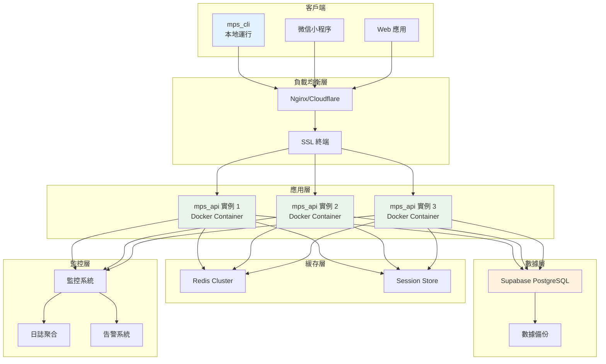

# MPS API 部署和運維指南

## 📋 部署概述

本文檔提供 MPS API 服務的完整部署方案，包括開發環境、測試環境和生產環境的配置，以及日常運維的最佳實踐。

## 🏗️ 部署架構

### 📊 整體部署架構圖



---

## 🐳 Docker 部署方案

### 1. Dockerfile 設計

#### mps_api/Dockerfile
```dockerfile
FROM python:3.11-slim

# 設置工作目錄
WORKDIR /app

# 安裝系統依賴
RUN apt-get update && apt-get install -y \
    gcc \
    && rm -rf /var/lib/apt/lists/*

# 複製依賴文件
COPY requirements.txt .

# 安裝 Python 依賴
RUN pip install --no-cache-dir -r requirements.txt

# 複製應用代碼
COPY . .

# 創建非 root 用戶
RUN useradd --create-home --shell /bin/bash app \
    && chown -R app:app /app
USER app

# 創建日誌目錄
RUN mkdir -p logs

# 暴露端口
EXPOSE 8000

# 健康檢查
HEALTHCHECK --interval=30s --timeout=10s --start-period=5s --retries=3 \
    CMD curl -f http://localhost:8000/health || exit 1

# 啟動命令
CMD ["uvicorn", "main:app", "--host", "0.0.0.0", "--port", "8000", "--workers", "4"]
```

### 2. Docker Compose 配置

#### docker-compose.yml
```yaml
version: '3.8'

services:
  mps_api:
    build: 
      context: ./mps_api
      dockerfile: Dockerfile
    ports:
      - "8000:8000"
    environment:
      - SUPABASE_URL=${SUPABASE_URL}
      - SUPABASE_SERVICE_ROLE_KEY=${SUPABASE_SERVICE_ROLE_KEY}
      - JWT_SECRET=${JWT_SECRET}
      - REDIS_URL=redis://redis:6379
      - LOG_LEVEL=INFO
    volumes:
      - ./logs:/app/logs
      - ./config:/app/config
    depends_on:
      - redis
    restart: unless-stopped
    networks:
      - mps_network
    healthcheck:
      test: ["CMD", "curl", "-f", "http://localhost:8000/health"]
      interval: 30s
      timeout: 10s
      retries: 3
      start_period: 40s

  redis:
    image: redis:7-alpine
    ports:
      - "6379:6379"
    volumes:
      - redis_data:/data
    restart: unless-stopped
    networks:
      - mps_network
    command: redis-server --appendonly yes

  nginx:
    image: nginx:alpine
    ports:
      - "80:80"
      - "443:443"
    volumes:
      - ./nginx.conf:/etc/nginx/nginx.conf
      - ./ssl:/etc/nginx/ssl
    depends_on:
      - mps_api
    restart: unless-stopped
    networks:
      - mps_network

volumes:
  redis_data:

networks:
  mps_network:
    driver: bridge
```

### 3. Nginx 配置

#### nginx.conf
```nginx
events {
    worker_connections 1024;
}

http {
    upstream mps_api {
        server mps_api:8000;
        # 如果有多個實例
        # server mps_api_2:8000;
        # server mps_api_3:8000;
    }
    
    # 限流配置
    limit_req_zone $binary_remote_addr zone=api_limit:10m rate=10r/s;
    
    server {
        listen 80;
        server_name your-api-domain.com;
        
        # 重定向到 HTTPS
        return 301 https://$server_name$request_uri;
    }
    
    server {
        listen 443 ssl http2;
        server_name your-api-domain.com;
        
        # SSL 配置
        ssl_certificate /etc/nginx/ssl/cert.pem;
        ssl_certificate_key /etc/nginx/ssl/key.pem;
        ssl_protocols TLSv1.2 TLSv1.3;
        ssl_ciphers HIGH:!aNULL:!MD5;
        
        # 安全頭
        add_header X-Frame-Options DENY;
        add_header X-Content-Type-Options nosniff;
        add_header X-XSS-Protection "1; mode=block";
        add_header Strict-Transport-Security "max-age=31536000; includeSubDomains";
        
        # API 代理
        location / {
            # 限流
            limit_req zone=api_limit burst=20 nodelay;
            
            proxy_pass http://mps_api;
            proxy_set_header Host $host;
            proxy_set_header X-Real-IP $remote_addr;
            proxy_set_header X-Forwarded-For $proxy_add_x_forwarded_for;
            proxy_set_header X-Forwarded-Proto $scheme;
            
            # 超時設置
            proxy_connect_timeout 5s;
            proxy_send_timeout 60s;
            proxy_read_timeout 60s;
            
            # 緩存設置 (僅對 GET 請求)
            location ~* ^/member/cards|/merchant/transactions|/admin/statistics {
                proxy_cache_valid 200 5m;
                proxy_cache_key "$scheme$request_method$host$request_uri";
                add_header X-Cache-Status $upstream_cache_status;
            }
        }
        
        # 健康檢查端點
        location /health {
            proxy_pass http://mps_api/health;
            access_log off;
        }
    }
}
```

---

## 🌍 環境配置

### 1. 開發環境

#### mps_api/.env.development
```bash
# API 服務配置
API_HOST=127.0.0.1
API_PORT=8000
API_DEBUG=true
API_RELOAD=true

# Supabase 配置
SUPABASE_URL=https://your-dev-project.supabase.co
SUPABASE_SERVICE_ROLE_KEY=your-dev-service-role-key

# JWT 配置
JWT_SECRET=dev-jwt-secret-key-min-32-characters
JWT_EXPIRE_HOURS=24

# Redis 配置
REDIS_URL=redis://localhost:6379
REDIS_DB=0

# 日誌配置
LOG_LEVEL=DEBUG
LOG_FILE=logs/mps_api_dev.log

# CORS 配置
CORS_ORIGINS=["http://localhost:3000", "http://127.0.0.1:3000"]
```

#### mps_cli/.env.development
```bash
# API 服務配置
API_BASE_URL=http://127.0.0.1:8000
API_TIMEOUT=30
API_RETRY_COUNT=3

# UI 配置
UI_PAGE_SIZE=20
QR_TTL_SECONDS=900
SHOW_COLORS=true

# 日誌配置
LOG_LEVEL=DEBUG
LOG_FILE=logs/mps_cli_dev.log
```

### 2. 測試環境

#### mps_api/.env.testing
```bash
# API 服務配置
API_HOST=0.0.0.0
API_PORT=8000
API_DEBUG=false
API_RELOAD=false

# Supabase 配置
SUPABASE_URL=https://your-test-project.supabase.co
SUPABASE_SERVICE_ROLE_KEY=your-test-service-role-key

# JWT 配置
JWT_SECRET=test-jwt-secret-key-min-32-characters
JWT_EXPIRE_HOURS=12

# Redis 配置
REDIS_URL=redis://redis:6379
REDIS_DB=1

# 日誌配置
LOG_LEVEL=INFO
LOG_FILE=logs/mps_api_test.log

# 限流配置
RATE_LIMIT_REQUESTS=100
RATE_LIMIT_WINDOW=60
```

### 3. 生產環境

#### mps_api/.env.production
```bash
# API 服務配置
API_HOST=0.0.0.0
API_PORT=8000
API_DEBUG=false
API_WORKERS=4

# Supabase 配置
SUPABASE_URL=https://your-prod-project.supabase.co
SUPABASE_SERVICE_ROLE_KEY=${SUPABASE_SERVICE_ROLE_KEY}

# JWT 配置
JWT_SECRET=${JWT_SECRET}
JWT_EXPIRE_HOURS=24

# Redis 配置
REDIS_URL=${REDIS_URL}
REDIS_DB=0
REDIS_PASSWORD=${REDIS_PASSWORD}

# 日誌配置
LOG_LEVEL=INFO
LOG_FILE=logs/mps_api.log
LOG_MAX_SIZE=100MB
LOG_BACKUP_COUNT=10

# 安全配置
CORS_ORIGINS=${CORS_ORIGINS}
RATE_LIMIT_REQUESTS=1000
RATE_LIMIT_WINDOW=60

# 監控配置
SENTRY_DSN=${SENTRY_DSN}
METRICS_ENABLED=true
```

---

## 🚀 部署流程

### 1. 開發環境部署

```bash
# 1. 克隆項目
git clone <repository_url>
cd MemberPaymentSystem

# 2. 設置 API 服務
cd mps_api
python -m venv venv
source venv/bin/activate  # Windows: venv\Scripts\activate
pip install -r requirements.txt

# 3. 配置環境變量
cp .env.example .env.development
# 編輯 .env.development，填入開發環境配置

# 4. 啟動 API 服務
uvicorn main:app --reload --host 127.0.0.1 --port 8000

# 5. 測試 API 服務
curl http://127.0.0.1:8000/health

# 6. 配置 CLI 客戶端
cd ../mps_cli
cp .env.example .env.development
# 編輯 .env.development，設置 API_BASE_URL=http://127.0.0.1:8000

# 7. 測試 CLI 連接
python main.py test
```

### 2. 生產環境部署

#### 使用 Docker Compose
```bash
# 1. 準備生產配置
cp .env.example .env.production
# 編輯 .env.production，填入生產環境配置

# 2. 構建和啟動服務
docker-compose -f docker-compose.prod.yml up -d

# 3. 檢查服務狀態
docker-compose ps
docker-compose logs mps_api

# 4. 健康檢查
curl https://your-api-domain.com/health
```

#### 使用 Kubernetes
```yaml
# k8s/deployment.yaml
apiVersion: apps/v1
kind: Deployment
metadata:
  name: mps-api
  labels:
    app: mps-api
spec:
  replicas: 3
  selector:
    matchLabels:
      app: mps-api
  template:
    metadata:
      labels:
        app: mps-api
    spec:
      containers:
      - name: mps-api
        image: mps-api:latest
        ports:
        - containerPort: 8000
        env:
        - name: SUPABASE_URL
          valueFrom:
            secretKeyRef:
              name: mps-secrets
              key: supabase-url
        - name: SUPABASE_SERVICE_ROLE_KEY
          valueFrom:
            secretKeyRef:
              name: mps-secrets
              key: supabase-service-role-key
        - name: JWT_SECRET
          valueFrom:
            secretKeyRef:
              name: mps-secrets
              key: jwt-secret
        resources:
          requests:
            memory: "256Mi"
            cpu: "250m"
          limits:
            memory: "512Mi"
            cpu: "500m"
        livenessProbe:
          httpGet:
            path: /health
            port: 8000
          initialDelaySeconds: 30
          periodSeconds: 10
        readinessProbe:
          httpGet:
            path: /health
            port: 8000
          initialDelaySeconds: 5
          periodSeconds: 5

---
apiVersion: v1
kind: Service
metadata:
  name: mps-api-service
spec:
  selector:
    app: mps-api
  ports:
    - protocol: TCP
      port: 80
      targetPort: 8000
  type: LoadBalancer
```

---

## 📊 監控和日誌

### 1. 應用監控

#### 關鍵指標
```python
# main.py - 添加監控中間件
from prometheus_client import Counter, Histogram, generate_latest
import time

# 指標定義
REQUEST_COUNT = Counter('mps_api_requests_total', 'Total requests', ['method', 'endpoint', 'status'])
REQUEST_DURATION = Histogram('mps_api_request_duration_seconds', 'Request duration', ['method', 'endpoint'])
RPC_CALL_COUNT = Counter('mps_api_rpc_calls_total', 'Total RPC calls', ['function_name', 'status'])
AUTH_ATTEMPTS = Counter('mps_api_auth_attempts_total', 'Authentication attempts', ['role', 'status'])

@app.middleware("http")
async def monitor_requests(request: Request, call_next):
    start_time = time.time()
    
    response = await call_next(request)
    
    # 記錄指標
    REQUEST_COUNT.labels(
        method=request.method,
        endpoint=request.url.path,
        status=response.status_code
    ).inc()
    
    REQUEST_DURATION.labels(
        method=request.method,
        endpoint=request.url.path
    ).observe(time.time() - start_time)
    
    return response

@app.get("/metrics")
async def get_metrics():
    """Prometheus 指標端點"""
    return Response(generate_latest(), media_type="text/plain")
```

#### 健康檢查端點
```python
# api/common.py
@router.get("/health")
async def health_check():
    """健康檢查"""
    try:
        # 檢查數據庫連接
        supabase = create_client(settings.supabase.url, settings.supabase.service_role_key)
        result = supabase.table("member_profiles").select("id").limit(1).execute()
        
        # 檢查 Redis 連接
        redis_client = redis.from_url(settings.redis.url)
        redis_client.ping()
        
        return {
            "status": "healthy",
            "timestamp": datetime.utcnow().isoformat(),
            "version": "1.0.0",
            "services": {
                "database": "connected",
                "redis": "connected"
            }
        }
        
    except Exception as e:
        logger.error(f"健康檢查失敗: {e}")
        raise HTTPException(status_code=503, detail="Service Unavailable")

@router.get("/ready")
async def readiness_check():
    """就緒檢查"""
    return {"status": "ready", "timestamp": datetime.utcnow().isoformat()}
```

### 2. 日誌管理

#### 結構化日誌配置
```python
# utils/logger.py
import logging
import json
from datetime import datetime

class StructuredFormatter(logging.Formatter):
    def format(self, record):
        log_entry = {
            "timestamp": datetime.utcnow().isoformat(),
            "level": record.levelname,
            "logger": record.name,
            "message": record.getMessage(),
            "module": record.module,
            "function": record.funcName,
            "line": record.lineno
        }
        
        # 添加額外字段
        if hasattr(record, 'user_id'):
            log_entry['user_id'] = record.user_id
        if hasattr(record, 'request_id'):
            log_entry['request_id'] = record.request_id
        if hasattr(record, 'operation'):
            log_entry['operation'] = record.operation
        
        return json.dumps(log_entry, ensure_ascii=False)

def setup_logging():
    """設置結構化日誌"""
    formatter = StructuredFormatter()
    
    # 文件處理器
    file_handler = RotatingFileHandler(
        settings.logging.file_path,
        maxBytes=100*1024*1024,  # 100MB
        backupCount=10,
        encoding='utf-8'
    )
    file_handler.setFormatter(formatter)
    
    # 控制台處理器
    console_handler = logging.StreamHandler()
    console_handler.setFormatter(logging.Formatter(
        '%(asctime)s - %(name)s - %(levelname)s - %(message)s'
    ))
    
    # 配置根日誌器
    logging.basicConfig(
        level=getattr(logging, settings.logging.level.upper()),
        handlers=[file_handler, console_handler]
    )
```

#### 業務日誌記錄
```python
# 在各個服務中添加業務日誌
class MemberService:
    def __init__(self):
        self.logger = get_logger(__name__)
    
    async def generate_qr_code(self, card_id: str, user_id: str):
        # 記錄業務操作
        self.logger.info(
            "生成 QR 碼",
            extra={
                'user_id': user_id,
                'operation': 'generate_qr',
                'card_id': card_id,
                'request_id': str(uuid.uuid4())
            }
        )
        
        try:
            result = self.supabase.rpc("rotate_card_qr", {...})
            
            self.logger.info(
                "QR 碼生成成功",
                extra={
                    'user_id': user_id,
                    'operation': 'generate_qr_success',
                    'card_id': card_id,
                    'qr_expires_at': result.data[0]['qr_expires_at']
                }
            )
            
            return result
            
        except Exception as e:
            self.logger.error(
                "QR 碼生成失敗",
                extra={
                    'user_id': user_id,
                    'operation': 'generate_qr_error',
                    'card_id': card_id,
                    'error': str(e)
                }
            )
            raise
```

---

## 🔒 安全配置

### 1. JWT 安全設置

#### 強密鑰生成
```bash
# 生成安全的 JWT 密鑰
python -c "import secrets; print(secrets.token_urlsafe(32))"
```

#### Token 安全配置
```python
# auth/jwt_handler.py
class JWTHandler:
    def __init__(self):
        self.secret = settings.jwt.secret
        self.algorithm = "HS256"
        self.expire_hours = settings.jwt.expire_hours
        
        # 驗證密鑰強度
        if len(self.secret) < 32:
            raise ValueError("JWT 密鑰長度必須至少 32 字符")
    
    def generate_token(self, payload: Dict) -> str:
        """生成 JWT Token"""
        # 添加安全字段
        payload.update({
            "iat": datetime.utcnow(),
            "exp": datetime.utcnow() + timedelta(hours=self.expire_hours),
            "iss": "mps_api",  # 簽發者
            "aud": "mps_clients",  # 受眾
            "jti": str(uuid.uuid4())  # JWT ID
        })
        
        return jwt.encode(payload, self.secret, algorithm=self.algorithm)
    
    def verify_token(self, token: str) -> Optional[Dict]:
        """驗證 JWT Token"""
        try:
            payload = jwt.decode(
                token, 
                self.secret, 
                algorithms=[self.algorithm],
                audience="mps_clients",
                issuer="mps_api"
            )
            return payload
        except jwt.ExpiredSignatureError:
            logger.warning("Token 已過期")
            return None
        except jwt.InvalidAudienceError:
            logger.warning("Token 受眾無效")
            return None
        except jwt.InvalidIssuerError:
            logger.warning("Token 簽發者無效")
            return None
        except jwt.InvalidTokenError as e:
            logger.warning(f"Token 無效: {e}")
            return None
```

### 2. API 安全中間件

#### 限流中間件
```python
# middleware/rate_limit.py
from slowapi import Limiter, _rate_limit_exceeded_handler
from slowapi.util import get_remote_address
from slowapi.errors import RateLimitExceeded

limiter = Limiter(key_func=get_remote_address)

# 在 main.py 中應用
app.state.limiter = limiter
app.add_exception_handler(RateLimitExceeded, _rate_limit_exceeded_handler)

# 在路由中使用
@router.post("/auth/login")
@limiter.limit("5/minute")  # 每分鐘最多 5 次登入嘗試
async def login(request: Request, login_data: LoginRequest):
    # ...
```

#### 安全頭中間件
```python
# middleware/security.py
@app.middleware("http")
async def add_security_headers(request: Request, call_next):
    response = await call_next(request)
    
    # 添加安全頭
    response.headers["X-Content-Type-Options"] = "nosniff"
    response.headers["X-Frame-Options"] = "DENY"
    response.headers["X-XSS-Protection"] = "1; mode=block"
    response.headers["Strict-Transport-Security"] = "max-age=31536000; includeSubDomains"
    response.headers["Referrer-Policy"] = "strict-origin-when-cross-origin"
    
    return response
```

---

## 📈 性能優化

### 1. 緩存策略

#### Redis 緩存配置
```python
# config/cache.py
import redis
import json
import pickle
from typing import Any, Optional

class CacheService:
    def __init__(self):
        self.redis_client = redis.from_url(settings.redis.url)
        self.default_ttl = 300  # 5分鐘
    
    async def get(self, key: str) -> Optional[Any]:
        """獲取緩存"""
        try:
            data = self.redis_client.get(key)
            if data:
                return pickle.loads(data)
            return None
        except Exception as e:
            logger.error(f"緩存獲取失敗: {key}, 錯誤: {e}")
            return None
    
    async def set(self, key: str, value: Any, ttl: int = None) -> bool:
        """設置緩存"""
        try:
            ttl = ttl or self.default_ttl
            data = pickle.dumps(value)
            return self.redis_client.setex(key, ttl, data)
        except Exception as e:
            logger.error(f"緩存設置失敗: {key}, 錯誤: {e}")
            return False
    
    async def delete(self, key: str) -> bool:
        """刪除緩存"""
        try:
            return bool(self.redis_client.delete(key))
        except Exception as e:
            logger.error(f"緩存刪除失敗: {key}, 錯誤: {e}")
            return False
    
    def cache_key(self, prefix: str, *args) -> str:
        """生成緩存鍵"""
        return f"mps:{prefix}:{':'.join(str(arg) for arg in args)}"

# 在服務中使用緩存
class MemberService:
    def __init__(self):
        self.cache = CacheService()
    
    async def get_member_cards(self, member_id: str) -> List[Dict]:
        # 檢查緩存
        cache_key = self.cache.cache_key("member_cards", member_id)
        cached_cards = await self.cache.get(cache_key)
        
        if cached_cards:
            logger.debug(f"從緩存獲取會員卡片: {member_id}")
            return cached_cards
        
        # 查詢數據庫
        cards = await self._fetch_member_cards_from_db(member_id)
        
        # 設置緩存
        await self.cache.set(cache_key, cards, ttl=300)
        
        return cards
```

### 2. 數據庫連接優化

#### 連接池配置
```python
# config/database.py
from supabase import create_client
import asyncpg
from typing import Optional

class DatabaseManager:
    def __init__(self):
        self.supabase = create_client(
            settings.supabase.url,
            settings.supabase.service_role_key
        )
        self.pool: Optional[asyncpg.Pool] = None
    
    async def init_pool(self):
        """初始化連接池"""
        self.pool = await asyncpg.create_pool(
            settings.supabase.database_url,
            min_size=5,
            max_size=20,
            command_timeout=60
        )
    
    async def execute_rpc(self, function_name: str, params: Dict) -> Any:
        """執行 RPC 函數"""
        if self.pool:
            # 使用連接池
            async with self.pool.acquire() as conn:
                result = await conn.fetchval(f"SELECT {function_name}($1)", json.dumps(params))
                return json.loads(result) if result else None
        else:
            # 使用 Supabase 客戶端
            result = self.supabase.rpc(function_name, params).execute()
            return result.data
```

---

## 🔧 運維操作

### 1. 日常維護

#### 服務重啟
```bash
# Docker Compose 環境
docker-compose restart mps_api

# Kubernetes 環境
kubectl rollout restart deployment/mps-api

# 直接部署環境
systemctl restart mps-api
```

#### 日誌查看
```bash
# 實時日誌
docker-compose logs -f mps_api

# 錯誤日誌
docker-compose logs mps_api | grep ERROR

# 特定時間範圍日誌
docker-compose logs --since="2024-01-01T00:00:00" --until="2024-01-01T23:59:59" mps_api
```

#### 性能監控
```bash
# 查看 API 指標
curl https://your-api-domain.com/metrics

# 查看健康狀態
curl https://your-api-domain.com/health

# 查看系統資源
docker stats mps_api
```

### 2. 故障排除

#### 常見問題和解決方案

| 問題 | 症狀 | 排查步驟 | 解決方案 |
|------|------|----------|----------|
| **API 無響應** | 客戶端連接超時 | 1. 檢查服務狀態<br/>2. 查看錯誤日誌<br/>3. 檢查資源使用 | 重啟服務或擴容 |
| **認證失敗** | 登入返回 401 | 1. 檢查 JWT 配置<br/>2. 驗證數據庫連接<br/>3. 查看認證日誌 | 檢查配置或重置密鑰 |
| **RPC 調用失敗** | 業務操作報錯 | 1. 檢查 Supabase 連接<br/>2. 驗證 RPC 函數<br/>3. 查看數據庫日誌 | 檢查數據庫狀態 |
| **性能下降** | 響應時間過長 | 1. 查看系統資源<br/>2. 檢查數據庫性能<br/>3. 分析慢查詢 | 優化查詢或擴容 |

#### 故障恢復流程
```bash
# 1. 快速診斷
curl -I https://your-api-domain.com/health
docker-compose ps
docker-compose logs --tail=100 mps_api

# 2. 服務重啟
docker-compose restart mps_api

# 3. 數據庫檢查
# 登入 Supabase 控制台檢查數據庫狀態

# 4. 緩存清理
docker-compose exec redis redis-cli FLUSHDB

# 5. 驗證恢復
python mps_cli/main.py test
```

### 3. 備份和恢復

#### 配置備份
```bash
# 備份配置文件
tar -czf config_backup_$(date +%Y%m%d).tar.gz \
    mps_api/.env.production \
    docker-compose.prod.yml \
    nginx.conf

# 備份到雲存儲
aws s3 cp config_backup_$(date +%Y%m%d).tar.gz s3://your-backup-bucket/
```

#### 數據備份
```bash
# Supabase 數據庫備份 (通過 Supabase 控制台或 CLI)
supabase db dump --db-url="postgresql://..." > backup_$(date +%Y%m%d).sql

# 上傳備份
aws s3 cp backup_$(date +%Y%m%d).sql s3://your-backup-bucket/database/
```

---

## 📊 監控告警

### 1. 關鍵指標監控

#### Prometheus 配置
```yaml
# prometheus.yml
global:
  scrape_interval: 15s

scrape_configs:
  - job_name: 'mps-api'
    static_configs:
      - targets: ['mps_api:8000']
    metrics_path: '/metrics'
    scrape_interval: 30s

rule_files:
  - "mps_api_rules.yml"

alerting:
  alertmanagers:
    - static_configs:
        - targets:
          - alertmanager:9093
```

#### 告警規則
```yaml
# mps_api_rules.yml
groups:
- name: mps_api_alerts
  rules:
  - alert: APIHighErrorRate
    expr: rate(mps_api_requests_total{status=~"5.."}[5m]) > 0.1
    for: 2m
    labels:
      severity: critical
    annotations:
      summary: "MPS API 錯誤率過高"
      description: "API 錯誤率超過 10%，持續 2 分鐘"

  - alert: APIHighLatency
    expr: histogram_quantile(0.95, rate(mps_api_request_duration_seconds_bucket[5m])) > 2
    for: 5m
    labels:
      severity: warning
    annotations:
      summary: "MPS API 響應時間過長"
      description: "95% 的請求響應時間超過 2 秒"

  - alert: APIServiceDown
    expr: up{job="mps-api"} == 0
    for: 1m
    labels:
      severity: critical
    annotations:
      summary: "MPS API 服務不可用"
      description: "API 服務已停止響應"
```

### 2. 業務指標監控

#### 自定義業務指標
```python
# 在各個服務中添加業務指標
from prometheus_client import Counter, Histogram, Gauge

# 業務指標定義
MEMBER_LOGIN_COUNT = Counter('mps_member_logins_total', 'Member login attempts', ['status'])
PAYMENT_AMOUNT = Histogram('mps_payment_amount', 'Payment amounts', buckets=[10, 50, 100, 500, 1000, 5000])
ACTIVE_SESSIONS = Gauge('mps_active_sessions', 'Active user sessions', ['role'])

# 在業務邏輯中記錄指標
class AuthService:
    async def login(self, role: str, identifier: str):
        try:
            # ... 登入邏輯
            MEMBER_LOGIN_COUNT.labels(status='success').inc()
            ACTIVE_SESSIONS.labels(role=role).inc()
            return result
        except Exception as e:
            MEMBER_LOGIN_COUNT.labels(status='failed').inc()
            raise

class PaymentService:
    async def charge_by_qr(self, amount: float, ...):
        # 記錄支付金額分布
        PAYMENT_AMOUNT.observe(amount)
        # ... 支付邏輯
```

---

## 🎯 部署檢查清單

### ✅ 部署前檢查

#### 環境準備
- [ ] 服務器資源充足 (CPU: 2核, 內存: 4GB, 磁盤: 20GB)
- [ ] Docker 和 Docker Compose 已安裝
- [ ] 域名和 SSL 證書已配置
- [ ] 防火牆規則已設置

#### 配置檢查
- [ ] 所有環境變量已正確設置
- [ ] JWT 密鑰已生成並配置
- [ ] Supabase 連接信息已驗證
- [ ] Redis 配置已設置

#### 安全檢查
- [ ] `service_role_key` 僅在服務端配置
- [ ] JWT 密鑰強度足夠
- [ ] CORS 策略已正確配置
- [ ] 限流規則已設置

### ✅ 部署後驗證

#### 服務驗證
- [ ] API 健康檢查通過
- [ ] 所有端點響應正常
- [ ] 認證流程工作正常
- [ ] 錯誤處理正確

#### 性能驗證
- [ ] API 響應時間 < 500ms
- [ ] 併發處理能力滿足需求
- [ ] 內存使用在合理範圍
- [ ] CPU 使用率 < 70%

#### 安全驗證
- [ ] 未授權訪問被正確拒絕
- [ ] Token 過期機制正常
- [ ] 敏感信息不在日誌中
- [ ] HTTPS 強制重定向工作

---

## 🎉 部署成功標準

### ✅ 功能完整性
- 所有 API 端點正常響應
- 所有 RPC 函數正確調用
- 客戶端功能完全可用
- 錯誤處理友好準確

### ✅ 性能表現
- API 響應時間 < 500ms
- 支持 100+ 併發用戶
- 99.9% 可用性
- 自動故障恢復

### ✅ 安全保障
- 敏感密鑰完全隔離
- 認證機制穩定可靠
- 權限控制精確有效
- 審計日誌完整

### ✅ 運維友好
- 監控指標完整
- 日誌結構化清晰
- 告警及時準確
- 故障排查便捷

這個部署和運維方案確保了 MPS API 服務的高可用性、高安全性和易維護性，為整個 MPS 系統提供了堅實的基礎設施支撐。