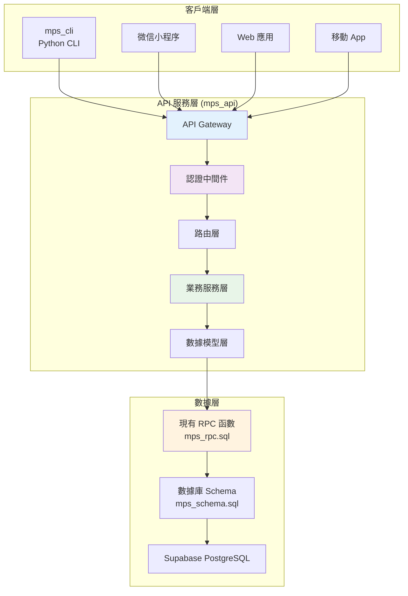
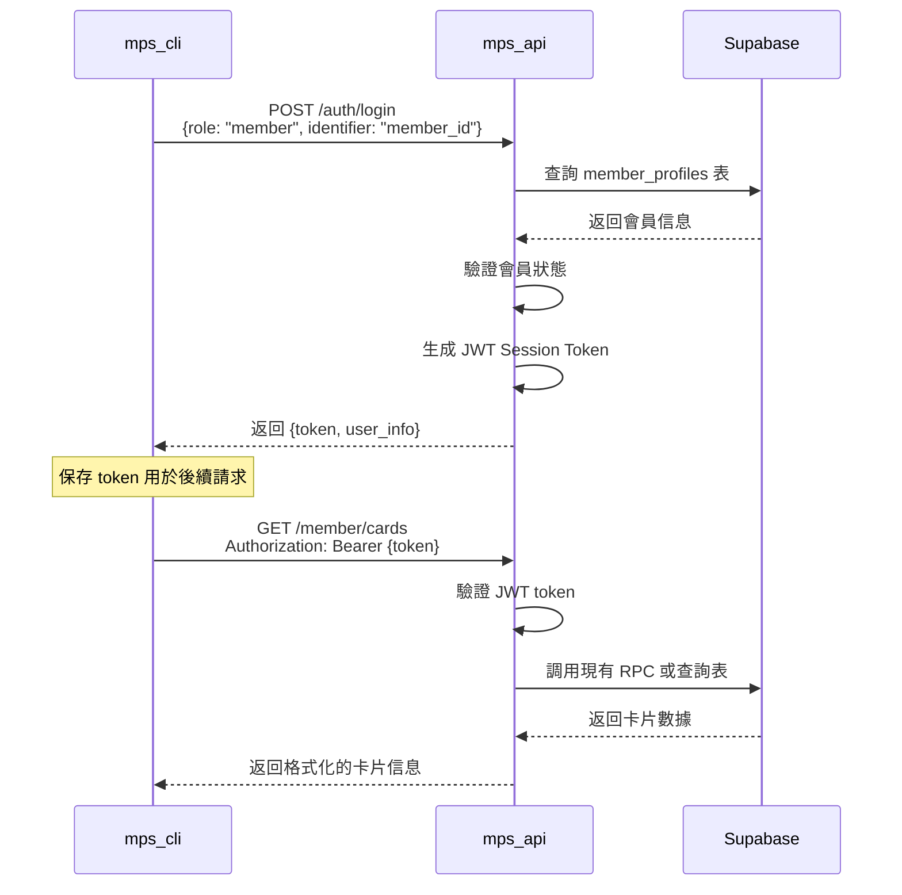
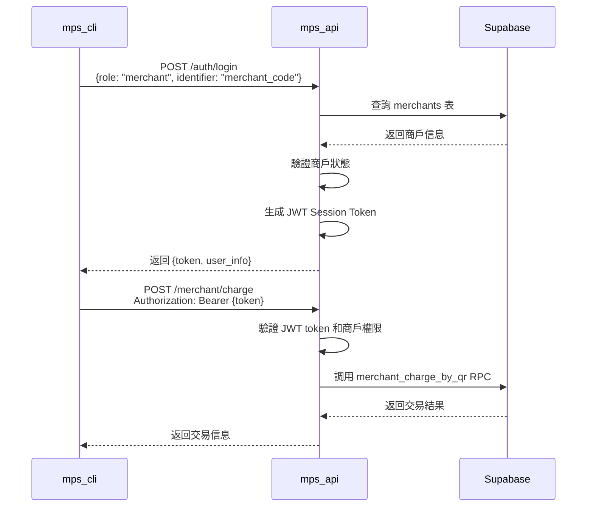

# MPS FastAPI 後端架構設計

## 📋 項目概述

MPS API 是一個基於 FastAPI 的後端服務，作為 MPS 系統的統一 API 層。它將現有的 Supabase RPC 函數包裝為標準的 HTTP API，為多種客戶端（CLI、小程序、Web 應用）提供安全、統一的接口。

## 🏗️ 整體架構

### 📊 系統架構圖



### 🎯 核心設計原則

1. **安全第一**：`service_role_key` 僅在 API 服務端使用
2. **統一接口**：所有客戶端使用相同的 HTTP API
3. **RPC 包裝**：完整保留現有 RPC 函數，僅作 HTTP 包裝
4. **角色分離**：支持會員、商戶、管理員三種角色的自定義認證
5. **可擴展性**：易於添加新的客戶端和功能

---

## 📁 項目結構設計

```
mps_api/
├── main.py                     # FastAPI 主程序
├── requirements.txt            # 依賴包列表
├── .env.example               # 環境變量示例
├── README.md                  # API 文檔
├── config/
│   ├── __init__.py
│   ├── settings.py            # API 配置管理
│   ├── database.py            # Supabase 客戶端
│   └── constants.py           # API 常量
├── auth/
│   ├── __init__.py
│   ├── models.py              # 認證數據模型
│   ├── service.py             # 認證業務邏輯
│   ├── middleware.py          # 認證中間件
│   └── jwt_handler.py         # JWT 處理
├── api/
│   ├── __init__.py
│   ├── auth.py                # 認證路由
│   ├── member.py              # 會員 API 路由
│   ├── merchant.py            # 商戶 API 路由
│   ├── admin.py               # 管理員 API 路由
│   └── common.py              # 通用 API 路由
├── services/
│   ├── __init__.py
│   ├── base_service.py        # 基礎服務類
│   ├── member_service.py      # 會員業務服務
│   ├── payment_service.py     # 支付業務服務
│   ├── merchant_service.py    # 商戶業務服務
│   ├── admin_service.py       # 管理業務服務
│   └── qr_service.py          # QR 碼業務服務
├── models/
│   ├── __init__.py
│   ├── request_models.py      # API 請求模型
│   ├── response_models.py     # API 響應模型
│   └── auth_models.py         # 認證相關模型
├── utils/
│   ├── __init__.py
│   ├── exceptions.py          # 自定義異常
│   ├── validators.py          # 輸入驗證
│   ├── formatters.py          # 數據格式化
│   └── logger.py              # 日誌管理
├── middleware/
│   ├── __init__.py
│   ├── cors.py                # CORS 處理
│   ├── rate_limit.py          # 限流中間件
│   └── error_handler.py       # 錯誤處理中間件
└── tests/
    ├── __init__.py
    ├── test_auth.py           # 認證測試
    ├── test_member_api.py     # 會員 API 測試
    ├── test_merchant_api.py   # 商戶 API 測試
    └── test_admin_api.py      # 管理員 API 測試
```

---

## 🔐 認證系統設計

### 🎭 三角色認證流程

#### 會員認證流程


#### 商戶認證流程


### 🔑 JWT Token 設計

```python
# JWT Payload 結構
{
    "sub": "user_id",           # 用戶 ID (member_id/merchant_id/admin_id)
    "role": "member",           # 角色類型
    "name": "張小明",            # 用戶名稱
    "permissions": [            # 權限列表
        "member:read_cards",
        "member:generate_qr",
        "member:recharge"
    ],
    "iat": 1640995200,          # 簽發時間
    "exp": 1641081600,          # 過期時間 (24小時)
    "session_id": "uuid"        # Session ID
}
```

---

## 🛣️ API 路由設計

### 📋 完整 API 端點映射

| 功能分類 | HTTP 端點 | 對應 RPC 函數 | 權限要求 |
|----------|-----------|---------------|----------|
| **認證** | `POST /auth/login` | 查詢用戶表 | 無 |
| **認證** | `POST /auth/logout` | - | 任意已登入 |
| **認證** | `GET /auth/me` | - | 任意已登入 |
| **會員-卡片** | `GET /member/cards` | 查詢 member_cards | member |
| **會員-QR** | `POST /member/qr/generate` | [`rotate_card_qr`](../../rpc/mps_rpc.sql:158) | member |
| **會員-充值** | `POST /member/recharge` | [`user_recharge_card`](../../rpc/mps_rpc.sql:467) | member |
| **會員-交易** | `GET /member/transactions` | [`get_member_transactions`](../../rpc/mps_rpc.sql:710) | member |
| **會員-綁定** | `POST /member/bind-card` | [`bind_member_to_card`](../../rpc/mps_rpc.sql:74) | member |
| **商戶-收款** | `POST /merchant/charge` | [`merchant_charge_by_qr`](../../rpc/mps_rpc.sql:274) | merchant |
| **商戶-退款** | `POST /merchant/refund` | [`merchant_refund_tx`](../../rpc/mps_rpc.sql:401) | merchant |
| **商戶-交易** | `GET /merchant/transactions` | [`get_merchant_transactions`](../../rpc/mps_rpc.sql:741) | merchant |
| **商戶-統計** | `GET /merchant/daily-summary` | [`get_merchant_transactions`](../../rpc/mps_rpc.sql:741) | merchant |
| **管理-會員** | `POST /admin/members` | [`create_member_profile`](../../rpc/mps_rpc.sql:15) | admin |
| **管理-卡片** | `POST /admin/cards/freeze` | [`freeze_card`](../../rpc/mps_rpc.sql:591) | admin |
| **管理-卡片** | `POST /admin/cards/unfreeze` | [`unfreeze_card`](../../rpc/mps_rpc.sql:606) | admin |
| **管理-積分** | `POST /admin/points/adjust` | [`update_points_and_level`](../../rpc/mps_rpc.sql:546) | admin |
| **管理-QR** | `POST /admin/qr/batch-rotate` | [`cron_rotate_qr_tokens`](../../rpc/mps_rpc.sql:235) | admin |

### 🔧 API 端點詳細設計

#### 認證相關 API

```python
# POST /auth/login
{
    "role": "member|merchant|admin",
    "identifier": "member_id|phone|merchant_code",
    "password": "optional_password",
    "extra": {}  # 額外驗證信息
}

# Response
{
    "success": true,
    "token": "jwt_token_string",
    "user_info": {
        "id": "user_id",
        "name": "用戶名稱",
        "role": "member",
        "permissions": ["member:read_cards", ...]
    },
    "expires_at": "2024-01-01T12:00:00Z"
}
```

#### 會員相關 API

```python
# GET /member/cards
# Headers: Authorization: Bearer {token}
# Response
{
    "cards": [
        {
            "id": "card_id",
            "card_no": "STD00000001",
            "card_type": "standard",
            "balance": 1000.50,
            "points": 1000,
            "level": 1,
            "status": "active"
        }
    ]
}

# POST /member/qr/generate
{
    "card_id": "uuid"
}
# Response
{
    "qr_plain": "base64_string",
    "expires_at": "2024-01-01T12:15:00Z",
    "card_info": {
        "card_no": "STD00000001",
        "balance": 1000.50
    }
}
```

#### 商戶相關 API

```python
# POST /merchant/charge
{
    "qr_plain": "customer_qr_code",
    "amount": 299.00,
    "external_order_id": "optional"
}
# Response
{
    "success": true,
    "transaction": {
        "tx_id": "uuid",
        "tx_no": "PAY0000000123",
        "final_amount": 284.05,
        "discount": 0.95,
        "points_earned": 299
    }
}

# POST /merchant/refund
{
    "original_tx_no": "PAY0000000123",
    "refund_amount": 100.00,
    "reason": "客戶要求退款"
}
# Response
{
    "success": true,
    "refund": {
        "refund_tx_id": "uuid",
        "refund_tx_no": "REF0000000456",
        "refunded_amount": 100.00
    }
}
```

---

## 🔧 核心組件設計

### 1. 認證系統 (auth/)

#### auth/models.py
```python
from pydantic import BaseModel
from typing import Optional, List
from enum import Enum

class UserRole(str, Enum):
    MEMBER = "member"
    MERCHANT = "merchant"
    ADMIN = "admin"

class LoginRequest(BaseModel):
    role: UserRole
    identifier: str
    password: Optional[str] = None
    extra: Optional[dict] = None

class LoginResponse(BaseModel):
    success: bool
    token: Optional[str] = None
    user_info: Optional[dict] = None
    expires_at: Optional[str] = None
    error: Optional[str] = None

class SessionPayload(BaseModel):
    sub: str                    # 用戶 ID
    role: UserRole             # 角色
    name: str                  # 用戶名稱
    permissions: List[str]     # 權限列表
    iat: int                   # 簽發時間
    exp: int                   # 過期時間
    session_id: str            # Session ID
```

#### auth/service.py
```python
from supabase import create_client
from config.settings import settings
import jwt
from datetime import datetime, timedelta

class AuthService:
    def __init__(self):
        self.supabase = create_client(
            settings.supabase.url,
            settings.supabase.service_role_key  # 僅在服務端使用
        )
        self.jwt_secret = settings.jwt.secret
    
    async def authenticate_member(self, identifier: str) -> Optional[dict]:
        """會員認證 - 通過 ID 或手機號"""
        try:
            # 嘗試按 UUID 查詢
            if self._is_uuid(identifier):
                result = self.supabase.table("member_profiles").select("*").eq("id", identifier).execute()
            else:
                # 按手機號查詢
                result = self.supabase.table("member_profiles").select("*").eq("phone", identifier).execute()
            
            if result.data and len(result.data) > 0:
                member = result.data[0]
                if member["status"] == "active":
                    return {
                        "id": member["id"],
                        "name": member["name"],
                        "role": "member",
                        "permissions": self._get_member_permissions()
                    }
            return None
            
        except Exception as e:
            logger.error(f"會員認證失敗: {e}")
            return None
    
    async def authenticate_merchant(self, merchant_code: str) -> Optional[dict]:
        """商戶認證 - 通過商戶代碼"""
        try:
            result = self.supabase.table("merchants").select("*").eq("code", merchant_code).execute()
            
            if result.data and len(result.data) > 0:
                merchant = result.data[0]
                if merchant.get("active", False):
                    return {
                        "id": merchant["id"],
                        "name": merchant["name"],
                        "role": "merchant",
                        "code": merchant["code"],
                        "permissions": self._get_merchant_permissions()
                    }
            return None
            
        except Exception as e:
            logger.error(f"商戶認證失敗: {e}")
            return None
    
    async def authenticate_admin(self, admin_name: str, admin_code: str = None) -> Optional[dict]:
        """管理員認證 - 簡化驗證"""
        # 這裡可以實現更複雜的管理員驗證邏輯
        # 目前簡化為基本驗證
        if admin_name and len(admin_name.strip()) > 0:
            return {
                "id": f"admin_{admin_name}",
                "name": admin_name,
                "role": "admin",
                "permissions": self._get_admin_permissions()
            }
        return None
    
    def generate_session_token(self, user_info: dict) -> str:
        """生成 Session Token"""
        payload = {
            "sub": user_info["id"],
            "role": user_info["role"],
            "name": user_info["name"],
            "permissions": user_info["permissions"],
            "iat": datetime.utcnow(),
            "exp": datetime.utcnow() + timedelta(hours=24),
            "session_id": str(uuid.uuid4())
        }
        
        return jwt.encode(payload, self.jwt_secret, algorithm="HS256")
    
    def verify_session_token(self, token: str) -> Optional[dict]:
        """驗證 Session Token"""
        try:
            payload = jwt.decode(token, self.jwt_secret, algorithms=["HS256"])
            return payload
        except jwt.ExpiredSignatureError:
            return None
        except jwt.InvalidTokenError:
            return None
    
    def _get_member_permissions(self) -> List[str]:
        return [
            "member:read_cards",
            "member:generate_qr", 
            "member:recharge",
            "member:read_transactions",
            "member:bind_card"
        ]
    
    def _get_merchant_permissions(self) -> List[str]:
        return [
            "merchant:charge",
            "merchant:refund",
            "merchant:read_transactions",
            "merchant:read_summary"
        ]
    
    def _get_admin_permissions(self) -> List[str]:
        return [
            "admin:create_member",
            "admin:manage_cards",
            "admin:adjust_points",
            "admin:system_maintenance",
            "admin:read_statistics"
        ]
```

### 2. 業務服務層 (services/)

#### services/member_service.py
```python
from supabase import create_client
from config.settings import settings
from typing import List, Dict, Any, Optional

class MemberService:
    def __init__(self):
        # 在 API 服務端安全地使用 service_role_key
        self.supabase = create_client(
            settings.supabase.url,
            settings.supabase.service_role_key
        )
    
    async def get_member_cards(self, member_id: str) -> List[Dict]:
        """獲取會員卡片 - 直接搬移現有邏輯"""
        try:
            # 查詢會員擁有的卡片
            owned_cards = self.supabase.table("member_cards").select("*").eq("owner_member_id", member_id).execute()
            
            # 查詢會員綁定的共享卡片
            bindings = self.supabase.table("card_bindings").select("*").eq("member_id", member_id).execute()
            shared_card_ids = [b["card_id"] for b in bindings.data]
            
            shared_cards = []
            for card_id in shared_card_ids:
                cards = self.supabase.table("member_cards").select("*").eq("id", card_id).execute()
                if cards.data:
                    shared_cards.extend(cards.data)
            
            # 合併並去重
            all_cards_data = owned_cards.data + shared_cards
            unique_cards = {card["id"]: card for card in all_cards_data}.values()
            
            return list(unique_cards)
            
        except Exception as e:
            logger.error(f"獲取會員卡片失敗: {member_id}, 錯誤: {e}")
            raise HTTPException(status_code=500, detail=f"獲取卡片失敗: {e}")
    
    async def generate_qr_code(self, card_id: str, ttl_seconds: int = 900) -> Dict:
        """生成 QR 碼 - 調用現有 RPC"""
        try:
            # 直接調用現有的 RPC 函數
            result = self.supabase.rpc("rotate_card_qr", {
                "p_card_id": card_id,
                "p_ttl_seconds": ttl_seconds
            }).execute()
            
            if result.data and len(result.data) > 0:
                qr_data = result.data[0]
                return {
                    "qr_plain": qr_data["qr_plain"],
                    "expires_at": qr_data["qr_expires_at"],
                    "card_id": card_id
                }
            else:
                raise Exception("QR 碼生成失敗")
                
        except Exception as e:
            logger.error(f"QR 碼生成失敗: {card_id}, 錯誤: {e}")
            raise HTTPException(status_code=500, detail=f"QR 碼生成失敗: {e}")
    
    async def recharge_card(self, card_id: str, amount: float, payment_method: str) -> Dict:
        """充值卡片 - 調用現有 RPC"""
        try:
            import uuid
            idempotency_key = f"recharge-{uuid.uuid4()}"
            
            # 調用現有的 RPC 函數
            result = self.supabase.rpc("user_recharge_card", {
                "p_card_id": card_id,
                "p_amount": amount,
                "p_payment_method": payment_method,
                "p_tag": {"source": "api"},
                "p_idempotency_key": idempotency_key
            }).execute()
            
            if result.data and len(result.data) > 0:
                recharge_data = result.data[0]
                return {
                    "tx_id": recharge_data["tx_id"],
                    "tx_no": recharge_data["tx_no"],
                    "amount": recharge_data["amount"]
                }
            else:
                raise Exception("充值失敗")
                
        except Exception as e:
            logger.error(f"充值失敗: {card_id}, 錯誤: {e}")
            raise HTTPException(status_code=500, detail=f"充值失敗: {e}")
```

### 3. API 路由層 (api/)

#### api/member.py
```python
from fastapi import APIRouter, Depends, HTTPException
from auth.middleware import require_member_auth
from services.member_service import MemberService
from models.request_models import GenerateQRRequest, RechargeRequest

router = APIRouter(prefix="/member", tags=["會員"])

@router.get("/cards")
async def get_member_cards(session: dict = Depends(require_member_auth)):
    """獲取會員卡片"""
    service = MemberService()
    cards = await service.get_member_cards(session["sub"])
    return {"cards": cards}

@router.post("/qr/generate")
async def generate_qr(request: GenerateQRRequest, session: dict = Depends(require_member_auth)):
    """生成付款 QR 碼"""
    service = MemberService()
    qr_info = await service.generate_qr_code(request.card_id, request.ttl_seconds)
    return qr_info

@router.post("/recharge")
async def recharge_card(request: RechargeRequest, session: dict = Depends(require_member_auth)):
    """充值卡片"""
    service = MemberService()
    result = await service.recharge_card(
        request.card_id, 
        request.amount, 
        request.payment_method
    )
    return result
```

---

## 🔄 mps_cli 適配方案

### 📊 修改對照表

| 現有文件 | 修改類型 | 修改內容 | 工作量 |
|----------|----------|----------|--------|
| [`config/supabase_client.py`](../../mps_cli/config/supabase_client.py) | 重寫 | 改為 `api_client.py` | 4小時 |
| [`services/base_service.py`](../../mps_cli/services/base_service.py) | 適配 | 改 `rpc_call` 為 `api_call` | 2小時 |
| [`services/member_service.py`](../../mps_cli/services/member_service.py) | 調用修改 | RPC → HTTP API | 1小時 |
| [`services/payment_service.py`](../../mps_cli/services/payment_service.py) | 調用修改 | RPC → HTTP API | 1小時 |
| [`services/merchant_service.py`](../../mps_cli/services/merchant_service.py) | 調用修改 | RPC → HTTP API | 1小時 |
| [`services/admin_service.py`](../../mps_cli/services/admin_service.py) | 調用修改 | RPC → HTTP API | 1小時 |
| [`services/qr_service.py`](../../mps_cli/services/qr_service.py) | 調用修改 | RPC → HTTP API | 1小時 |

### 🔧 關鍵修改示例

#### 新增：config/api_client.py
```python
import requests
import json
from typing import Dict, Any, Optional
from config.settings import settings

class APIClient:
    def __init__(self):
        self.base_url = settings.api.base_url
        self.session_token: Optional[str] = None
        self.session_info: Optional[Dict] = None
    
    def login(self, role: str, identifier: str, password: str = None) -> bool:
        """登入並獲取 Session Token"""
        try:
            response = requests.post(f"{self.base_url}/auth/login", json={
                "role": role,
                "identifier": identifier,
                "password": password
            })
            
            if response.status_code == 200:
                data = response.json()
                if data["success"]:
                    self.session_token = data["token"]
                    self.session_info = data["user_info"]
                    return True
            
            return False
            
        except Exception as e:
            logger.error(f"API 登入失敗: {e}")
            return False
    
    def call_api(self, method: str, endpoint: str, data: Dict = None) -> Dict:
        """調用 API"""
        headers = {"Content-Type": "application/json"}
        
        if self.session_token:
            headers["Authorization"] = f"Bearer {self.session_token}"
        
        url = f"{self.base_url}{endpoint}"
        
        try:
            if method.upper() == "GET":
                response = requests.get(url, headers=headers, params=data)
            elif method.upper() == "POST":
                response = requests.post(url, headers=headers, json=data)
            elif method.upper() == "PUT":
                response = requests.put(url, headers=headers, json=data)
            elif method.upper() == "DELETE":
                response = requests.delete(url, headers=headers)
            else:
                raise ValueError(f"不支持的 HTTP 方法: {method}")
            
            if response.status_code == 200:
                return response.json()
            else:
                error_data = response.json() if response.content else {}
                raise Exception(f"API 調用失敗: {response.status_code}, {error_data}")
                
        except Exception as e:
            logger.error(f"API 調用失敗: {method} {endpoint}, 錯誤: {e}")
            raise Exception(f"API 調用失敗: {e}")
```

#### 修改：services/base_service.py
```python
# 原來的 rpc_call 方法
def rpc_call(self, function_name: str, params: Dict[str, Any]) -> Any:
    return self.client.rpc(function_name, params)

# 修改為 api_call 方法
def api_call(self, method: str, endpoint: str, data: Dict[str, Any] = None) -> Any:
    return self.client.call_api(method, endpoint, data)
```

#### 修改：services/member_service.py
```python
# 原來的方法
def create_member(self, name, phone, email, ...):
    params = {"p_name": name, "p_phone": phone, "p_email": email, ...}
    return self.rpc_call("create_member_profile", params)

# 修改後的方法
def create_member(self, name, phone, email, ...):
    data = {"name": name, "phone": phone, "email": email, ...}
    return self.api_call("POST", "/admin/members", data)
```

---

## 📋 實施計劃

### 🎯 第一階段：API 基礎架構 (3-4 天)

#### Day 1: 項目搭建
- [x] 創建 mps_api 項目結構
- [x] 配置 FastAPI 基礎框架
- [x] 設置 Supabase 客戶端（使用 service_role_key）
- [x] 實現基礎配置管理

#### Day 2: 認證系統
- [x] 實現 JWT 認證機制
- [x] 創建三角色認證邏輯
- [x] 實現認證中間件
- [x] 創建 Session 管理

#### Day 3-4: 核心 API 端點
- [x] 實現會員相關 API (4個端點)
- [x] 實現商戶相關 API (4個端點)
- [x] 實現管理員相關 API (5個端點)
- [x] 錯誤處理和日誌

### 🎯 第二階段：CLI 適配 (2-3 天)

#### Day 5: 客戶端適配
- [x] 創建 API 客戶端 (`api_client.py`)
- [x] 修改基礎服務類
- [x] 實現 Session 管理

#### Day 6-7: 服務層適配
- [x] 修改所有服務類的調用方式
- [x] 適配錯誤處理
- [x] 測試和驗證功能

### 🎯 第三階段：測試和優化 (1-2 天)

#### Day 8-9: 集成測試
- [x] 端到端功能測試
- [x] 性能優化
- [x] 文檔完善

---

## 🚀 部署和運維

### 📦 部署方案

#### mps_api 部署
```bash
# 使用 Docker 部署
FROM python:3.11-slim
WORKDIR /app
COPY requirements.txt .
RUN pip install -r requirements.txt
COPY . .
EXPOSE 8000
CMD ["uvicorn", "main:app", "--host", "0.0.0.0", "--port", "8000"]
```

#### mps_cli 配置
```bash
# .env 配置
API_BASE_URL=https://your-api-domain.com
API_TIMEOUT=30
```

### 🔧 環境配置

#### mps_api/.env.example
```bash
# Supabase 配置 (僅在服務端)
SUPABASE_URL=https://your-project.supabase.co
SUPABASE_SERVICE_ROLE_KEY=your-service-role-key

# JWT 配置
JWT_SECRET=your-jwt-secret-key
JWT_EXPIRE_HOURS=24

# API 配置
API_HOST=0.0.0.0
API_PORT=8000
API_DEBUG=false

# 日誌配置
LOG_LEVEL=INFO
LOG_FILE=logs/mps_api.log
```

#### mps_cli/.env.example (修改後)
```bash
# API 服務配置
API_BASE_URL=http://localhost:8000
API_TIMEOUT=30

# UI 配置 (保持不變)
UI_PAGE_SIZE=20
QR_TTL_SECONDS=900
SHOW_COLORS=true

# 日誌配置 (保持不變)
LOG_LEVEL=INFO
LOG_FILE=logs/mps_cli.log
```

---

## 📊 完整工作量評估

### 🎯 開發工作量

| 階段 | 組件 | 工作量 | 說明 |
|------|------|--------|------|
| **API 開發** | 基礎架構 | 1天 | FastAPI + 配置 |
| | 認證系統 | 1天 | JWT + 三角色認證 |
| | 業務服務 | 2天 | 包裝現有 RPC |
| | API 路由 | 1天 | HTTP 端點實現 |
| **CLI 適配** | 客戶端重構 | 1天 | API 客戶端 |
| | 服務層適配 | 1天 | 修改調用方式 |
| **測試驗證** | 集成測試 | 1天 | 端到端測試 |
| **文檔完善** | API 文檔 | 0.5天 | OpenAPI 文檔 |

**總工作量：約 8.5 天**

### 🎯 維護工作量

- **日常維護**：極低（主要是監控和日誌）
- **功能擴展**：中等（新增 API 端點）
- **安全更新**：低（主要是依賴包更新）

---

## 🎉 最終效果

### ✅ 安全性提升
- `service_role_key` 完全隔離在服務端
- 客戶端只持有有限權限的 Session Token
- 支持 Token 過期和刷新機制

### ✅ 可擴展性
- 統一的 HTTP API 接口
- 支持多種客戶端（CLI、小程序、Web）
- 易於添加新功能和新客戶端

### ✅ 維護性
- 業務邏輯集中在 API 層
- 客戶端邏輯簡化
- 統一的錯誤處理和日誌

### ✅ 用戶體驗
- CLI 用戶體驗完全不變
- 響應速度可能略有提升（API 層可以做緩存）
- 更好的錯誤提示和處理

這個方案完美地解決了安全問題，同時為未來的擴展奠定了堅實的基礎。您現有的所有 RPC 函數都會被完整保留和使用，只是調用方式從直接調用變為通過安全的 HTTP API 調用。