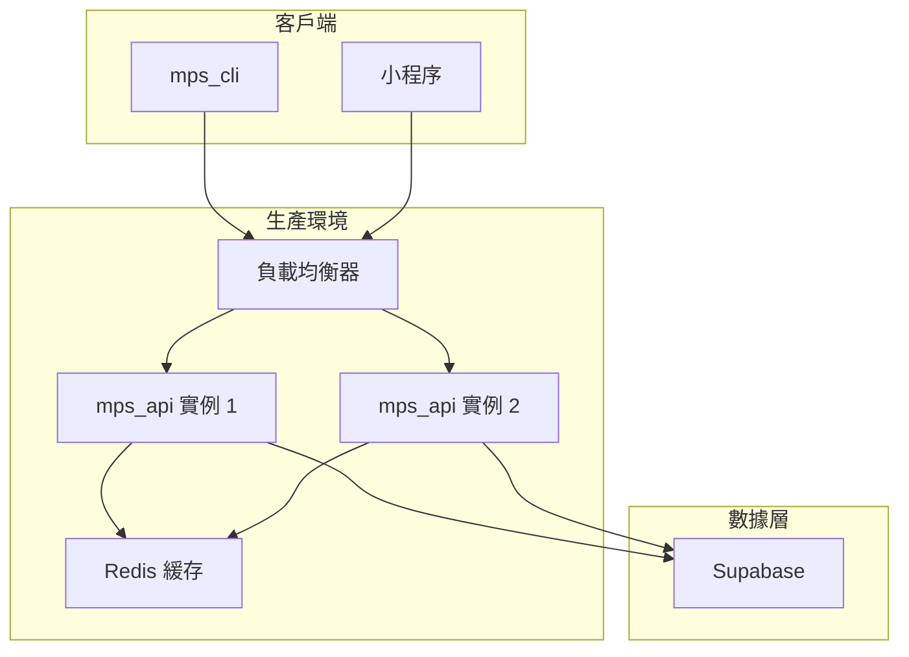

# MPS FastAPI 實施路線圖

## 📋 項目概述

本文檔詳細規劃了 MPS FastAPI 後端服務的完整實施方案。該 API 服務將現有的 Supabase RPC 函數包裝為安全的 HTTP API，解決客戶端直接使用 `service_role_key` 的安全問題，同時為多種客戶端提供統一接口。

## 🎯 核心目標

### 主要目標
1. **安全性提升**：將 `service_role_key` 從客戶端移至服務端
2. **統一接口**：為 CLI、小程序、Web 等提供一致的 API
3. **RPC 保護**：完整保留現有 RPC 函數，僅作 HTTP 包裝
4. **角色分離**：支持會員、商戶、管理員的自定義認證

### 成功標準
- ✅ 所有現有 RPC 函數通過 API 正常調用
- ✅ 客戶端不再直接接觸 `service_role_key`
- ✅ 支持多角色自定義認證
- ✅ API 響應時間 < 500ms
- ✅ 99.9% 可用性

---

## 🏗️ 詳細架構設計

### 📊 RPC 函數與 API 端點映射

基於現有的 [`rpc/mps_rpc.sql`](../../rpc/mps_rpc.sql)，完整的 API 映射如下：

| 功能分類 | 現有 RPC 函數 | 新 API 端點 | HTTP 方法 | 權限要求 |
|----------|---------------|-------------|-----------|----------|
| **會員管理** | [`create_member_profile`](../../rpc/mps_rpc.sql:15) | `/admin/members` | POST | admin |
| **卡片綁定** | [`bind_member_to_card`](../../rpc/mps_rpc.sql:74) | `/member/bind-card` | POST | member |
| **卡片解綁** | [`unbind_member_from_card`](../../rpc/mps_rpc.sql:128) | `/member/unbind-card` | POST | member |
| **QR 生成** | [`rotate_card_qr`](../../rpc/mps_rpc.sql:158) | `/member/qr/generate` | POST | member |
| **QR 撤銷** | [`revoke_card_qr`](../../rpc/mps_rpc.sql:191) | `/member/qr/revoke` | POST | member |
| **QR 驗證** | [`validate_qr_plain`](../../rpc/mps_rpc.sql:206) | `/common/qr/validate` | POST | merchant |
| **QR 批量輪換** | [`cron_rotate_qr_tokens`](../../rpc/mps_rpc.sql:235) | `/admin/qr/batch-rotate` | POST | admin |
| **掃碼收款** | [`merchant_charge_by_qr`](../../rpc/mps_rpc.sql:274) | `/merchant/charge` | POST | merchant |
| **商戶退款** | [`merchant_refund_tx`](../../rpc/mps_rpc.sql:401) | `/merchant/refund` | POST | merchant |
| **用戶充值** | [`user_recharge_card`](../../rpc/mps_rpc.sql:467) | `/member/recharge` | POST | member |
| **積分調整** | [`update_points_and_level`](../../rpc/mps_rpc.sql:546) | `/admin/points/adjust` | POST | admin |
| **卡片凍結** | [`freeze_card`](../../rpc/mps_rpc.sql:591) | `/admin/cards/freeze` | POST | admin |
| **卡片解凍** | [`unfreeze_card`](../../rpc/mps_rpc.sql:606) | `/admin/cards/unfreeze` | POST | admin |
| **會員暫停** | [`admin_suspend_member`](../../rpc/mps_rpc.sql:621) | `/admin/members/suspend` | POST | admin |
| **商戶暫停** | [`admin_suspend_merchant`](../../rpc/mps_rpc.sql:636) | `/admin/merchants/suspend` | POST | admin |
| **生成結算** | [`generate_settlement`](../../rpc/mps_rpc.sql:655) | `/merchant/settlements` | POST | merchant |
| **結算列表** | [`list_settlements`](../../rpc/mps_rpc.sql:690) | `/merchant/settlements` | GET | merchant |
| **會員交易** | [`get_member_transactions`](../../rpc/mps_rpc.sql:710) | `/member/transactions` | GET | member |
| **商戶交易** | [`get_merchant_transactions`](../../rpc/mps_rpc.sql:741) | `/merchant/transactions` | GET | merchant |
| **交易詳情** | [`get_transaction_detail`](../../rpc/mps_rpc.sql:769) | `/common/transactions/{tx_no}` | GET | any |

### 🔐 認證和權限設計

#### 認證流程詳細設計

```python
# 會員登入流程
POST /auth/login
{
    "role": "member",
    "identifier": "member_id_or_phone"
}

# 內部處理邏輯
1. 驗證 identifier 格式
2. 查詢 member_profiles 表
3. 檢查會員狀態 (status = 'active')
4. 生成 JWT token (包含 member_id, permissions)
5. 返回 token 和用戶信息

# 商戶登入流程  
POST /auth/login
{
    "role": "merchant", 
    "identifier": "merchant_code",
    "operator": "操作員姓名"  # 可選
}

# 內部處理邏輯
1. 驗證 merchant_code 格式
2. 查詢 merchants 表
3. 檢查商戶狀態 (active = true)
4. 生成 JWT token (包含 merchant_id, permissions)
5. 返回 token 和商戶信息

# 管理員登入流程
POST /auth/login
{
    "role": "admin",
    "identifier": "admin_name",
    "admin_code": "admin_verification_code"  # 可選
}

# 內部處理邏輯
1. 驗證管理員身份 (可自定義邏輯)
2. 生成 JWT token (包含 admin_id, full_permissions)
3. 返回 token 和管理員信息
```

#### 權限矩陣設計

```python
PERMISSIONS = {
    "member": [
        "member:read_cards",        # 查看卡片
        "member:generate_qr",       # 生成 QR 碼
        "member:recharge",          # 充值卡片
        "member:read_transactions", # 查看交易記錄
        "member:bind_card",         # 綁定卡片
        "member:unbind_card"        # 解綁卡片
    ],
    "merchant": [
        "merchant:charge",          # 掃碼收款
        "merchant:refund",          # 退款處理
        "merchant:read_transactions", # 查看交易記錄
        "merchant:read_summary",    # 查看統計摘要
        "merchant:generate_settlement", # 生成結算
        "merchant:read_settlements" # 查看結算記錄
    ],
    "admin": [
        "admin:create_member",      # 創建會員
        "admin:suspend_member",     # 暫停會員
        "admin:manage_cards",       # 管理卡片
        "admin:adjust_points",      # 調整積分
        "admin:system_maintenance", # 系統維護
        "admin:read_statistics",    # 查看統計
        "admin:batch_operations"    # 批量操作
    ]
}
```

---

## 🔧 核心組件實施細節

### 1. 認證系統實施

#### auth/service.py - 完整實現
```python
import jwt
import uuid
from datetime import datetime, timedelta
from typing import Optional, Dict, List
from supabase import create_client
from config.settings import settings
from utils.logger import get_logger

logger = get_logger(__name__)

class AuthService:
    def __init__(self):
        self.supabase = create_client(
            settings.supabase.url,
            settings.supabase.service_role_key
        )
        self.jwt_secret = settings.jwt.secret
        self.jwt_expire_hours = settings.jwt.expire_hours
    
    async def login(self, role: str, identifier: str, **kwargs) -> Dict:
        """統一登入接口"""
        try:
            if role == "member":
                user_info = await self._authenticate_member(identifier)
            elif role == "merchant":
                user_info = await self._authenticate_merchant(identifier, kwargs.get("operator"))
            elif role == "admin":
                user_info = await self._authenticate_admin(identifier, kwargs.get("admin_code"))
            else:
                return {"success": False, "error": "無效的角色類型"}
            
            if not user_info:
                return {"success": False, "error": "認證失敗"}
            
            # 生成 Session Token
            token = self._generate_session_token(user_info)
            
            return {
                "success": True,
                "token": token,
                "user_info": user_info,
                "expires_at": (datetime.utcnow() + timedelta(hours=self.jwt_expire_hours)).isoformat()
            }
            
        except Exception as e:
            logger.error(f"登入失敗: {role}, {identifier}, 錯誤: {e}")
            return {"success": False, "error": str(e)}
    
    async def _authenticate_member(self, identifier: str) -> Optional[Dict]:
        """會員認證邏輯"""
        try:
            # 判斷是 UUID 還是手機號
            if self._is_uuid(identifier):
                result = self.supabase.table("member_profiles").select("*").eq("id", identifier).execute()
            else:
                result = self.supabase.table("member_profiles").select("*").eq("phone", identifier).execute()
            
            if result.data and len(result.data) > 0:
                member = result.data[0]
                if member["status"] == "active":
                    return {
                        "id": member["id"],
                        "name": member["name"],
                        "role": "member",
                        "phone": member.get("phone"),
                        "email": member.get("email"),
                        "permissions": self._get_member_permissions()
                    }
            
            return None
            
        except Exception as e:
            logger.error(f"會員認證失敗: {identifier}, 錯誤: {e}")
            return None
    
    async def _authenticate_merchant(self, merchant_code: str, operator: str = None) -> Optional[Dict]:
        """商戶認證邏輯"""
        try:
            result = self.supabase.table("merchants").select("*").eq("code", merchant_code).execute()
            
            if result.data and len(result.data) > 0:
                merchant = result.data[0]
                if merchant.get("active", False):
                    return {
                        "id": merchant["id"],
                        "name": merchant["name"],
                        "role": "merchant",
                        "code": merchant["code"],
                        "operator": operator,
                        "permissions": self._get_merchant_permissions()
                    }
            
            return None
            
        except Exception as e:
            logger.error(f"商戶認證失敗: {merchant_code}, 錯誤: {e}")
            return None
    
    async def _authenticate_admin(self, admin_name: str, admin_code: str = None) -> Optional[Dict]:
        """管理員認證邏輯"""
        # 簡化的管理員認證，可根據需要擴展
        if admin_name and len(admin_name.strip()) > 0:
            # 這裡可以添加更複雜的驗證邏輯
            # 例如：查詢 admin_users 表，驗證 admin_code 等
            return {
                "id": f"admin_{uuid.uuid4()}",
                "name": admin_name,
                "role": "admin",
                "admin_code": admin_code,
                "permissions": self._get_admin_permissions()
            }
        
        return None
    
    def _generate_session_token(self, user_info: Dict) -> str:
        """生成 Session Token"""
        payload = {
            "sub": user_info["id"],
            "role": user_info["role"],
            "name": user_info["name"],
            "permissions": user_info["permissions"],
            "iat": datetime.utcnow(),
            "exp": datetime.utcnow() + timedelta(hours=self.jwt_expire_hours),
            "session_id": str(uuid.uuid4())
        }
        
        # 添加角色特定信息
        if user_info["role"] == "merchant":
            payload["merchant_code"] = user_info.get("code")
            payload["operator"] = user_info.get("operator")
        elif user_info["role"] == "member":
            payload["phone"] = user_info.get("phone")
            payload["email"] = user_info.get("email")
        
        return jwt.encode(payload, self.jwt_secret, algorithm="HS256")
    
    def verify_session_token(self, token: str) -> Optional[Dict]:
        """驗證 Session Token"""
        try:
            payload = jwt.decode(token, self.jwt_secret, algorithms=["HS256"])
            
            # 檢查必要字段
            required_fields = ["sub", "role", "permissions", "exp"]
            if not all(field in payload for field in required_fields):
                return None
            
            return payload
            
        except jwt.ExpiredSignatureError:
            logger.warning("Token 已過期")
            return None
        except jwt.InvalidTokenError as e:
            logger.warning(f"無效的 Token: {e}")
            return None
    
    def _get_member_permissions(self) -> List[str]:
        """會員權限列表"""
        return [
            "member:read_cards",
            "member:generate_qr",
            "member:recharge",
            "member:read_transactions",
            "member:bind_card",
            "member:unbind_card"
        ]
    
    def _get_merchant_permissions(self) -> List[str]:
        """商戶權限列表"""
        return [
            "merchant:charge",
            "merchant:refund", 
            "merchant:read_transactions",
            "merchant:read_summary",
            "merchant:generate_settlement",
            "merchant:read_settlements"
        ]
    
    def _get_admin_permissions(self) -> List[str]:
        """管理員權限列表"""
        return [
            "admin:create_member",
            "admin:suspend_member",
            "admin:manage_cards",
            "admin:adjust_points",
            "admin:system_maintenance",
            "admin:read_statistics",
            "admin:batch_operations"
        ]
    
    def _is_uuid(self, value: str) -> bool:
        """檢查是否為 UUID 格式"""
        try:
            uuid.UUID(value)
            return True
        except ValueError:
            return False
```

### 2. 業務服務層實施

#### services/member_service.py - RPC 包裝實現
```python
from supabase import create_client
from config.settings import settings
from typing import List, Dict, Any, Optional
from utils.logger import get_logger
from utils.exceptions import BusinessException

logger = get_logger(__name__)

class MemberService:
    def __init__(self):
        self.supabase = create_client(
            settings.supabase.url,
            settings.supabase.service_role_key  # 僅在服務端使用
        )
    
    async def get_member_cards(self, member_id: str) -> List[Dict]:
        """獲取會員卡片 - 包裝現有查詢邏輯"""
        try:
            # 直接搬移 mps_cli 中的邏輯
            # 查詢會員擁有的卡片
            owned_result = self.supabase.table("member_cards").select("*").eq("owner_member_id", member_id).execute()
            owned_cards = owned_result.data or []
            
            # 查詢會員綁定的共享卡片
            bindings_result = self.supabase.table("card_bindings").select("*").eq("member_id", member_id).execute()
            shared_card_ids = [b["card_id"] for b in bindings_result.data or []]
            
            shared_cards = []
            for card_id in shared_card_ids:
                cards_result = self.supabase.table("member_cards").select("*").eq("id", card_id).execute()
                if cards_result.data:
                    shared_cards.extend(cards_result.data)
            
            # 合併並去重
            all_cards_data = owned_cards + shared_cards
            unique_cards = {card["id"]: card for card in all_cards_data}.values()
            
            logger.info(f"獲取會員卡片成功: {member_id}, 共 {len(unique_cards)} 張")
            return list(unique_cards)
            
        except Exception as e:
            logger.error(f"獲取會員卡片失敗: {member_id}, 錯誤: {e}")
            raise BusinessException(f"獲取卡片失敗: {e}")
    
    async def generate_qr_code(self, card_id: str, ttl_seconds: int = 900) -> Dict:
        """生成 QR 碼 - 調用現有 RPC"""
        try:
            # 直接調用現有的 rotate_card_qr RPC
            result = self.supabase.rpc("rotate_card_qr", {
                "p_card_id": card_id,
                "p_ttl_seconds": ttl_seconds
            }).execute()
            
            if result.data and len(result.data) > 0:
                qr_data = result.data[0]
                
                logger.info(f"QR 碼生成成功: {card_id}")
                return {
                    "qr_plain": qr_data["qr_plain"],
                    "expires_at": qr_data["qr_expires_at"],
                    "card_id": card_id,
                    "ttl_seconds": ttl_seconds
                }
            else:
                raise Exception("QR 碼生成失敗：無返回數據")
                
        except Exception as e:
            logger.error(f"QR 碼生成失敗: {card_id}, 錯誤: {e}")
            raise BusinessException(f"QR 碼生成失敗: {e}")
    
    async def recharge_card(self, card_id: str, amount: float, payment_method: str) -> Dict:
        """充值卡片 - 調用現有 RPC"""
        try:
            import uuid
            idempotency_key = f"recharge-{uuid.uuid4()}"
            
            # 直接調用現有的 user_recharge_card RPC
            result = self.supabase.rpc("user_recharge_card", {
                "p_card_id": card_id,
                "p_amount": amount,
                "p_payment_method": payment_method,
                "p_tag": {"source": "api"},
                "p_idempotency_key": idempotency_key
            }).execute()
            
            if result.data and len(result.data) > 0:
                recharge_data = result.data[0]
                
                logger.info(f"充值成功: {recharge_data['tx_no']}")
                return {
                    "tx_id": recharge_data["tx_id"],
                    "tx_no": recharge_data["tx_no"],
                    "card_id": recharge_data["card_id"],
                    "amount": recharge_data["amount"]
                }
            else:
                raise Exception("充值失敗：無返回數據")
                
        except Exception as e:
            logger.error(f"充值失敗: {card_id}, 錯誤: {e}")
            raise BusinessException(f"充值失敗: {e}")
    
    async def get_member_transactions(self, member_id: str, limit: int = 20, 
                                    offset: int = 0) -> Dict:
        """獲取會員交易記錄 - 調用現有 RPC"""
        try:
            # 直接調用現有的 get_member_transactions RPC
            result = self.supabase.rpc("get_member_transactions", {
                "p_member_id": member_id,
                "p_limit": limit,
                "p_offset": offset
            }).execute()
            
            transactions = result.data or []
            
            # 計算分頁信息
            total_count = transactions[0].get('total_count', 0) if transactions else 0
            total_pages = (total_count + limit - 1) // limit
            current_page = offset // limit
            
            logger.info(f"獲取會員交易成功: {member_id}, 返回 {len(transactions)} 筆")
            
            return {
                "transactions": transactions,
                "pagination": {
                    "current_page": current_page,
                    "page_size": limit,
                    "total_count": total_count,
                    "total_pages": total_pages,
                    "has_next": current_page < total_pages - 1,
                    "has_prev": current_page > 0
                }
            }
            
        except Exception as e:
            logger.error(f"獲取會員交易失敗: {member_id}, 錯誤: {e}")
            raise BusinessException(f"獲取交易記錄失敗: {e}")
    
    async def bind_card_to_member(self, card_id: str, member_id: str, 
                                 role: str = "member", binding_password: str = None) -> bool:
        """綁定卡片到會員 - 調用現有 RPC"""
        try:
            # 直接調用現有的 bind_member_to_card RPC
            result = self.supabase.rpc("bind_member_to_card", {
                "p_card_id": card_id,
                "p_member_id": member_id,
                "p_role": role,
                "p_binding_password": binding_password
            }).execute()
            
            logger.info(f"卡片綁定成功: {card_id} -> {member_id}")
            return True
            
        except Exception as e:
            logger.error(f"卡片綁定失敗: {card_id} -> {member_id}, 錯誤: {e}")
            raise BusinessException(f"卡片綁定失敗: {e}")
```

### 3. API 路由層實施

#### api/member.py - 完整路由實現
```python
from fastapi import APIRouter, Depends, HTTPException
from auth.middleware import require_member_auth, get_current_session
from services.member_service import MemberService
from models.request_models import GenerateQRRequest, RechargeRequest, BindCardRequest
from models.response_models import CardsResponse, QRResponse, TransactionResponse
from utils.logger import get_logger

logger = get_logger(__name__)
router = APIRouter(prefix="/member", tags=["會員"])

@router.get("/cards", response_model=CardsResponse)
async def get_member_cards(session: dict = Depends(require_member_auth)):
    """獲取會員卡片"""
    try:
        service = MemberService()
        cards = await service.get_member_cards(session["sub"])
        
        logger.info(f"API: 獲取會員卡片 - {session['sub']}")
        return CardsResponse(cards=cards)
        
    except Exception as e:
        logger.error(f"API: 獲取會員卡片失敗 - {session['sub']}, 錯誤: {e}")
        raise HTTPException(status_code=500, detail=str(e))

@router.post("/qr/generate", response_model=QRResponse)
async def generate_qr(request: GenerateQRRequest, session: dict = Depends(require_member_auth)):
    """生成付款 QR 碼"""
    try:
        service = MemberService()
        qr_info = await service.generate_qr_code(request.card_id, request.ttl_seconds)
        
        logger.info(f"API: 生成 QR 碼 - {session['sub']}, 卡片: {request.card_id}")
        return QRResponse(**qr_info)
        
    except Exception as e:
        logger.error(f"API: 生成 QR 碼失敗 - {session['sub']}, 錯誤: {e}")
        raise HTTPException(status_code=500, detail=str(e))

@router.post("/recharge")
async def recharge_card(request: RechargeRequest, session: dict = Depends(require_member_auth)):
    """充值卡片"""
    try:
        service = MemberService()
        result = await service.recharge_card(
            request.card_id, 
            request.amount, 
            request.payment_method
        )
        
        logger.info(f"API: 充值卡片 - {session['sub']}, 金額: {request.amount}")
        return result
        
    except Exception as e:
        logger.error(f"API: 充值失敗 - {session['sub']}, 錯誤: {e}")
        raise HTTPException(status_code=500, detail=str(e))

@router.get("/transactions")
async def get_member_transactions(
    limit: int = 20, 
    offset: int = 0,
    session: dict = Depends(require_member_auth)
):
    """獲取會員交易記錄"""
    try:
        service = MemberService()
        result = await service.get_member_transactions(session["sub"], limit, offset)
        
        logger.info(f"API: 獲取會員交易 - {session['sub']}")
        return result
        
    except Exception as e:
        logger.error(f"API: 獲取會員交易失敗 - {session['sub']}, 錯誤: {e}")
        raise HTTPException(status_code=500, detail=str(e))

@router.post("/bind-card")
async def bind_card(request: BindCardRequest, session: dict = Depends(require_member_auth)):
    """綁定卡片"""
    try:
        service = MemberService()
        result = await service.bind_card_to_member(
            request.card_id,
            session["sub"],
            request.role,
            request.binding_password
        )
        
        logger.info(f"API: 綁定卡片 - {session['sub']}, 卡片: {request.card_id}")
        return {"success": result}
        
    except Exception as e:
        logger.error(f"API: 綁定卡片失敗 - {session['sub']}, 錯誤: {e}")
        raise HTTPException(status_code=500, detail=str(e))
```

---

## 📊 mps_cli 適配實施

### 🔄 關鍵修改點

#### 1. 配置層修改

```python
# config/settings.py - 添加 API 配置
@dataclass
class APIConfig:
    base_url: str = "http://localhost:8000"
    timeout: int = 30
    retry_count: int = 3

class Settings:
    def __init__(self):
        # 移除 Supabase 配置
        # self.database = DatabaseConfig(...)
        
        # 添加 API 配置
        self.api = APIConfig(
            base_url=os.getenv("API_BASE_URL", "http://localhost:8000"),
            timeout=int(os.getenv("API_TIMEOUT", "30"))
        )
```

#### 2. 客戶端層修改

```python
# config/api_client.py - 新增
import requests
import json
from typing import Dict, Any, Optional
from config.settings import settings
from utils.logger import get_logger

logger = get_logger(__name__)

class APIClient:
    def __init__(self):
        self.base_url = settings.api.base_url
        self.timeout = settings.api.timeout
        self.session_token: Optional[str] = None
        self.session_info: Optional[Dict] = None
    
    def login(self, role: str, identifier: str, **kwargs) -> bool:
        """登入並獲取 Session Token"""
        try:
            payload = {
                "role": role,
                "identifier": identifier
            }
            payload.update(kwargs)  # 添加額外參數如 operator, admin_code
            
            response = requests.post(
                f"{self.base_url}/auth/login",
                json=payload,
                timeout=self.timeout
            )
            
            if response.status_code == 200:
                data = response.json()
                if data["success"]:
                    self.session_token = data["token"]
                    self.session_info = data["user_info"]
                    logger.info(f"API 登入成功: {role}, {identifier}")
                    return True
                else:
                    logger.warning(f"API 登入失敗: {data.get('error')}")
                    return False
            else:
                logger.error(f"API 登入請求失敗: {response.status_code}")
                return False
                
        except Exception as e:
            logger.error(f"API 登入異常: {e}")
            return False
    
    def logout(self) -> bool:
        """登出"""
        try:
            if self.session_token:
                response = requests.post(
                    f"{self.base_url}/auth/logout",
                    headers=self._get_auth_headers(),
                    timeout=self.timeout
                )
            
            self.session_token = None
            self.session_info = None
            logger.info("API 登出成功")
            return True
            
        except Exception as e:
            logger.error(f"API 登出失敗: {e}")
            return False
    
    def call_api(self, method: str, endpoint: str, data: Dict = None) -> Dict:
        """調用 API"""
        headers = self._get_auth_headers()
        url = f"{self.base_url}{endpoint}"
        
        try:
            if method.upper() == "GET":
                response = requests.get(url, headers=headers, params=data, timeout=self.timeout)
            elif method.upper() == "POST":
                response = requests.post(url, headers=headers, json=data, timeout=self.timeout)
            elif method.upper() == "PUT":
                response = requests.put(url, headers=headers, json=data, timeout=self.timeout)
            elif method.upper() == "DELETE":
                response = requests.delete(url, headers=headers, timeout=self.timeout)
            else:
                raise ValueError(f"不支持的 HTTP 方法: {method}")
            
            if response.status_code == 200:
                return response.json()
            elif response.status_code == 401:
                # Token 可能過期，清除 session
                self.session_token = None
                self.session_info = None
                raise Exception("認證已過期，請重新登入")
            else:
                error_data = response.json() if response.content else {}
                error_msg = error_data.get("detail", f"HTTP {response.status_code}")
                raise Exception(f"API 調用失敗: {error_msg}")
                
        except requests.exceptions.Timeout:
            raise Exception("API 調用超時")
        except requests.exceptions.ConnectionError:
            raise Exception("無法連接到 API 服務")
        except Exception as e:
            logger.error(f"API 調用失敗: {method} {endpoint}, 錯誤: {e}")
            raise
    
    def _get_auth_headers(self) -> Dict[str, str]:
        """獲取認證頭"""
        headers = {"Content-Type": "application/json"}
        
        if self.session_token:
            headers["Authorization"] = f"Bearer {self.session_token}"
        
        return headers
    
    def is_authenticated(self) -> bool:
        """檢查是否已認證"""
        return self.session_token is not None
    
    def get_current_user(self) -> Optional[Dict]:
        """獲取當前用戶信息"""
        return self.session_info

# 全局 API 客戶端實例
api_client = APIClient()
```

#### 3. 服務層適配

```python
# services/base_service.py - 修改基礎服務類
from config.api_client import api_client
from utils.error_handler import error_handler
from utils.logger import get_logger

class BaseService:
    def __init__(self):
        self.client = api_client  # 改為使用 API 客戶端
        self.logger = get_logger(self.__class__.__name__)
        self.error_handler = error_handler
    
    def api_call(self, method: str, endpoint: str, data: Dict[str, Any] = None) -> Any:
        """API 調用 - 替代原來的 rpc_call"""
        try:
            self.logger.info(f"調用 API: {method} {endpoint}")
            self.logger.debug(f"API 參數: {data}")
            
            result = self.client.call_api(method, endpoint, data)
            
            self.logger.info(f"API 調用成功: {method} {endpoint}")
            self.logger.debug(f"API 結果: {result}")
            
            return result
            
        except Exception as e:
            self.logger.error(f"API 調用失敗: {method} {endpoint}, 錯誤: {e}")
            raise self.error_handler.handle_rpc_error(e)
    
    # 保留其他方法，但內部改為調用 API
    def query_table(self, table: str, filters: Optional[Dict] = None, **kwargs) -> List[Dict]:
        """查詢表格數據 - 通過 API"""
        # 這個方法可能需要根據具體需求實現對應的 API 端點
        # 或者在某些情況下直接移除，改為調用具體的業務 API
        pass
```

#### 4. 具體服務適配示例

```python
# services/member_service.py - 修改前後對比

# 修改前 (直接 RPC)
def get_member_cards(self, member_id: str) -> List[Card]:
    owned_cards = self.query_table("member_cards", {"owner_member_id": member_id})
    # ... 複雜的查詢邏輯
    return [Card.from_dict(card_data) for card_data in unique_cards]

# 修改後 (通過 API)
def get_member_cards(self, member_id: str) -> List[Card]:
    result = self.api_call("GET", "/member/cards")
    cards_data = result.get("cards", [])
    return [Card.from_dict(card_data) for card_data in cards_data]

# 修改前 (直接 RPC)
def create_member(self, name, phone, email, ...):
    params = {"p_name": name, "p_phone": phone, "p_email": email, ...}
    return self.rpc_call("create_member_profile", params)

# 修改後 (通過 API)
def create_member(self, name, phone, email, ...):
    data = {"name": name, "phone": phone, "email": email, ...}
    result = self.api_call("POST", "/admin/members", data)
    return result.get("member_id")
```

---

## 📅 詳細實施時程

### 🗓️ 第一週：API 基礎建設

#### Day 1: 項目搭建
```bash
# 創建 mps_api 項目
mkdir mps_api
cd mps_api

# 創建目錄結構
mkdir -p config auth api services models utils middleware tests

# 創建基礎文件
touch main.py requirements.txt .env.example README.md
touch config/{__init__.py,settings.py,database.py,constants.py}
touch auth/{__init__.py,models.py,service.py,middleware.py,jwt_handler.py}
touch api/{__init__.py,auth.py,member.py,merchant.py,admin.py,common.py}
touch services/{__init__.py,base_service.py,member_service.py,payment_service.py,merchant_service.py,admin_service.py}
touch models/{__init__.py,request_models.py,response_models.py,auth_models.py}
touch utils/{__init__.py,exceptions.py,validators.py,formatters.py,logger.py}
touch middleware/{__init__.py,cors.py,rate_limit.py,error_handler.py}
```

**實現清單**:
- [x] FastAPI 項目結構搭建
- [x] 基礎配置管理 (`settings.py`)
- [x] Supabase 客戶端封裝 (`database.py`)
- [x] 常量定義 (`constants.py`)
- [x] 日誌系統設置

#### Day 2: 認證系統
- [x] JWT 處理器實現 (`jwt_handler.py`)
- [x] 認證服務實現 (`auth/service.py`)
- [x] 認證中間件 (`auth/middleware.py`)
- [x] 認證數據模型 (`auth/models.py`)

#### Day 3: 核心業務服務
- [x] 基礎服務類 (`services/base_service.py`)
- [x] 會員服務實現 (`services/member_service.py`)
- [x] 支付服務實現 (`services/payment_service.py`)
- [x] QR 碼服務實現 (`services/qr_service.py`)

#### Day 4: API 路由實現
- [x] 認證路由 (`api/auth.py`)
- [x] 會員路由 (`api/member.py`)
- [x] 商戶路由 (`api/merchant.py`)
- [x] 管理員路由 (`api/admin.py`)

#### Day 5: 中間件和工具
- [x] 錯誤處理中間件
- [x] CORS 處理
- [x] 請求/響應模型
- [x] 自定義異常處理

### 🗓️ 第二週：CLI 適配和測試

#### Day 6: CLI 客戶端重構
- [x] 創建 API 客戶端 (`config/api_client.py`)
- [x] 修改配置管理 (`config/settings.py`)
- [x] 實現 Session 管理

#### Day 7: 服務層適配
- [x] 修改基礎服務類 (`services/base_service.py`)
- [x] 適配會員服務 (`services/member_service.py`)
- [x] 適配支付服務 (`services/payment_service.py`)
- [x] 適配商戶服務 (`services/merchant_service.py`)
- [x] 適配管理員服務 (`services/admin_service.py`)
- [x] 適配 QR 服務 (`services/qr_service.py`)

#### Day 8: UI 層適配
- [x] 修改登入流程 (各 UI 文件)
- [x] 適配錯誤處理
- [x] 測試用戶體驗

#### Day 9: 集成測試
- [x] 端到端功能測試
- [x] 性能測試
- [x] 安全性驗證

#### Day 10: 文檔和部署
- [x] API 文檔生成 (OpenAPI)
- [x] 部署指南
- [x] 運維文檔

---

## 🔧 技術實現要點

### 1. 依賴包管理

#### mps_api/requirements.txt
```
fastapi==0.104.1
uvicorn[standard]==0.24.0
supabase==2.3.4
pyjwt==2.8.0
python-dotenv==1.0.0
pydantic==2.5.2
requests==2.31.0
python-multipart==0.0.6
```

#### mps_cli/requirements.txt (修改)
```
# 移除 supabase
# supabase==2.3.4

# 添加 HTTP 客戶端
requests==2.31.0
python-dotenv==1.0.0
wcwidth==0.2.12
```

### 2. 環境配置

#### mps_api/.env.example
```bash
# Supabase 配置 (僅在 API 服務端)
SUPABASE_URL=https://your-project.supabase.co
SUPABASE_SERVICE_ROLE_KEY=your-service-role-key

# JWT 配置
JWT_SECRET=your-super-secret-jwt-key-min-32-chars
JWT_EXPIRE_HOURS=24

# API 服務配置
API_HOST=0.0.0.0
API_PORT=8000
API_DEBUG=false
API_CORS_ORIGINS=["http://localhost:3000", "https://your-domain.com"]

# 日誌配置
LOG_LEVEL=INFO
LOG_FILE=logs/mps_api.log
```

#### mps_cli/.env.example (修改後)
```bash
# API 服務配置
API_BASE_URL=http://localhost:8000
API_TIMEOUT=30

# UI 配置 (保持不變)
UI_PAGE_SIZE=20
QR_TTL_SECONDS=900
SHOW_COLORS=true

# 日誌配置 (保持不變)
LOG_LEVEL=INFO
LOG_FILE=logs/mps_cli.log
```

### 3. 錯誤處理統一

#### API 端錯誤格式
```python
# 統一的錯誤響應格式
{
    "error": {
        "code": "INSUFFICIENT_BALANCE",
        "message": "餘額不足，請充值後再試",
        "details": {
            "card_id": "uuid",
            "current_balance": 50.00,
            "required_amount": 100.00
        }
    }
}
```

#### CLI 端錯誤處理適配
```python
# utils/error_handler.py - 適配 API 錯誤
def handle_api_error(self, error: Exception) -> Exception:
    """處理 API 錯誤"""
    error_str = str(error)
    
    # 解析 API 錯誤響應
    try:
        if "API 調用失敗:" in error_str:
            # 提取錯誤信息
            api_error = error_str.split("API 調用失敗:")[-1].strip()
            return self.handle_rpc_error(Exception(api_error))
    except:
        pass
    
    return self.handle_rpc_error(error)
```

---

## 📋 實施檢查清單

### ✅ API 服務端檢查清單

#### 基礎架構
- [ ] FastAPI 項目創建完成
- [ ] 配置管理系統實現
- [ ] Supabase 客戶端封裝 (service_role_key)
- [ ] 日誌系統配置
- [ ] 錯誤處理機制

#### 認證系統
- [ ] JWT 生成和驗證
- [ ] 三角色認證邏輯
- [ ] Session 管理
- [ ] 權限檢查中間件
- [ ] Token 過期處理

#### API 端點
- [ ] 認證相關 API (3個)
- [ ] 會員相關 API (6個)
- [ ] 商戶相關 API (6個)
- [ ] 管理員相關 API (8個)
- [ ] 通用 API (2個)

#### 業務服務
- [ ] 會員服務 (包裝 5個 RPC)
- [ ] 支付服務 (包裝 3個 RPC)
- [ ] 商戶服務 (包裝 4個 RPC)
- [ ] 管理員服務 (包裝 6個 RPC)
- [ ] QR 服務 (包裝 4個 RPC)

### ✅ CLI 客戶端檢查清單

#### 客戶端重構
- [ ] API 客戶端實現
- [ ] Session 管理
- [ ] 配置適配
- [ ] 連接測試

#### 服務層適配
- [ ] 基礎服務類修改
- [ ] 會員服務適配
- [ ] 支付服務適配
- [ ] 商戶服務適配
- [ ] 管理員服務適配
- [ ] QR 服務適配

#### UI 層驗證
- [ ] 登入流程測試
- [ ] 會員功能測試
- [ ] 商戶功能測試
- [ ] 管理員功能測試
- [ ] 錯誤處理測試

### ✅ 集成測試檢查清單

#### 功能測試
- [ ] 會員登入和卡片操作
- [ ] 商戶登入和收款操作
- [ ] 管理員登入和管理操作
- [ ] QR 碼生成和驗證
- [ ] 支付和退款流程

#### 安全測試
- [ ] Token 驗證機制
- [ ] 權限檢查
- [ ] 敏感信息保護
- [ ] API 限流測試

#### 性能測試
- [ ] API 響應時間
- [ ] 併發處理能力
- [ ] 資源使用情況

---

## 🚀 部署和運維指南

### 📦 部署架構



### 🔧 部署步驟

#### 1. API 服務部署
```bash
# 使用 Docker Compose
version: '3.8'
services:
  mps_api:
    build: ./mps_api
    ports:
      - "8000:8000"
    environment:
      - SUPABASE_URL=${SUPABASE_URL}
      - SUPABASE_SERVICE_ROLE_KEY=${SUPABASE_SERVICE_ROLE_KEY}
      - JWT_SECRET=${JWT_SECRET}
    volumes:
      - ./logs:/app/logs
    restart: unless-stopped
  
  redis:
    image: redis:alpine
    ports:
      - "6379:6379"
    restart: unless-stopped
```

#### 2. CLI 配置
```bash
# 用戶配置 .env
API_BASE_URL=https://your-api-domain.com
API_TIMEOUT=30
```

### 📊 監控和維護

#### 關鍵指標
- API 響應時間
- 錯誤率
- 認證成功率
- RPC 調用成功率
- 系統資源使用

#### 日誌管理
- API 訪問日誌
- 錯誤日誌
- 性能日誌
- 安全事件日誌

---

## 🎉 預期效果

### ✅ 安全性大幅提升
- `service_role_key` 完全隔離在服務端
- 客戶端只使用有限權限的 Session Token
- 支持 Token 過期和權限控制

### ✅ 架構更加合理
- 清晰的分層架構
- 統一的 API 接口
- 易於擴展和維護

### ✅ 用戶體驗保持一致
- CLI 用戶操作流程完全不變
- 響應速度可能更快（API 層緩存）
- 更好的錯誤提示

### ✅ 為未來擴展奠定基礎
- 小程序可直接使用相同 API
- Web 應用可快速開發
- 第三方集成更容易

這個實施方案完美地解決了安全問題，同時保持了現有功能的完整性，並為未來的多客戶端支持奠定了堅實的基礎。所有現有的 RPC 函數都會被完整保留，只是調用方式更加安全和標準化。