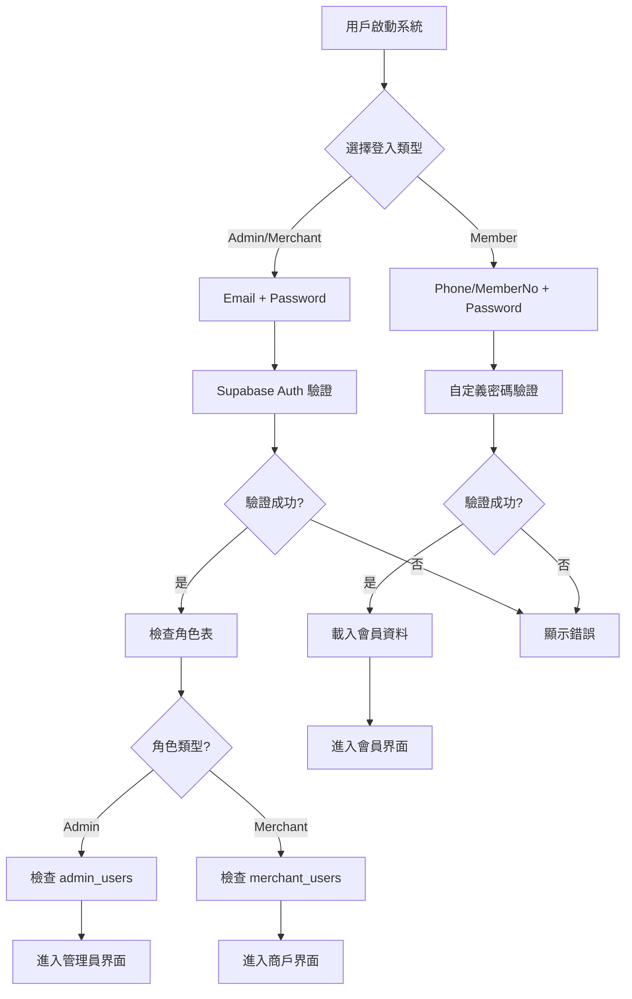

# MPS 統一身份驗證改善計劃

> **文件版本**: 1.0  
> **建立日期**: 2025-01-15  
> **最後更新**: 2025-01-15  
> **狀態**: 設計階段

## 📋 目錄
- [問題分析](#問題分析)
- [解決方案設計](#解決方案設計)
- [資料庫層實作](#資料庫層實作)
- [Python 客戶端實作](#python-客戶端實作)
- [實作步驟](#實作步驟)
- [測試計劃](#測試計劃)
- [部署指南](#部署指南)

---

## 🚨 問題分析

### 當前安全漏洞

#### 1. Admin Login 完全沒有驗證
- **位置**: `mps_cli/services/admin_service.py:185`
- **問題**: `validate_admin_access()` 永遠返回 `True`
- **影響**: 任何人都可以進入管理員系統

```python
def validate_admin_access(self) -> bool:
    """驗證管理員訪問權限"""
    # 目前簡化為總是返回 True
    return True  # ← 嚴重安全漏洞！
```

#### 2. Member Login 沒有密碼驗證
- **位置**: `mps_cli/ui/member_ui.py:45`
- **問題**: 只要知道 Member ID 或 Phone 就能登入
- **影響**: 會員資料和卡片可被任意存取

#### 3. Merchant Login 沒有密碼驗證
- **位置**: `mps_cli/ui/merchant_ui.py:46`
- **問題**: 只要知道 Merchant Code 就能登入
- **影響**: 商戶可以被冒用進行收款操作

#### 4. RPC 函數缺少權限檢查
- **位置**: `rpc/mps_rpc.sql`
- **問題**: 管理員專用函數沒有檢查調用者身份
- **影響**: 任何有 Supabase 連接的用戶都可以調用這些函數

---

## 🎯 解決方案設計

### 核心設計理念

**混合登入模式**：根據角色特性採用不同的登入方式



### 三種角色的登入方式

| 角色 | 登入識別碼 | 密碼驗證 | 驗證機制 | 原因 |
|------|-----------|---------|---------|------|
| **Admin** | Email | Password | Supabase Auth | 需要最高安全性，統一管理 |
| **Merchant** | Merchant Code 或 Email | Password | 混合驗證 | 靈活性，支援兩種方式 |
| **Member** | Phone 或 Member No | Password | 自定義驗證 | 用戶友好，無需記 email |

**為什麼 Member 使用 Phone/Member No？**
- ✅ Phone 容易記憶，符合用戶習慣
- ✅ Member No 是系統唯一識別碼
- ❌ Card No 不適合：一個會員可能有多張卡，卡片可能遺失或更換

### 權限矩陣

| 功能 | Member | Merchant | Admin | Super Admin |
|------|--------|----------|-------|-------------|
| 查看自己的卡片 | ✅ | ❌ | ✅ | ✅ |
| 生成付款 QR | ✅ | ❌ | ✅ | ✅ |
| 充值卡片 | ✅ | ❌ | ✅ | ✅ |
| 綁定卡片 | ✅ | ❌ | ✅ | ✅ |
| 掃碼收款 | ❌ | ✅ | ✅ | ✅ |
| 處理退款 | ❌ | ✅ | ✅ | ✅ |
| 查看商戶交易 | ❌ | ✅ | ✅ | ✅ |
| 創建會員 | ❌ | ❌ | ✅ | ✅ |
| 凍結/解凍卡片 | ❌ | ❌ | ✅ | ✅ |
| 暫停會員/商戶 | ❌ | ❌ | ✅ | ✅ |
| 調整積分 | ❌ | ❌ | ✅ | ✅ |
| 系統統計 | ❌ | ❌ | ✅ | ✅ |
| 管理管理員 | ❌ | ❌ | ❌ | ✅ |

---

## 🗄️ 資料庫層實作

### 階段 1：Schema 變更

#### 檔案：`schema/mps_schema.sql`

**變更 1：新增管理員表**

在 `3.5 Merchants` 之後新增：

```sql
-- 3.6 Admin Users
CREATE TABLE admin_users (
  id uuid PRIMARY KEY DEFAULT gen_random_uuid(),
  auth_user_id uuid NOT NULL UNIQUE REFERENCES auth.users(id) ON DELETE CASCADE,
  name text NOT NULL,
  role text NOT NULL DEFAULT 'admin', -- admin, super_admin
  permissions jsonb DEFAULT '[]'::jsonb,
  is_active boolean NOT NULL DEFAULT true,
  created_at timestamptz NOT NULL DEFAULT now_utc(),
  updated_at timestamptz NOT NULL DEFAULT now_utc()
);

CREATE INDEX idx_admin_users_auth_user ON admin_users(auth_user_id);
CREATE INDEX idx_admin_users_active ON admin_users(is_active);

CREATE TRIGGER trg_admin_users_updated_at
BEFORE UPDATE ON admin_users
FOR EACH ROW EXECUTE FUNCTION set_updated_at();

COMMENT ON TABLE admin_users IS '管理員用戶表，關聯 Supabase Auth';
COMMENT ON COLUMN admin_users.role IS 'admin: 一般管理員, super_admin: 超級管理員';
```

**變更 2：修改 Member Profiles 表**

```sql
ALTER TABLE member_profiles 
  ADD COLUMN auth_user_id uuid REFERENCES auth.users(id) ON DELETE SET NULL,
  ADD COLUMN password_hash text;

CREATE INDEX idx_member_profiles_auth_user ON member_profiles(auth_user_id);

COMMENT ON COLUMN member_profiles.auth_user_id IS '關聯的 Supabase Auth 用戶（可選）';
COMMENT ON COLUMN member_profiles.password_hash IS '會員登入密碼雜湊';
```

**變更 3：修改 Merchants 表**

```sql
ALTER TABLE merchants 
  ADD COLUMN password_hash text;

COMMENT ON COLUMN merchants.password_hash IS '商戶登入密碼雜湊';
```

**變更 4：新增 RLS 政策**

在 `13) ROW LEVEL SECURITY` 區塊新增：

```sql
-- ADMIN USERS
ALTER TABLE admin_users ENABLE ROW LEVEL SECURITY;

CREATE POLICY "Admins can view own profile" ON admin_users
    FOR SELECT USING (
        auth.uid() IS NOT NULL AND
        auth_user_id = auth.uid()
    );

CREATE POLICY "Super admins can view all admins" ON admin_users
    FOR SELECT USING (
        auth.uid() IS NOT NULL AND
        EXISTS (
            SELECT 1 FROM admin_users
            WHERE auth_user_id = auth.uid()
            AND role = 'super_admin'
            AND is_active = true
        )
    );
```

### 階段 2：RPC 函數實作

#### 檔案：`rpc/mps_rpc.sql`

**新增 1：認證與授權函數**

在檔案開頭新增：

```sql
-- ============================================================================
-- AUTHENTICATION & AUTHORIZATION FUNCTIONS
-- ============================================================================

-- 取得當前用戶角色
CREATE OR REPLACE FUNCTION get_user_role()
RETURNS text
LANGUAGE plpgsql
SECURITY DEFINER
STABLE
AS $$
DECLARE
  v_role text;
BEGIN
  -- 檢查是否為超級管理員
  SELECT 'super_admin' INTO v_role
  FROM admin_users
  WHERE auth_user_id = auth.uid() 
    AND is_active = true 
    AND role = 'super_admin'
  LIMIT 1;
  
  IF v_role IS NOT NULL THEN RETURN v_role; END IF;
  
  -- 檢查是否為一般管理員
  SELECT 'admin' INTO v_role
  FROM admin_users
  WHERE auth_user_id = auth.uid() AND is_active = true
  LIMIT 1;
  
  IF v_role IS NOT NULL THEN RETURN v_role; END IF;
  
  -- 檢查是否為商戶用戶
  SELECT 'merchant' INTO v_role
  FROM merchant_users
  WHERE auth_user_id = auth.uid()
  LIMIT 1;
  
  IF v_role IS NOT NULL THEN RETURN v_role; END IF;
  
  -- 檢查是否為會員
  SELECT 'member' INTO v_role
  FROM member_profiles
  WHERE auth_user_id = auth.uid() AND status = 'active'
  LIMIT 1;
  
  RETURN v_role;
END;
$$;

-- 檢查是否為管理員
CREATE OR REPLACE FUNCTION is_admin()
RETURNS boolean
LANGUAGE sql
SECURITY DEFINER
STABLE
AS $$
  SELECT EXISTS (
    SELECT 1 FROM admin_users
    WHERE auth_user_id = auth.uid() AND is_active = true
  );
$$;

-- 統一的權限檢查函數
CREATE OR REPLACE FUNCTION check_permission(required_role text)
RETURNS void
LANGUAGE plpgsql
SECURITY DEFINER
AS $$
DECLARE
  v_user_role text;
BEGIN
  v_user_role := get_user_role();
  
  IF v_user_role IS NULL THEN
    RAISE EXCEPTION 'NOT_AUTHENTICATED';
  END IF;
  
  -- Super admin 可以做任何事
  IF v_user_role = 'super_admin' THEN RETURN; END IF;
  
  -- Admin 可以做除了管理管理員以外的事
  IF v_user_role = 'admin' AND required_role IN ('admin', 'merchant', 'member') THEN
    RETURN;
  END IF;
  
  -- 其他角色只能做自己角色的事
  IF v_user_role = required_role THEN RETURN; END IF;
  
  RAISE EXCEPTION 'PERMISSION_DENIED: Required %, but user is %', required_role, v_user_role;
END;
$$;

-- 取得用戶資料
CREATE OR REPLACE FUNCTION get_user_profile()
RETURNS jsonb
LANGUAGE plpgsql
SECURITY DEFINER
STABLE
AS $$
DECLARE
  v_profile jsonb;
  v_role text;
BEGIN
  v_role := get_user_role();
  
  IF v_role IS NULL THEN RETURN NULL; END IF;
  
  IF v_role IN ('admin', 'super_admin') THEN
    SELECT jsonb_build_object(
      'role', role,
      'id', id,
      'name', name,
      'permissions', permissions,
      'is_super_admin', (role = 'super_admin')
    ) INTO v_profile
    FROM admin_users
    WHERE auth_user_id = auth.uid();
    
  ELSIF v_role = 'merchant' THEN
    SELECT jsonb_build_object(
      'role', 'merchant',
      'merchant_id', mu.merchant_id,
      'merchant_code', m.code,
      'merchant_name', m.name,
      'user_role', mu.role
    ) INTO v_profile
    FROM merchant_users mu
    JOIN merchants m ON m.id = mu.merchant_id
    WHERE mu.auth_user_id = auth.uid();
    
  ELSIF v_role = 'member' THEN
    SELECT jsonb_build_object(
      'role', 'member',
      'member_id', id,
      'member_no', member_no,
      'name', name,
      'phone', phone,
      'email', email
    ) INTO v_profile
    FROM member_profiles
    WHERE auth_user_id = auth.uid();
  END IF;
  
  RETURN v_profile;
END;
$$;

-- 會員登入驗證
CREATE OR REPLACE FUNCTION member_login(
  p_identifier text,  -- phone 或 member_no
  p_password text
)
RETURNS jsonb
LANGUAGE plpgsql
SECURITY DEFINER
AS $$
DECLARE
  v_member member_profiles%ROWTYPE;
BEGIN
  PERFORM sec.fixed_search_path();
  
  -- 查找會員
  SELECT * INTO v_member
  FROM member_profiles
  WHERE (phone = p_identifier OR member_no = p_identifier)
    AND status = 'active'
  LIMIT 1;
  
  IF NOT FOUND THEN
    RAISE EXCEPTION 'MEMBER_NOT_FOUND';
  END IF;
  
  -- 檢查密碼
  IF v_member.password_hash IS NULL THEN
    RAISE EXCEPTION 'PASSWORD_NOT_SET';
  END IF;
  
  IF NOT (v_member.password_hash = crypt(p_password, v_member.password_hash)) THEN
    INSERT INTO audit.event_log(actor_user_id, action, object_type, object_id, context, happened_at)
    VALUES (NULL, 'LOGIN_FAILED', 'member_profiles', v_member.id, 
            jsonb_build_object('identifier', p_identifier), now_utc());
    RAISE EXCEPTION 'INVALID_PASSWORD';
  END IF;
  
  -- 記錄成功登入
  INSERT INTO audit.event_log(actor_user_id, action, object_type, object_id, context, happened_at)
  VALUES (NULL, 'LOGIN_SUCCESS', 'member_profiles', v_member.id, 
          jsonb_build_object('identifier', p_identifier), now_utc());
  
  RETURN jsonb_build_object(
    'role', 'member',
    'member_id', v_member.id,
    'member_no', v_member.member_no,
    'name', v_member.name,
    'phone', v_member.phone,
    'email', v_member.email
  );
END;
$$;

-- 商戶登入驗證
CREATE OR REPLACE FUNCTION merchant_login(
  p_merchant_code text,
  p_password text
)
RETURNS jsonb
LANGUAGE plpgsql
SECURITY DEFINER
AS $$
DECLARE
  v_merchant merchants%ROWTYPE;
BEGIN
  PERFORM sec.fixed_search_path();
  
  SELECT * INTO v_merchant
  FROM merchants
  WHERE code = p_merchant_code AND status = 'active'
  LIMIT 1;
  
  IF NOT FOUND THEN
    RAISE EXCEPTION 'MERCHANT_NOT_FOUND';
  END IF;
  
  IF v_merchant.password_hash IS NULL THEN
    RAISE EXCEPTION 'PASSWORD_NOT_SET';
  END IF;
  
  IF NOT (v_merchant.password_hash = crypt(p_password, v_merchant.password_hash)) THEN
    INSERT INTO audit.event_log(actor_user_id, action, object_type, object_id, context, happened_at)
    VALUES (NULL, 'LOGIN_FAILED', 'merchants', v_merchant.id, 
            jsonb_build_object('code', p_merchant_code), now_utc());
    RAISE EXCEPTION 'INVALID_PASSWORD';
  END IF;
  
  INSERT INTO audit.event_log(actor_user_id, action, object_type, object_id, context, happened_at)
  VALUES (NULL, 'LOGIN_SUCCESS', 'merchants', v_merchant.id, 
          jsonb_build_object('code', p_merchant_code), now_utc());
  
  RETURN jsonb_build_object(
    'role', 'merchant',
    'merchant_id', v_merchant.id,
    'merchant_code', v_merchant.code,
    'merchant_name', v_merchant.name
  );
END;
$$;

-- 設定會員密碼
CREATE OR REPLACE FUNCTION set_member_password(
  p_member_id uuid,
  p_password text
)
RETURNS boolean
LANGUAGE plpgsql
SECURITY DEFINER
AS $$
BEGIN
  PERFORM sec.fixed_search_path();
  
  IF length(p_password) < 6 THEN
    RAISE EXCEPTION 'PASSWORD_TOO_SHORT';
  END IF;
  
  UPDATE member_profiles
  SET password_hash = crypt(p_password, gen_salt('bf')),
      updated_at = now_utc()
  WHERE id = p_member_id;
  
  IF NOT FOUND THEN
    RAISE EXCEPTION 'MEMBER_NOT_FOUND';
  END IF;
  
  INSERT INTO audit.event_log(actor_user_id, action, object_type, object_id, context, happened_at)
  VALUES (auth.uid(), 'PASSWORD_CHANGED', 'member_profiles', p_member_id, '{}'::jsonb, now_utc());
  
  RETURN TRUE;
END;
$$;

-- 設定商戶密碼
CREATE OR REPLACE FUNCTION set_merchant_password(
  p_merchant_id uuid,
  p_password text
)
RETURNS boolean
LANGUAGE plpgsql
SECURITY DEFINER
AS $$
BEGIN
  PERFORM sec.fixed_search_path();
  PERFORM check_permission('admin');
  
  IF length(p_password) < 6 THEN
    RAISE EXCEPTION 'PASSWORD_TOO_SHORT';
  END IF;
  
  UPDATE merchants
  SET password_hash = crypt(p_password, gen_salt('bf')),
      updated_at = now_utc()
  WHERE id = p_merchant_id;
  
  IF NOT FOUND THEN
    RAISE EXCEPTION 'MERCHANT_NOT_FOUND';
  END IF;
  
  INSERT INTO audit.event_log(actor_user_id, action, object_type, object_id, context, happened_at)
  VALUES (auth.uid(), 'PASSWORD_CHANGED', 'merchants', p_merchant_id, '{}'::jsonb, now_utc());
  
  RETURN TRUE;
END;
$$;
```

**變更 2：更新管理員專用 RPC 函數**

需要在以下 6 個函數開頭加入 `PERFORM check_permission('admin');`：

1. `freeze_card(uuid)`
2. `unfreeze_card(uuid)`
3. `admin_suspend_member(uuid)`
4. `admin_suspend_merchant(uuid)`
5. `update_points_and_level(uuid, int, text)` - 當 reason='manual_adjust' 時
6. `cron_rotate_qr_tokens(integer)`

範例：

```sql
CREATE OR REPLACE FUNCTION freeze_card(p_card_id uuid)
RETURNS boolean
LANGUAGE plpgsql
SECURITY DEFINER
AS $$
BEGIN
  PERFORM sec.fixed_search_path();
  PERFORM check_permission('admin');  -- ← 新增這行
  
  UPDATE member_cards SET status='inactive', updated_at=now_utc() WHERE id=p_card_id;
  INSERT INTO audit.event_log(actor_user_id, action, object_type, object_id, context
, happened_at)
  VALUES (auth.uid(), 'CARD_FREEZE', 'member_cards', p_card_id, '{}'::jsonb, now_utc());
  RETURN TRUE;
END;
$$;
```

**變更 3：更新商戶收款函數權限檢查**

```sql
CREATE OR REPLACE FUNCTION merchant_charge_by_qr(
  p_merchant_code text,
  p_qr_plain text,
  p_raw_amount numeric,
  p_idempotency_key text DEFAULT NULL,
  p_tag jsonb DEFAULT '{}'::jsonb,
  p_external_order_id text DEFAULT NULL
)
RETURNS TABLE (tx_id uuid, tx_no text, card_id uuid, final_amount numeric, discount numeric)
LANGUAGE plpgsql
SECURITY DEFINER
AS $$
DECLARE
  v_merch merchants%ROWTYPE;
  v_user_role text;
  v_is_authorized boolean := false;
  -- ... 其他變數
BEGIN
  PERFORM sec.fixed_search_path();

  -- 權限檢查
  v_user_role := get_user_role();
  
  IF v_user_role IN ('admin', 'super_admin') THEN
    v_is_authorized := true;
  ELSIF v_user_role = 'merchant' THEN
    SELECT EXISTS(
      SELECT 1 FROM merchant_users 
      WHERE merchant_id=(SELECT id FROM merchants WHERE code=p_merchant_code)
        AND auth_user_id=auth.uid()
    ) INTO v_is_authorized;
  END IF;
  
  IF NOT v_is_authorized THEN 
    RAISE EXCEPTION 'NOT_AUTHORIZED_FOR_THIS_MERCHANT'; 
  END IF;

  -- ... 原有交易邏輯保持不變
END;
$$;
```

---

## 💻 Python 客戶端實作

### 1. Supabase Client 修改

**檔案**: `mps_cli/config/supabase_client.py`

在 `SupabaseClient` 類中新增以下方法：

```python
def sign_in_with_password(self, email: str, password: str) -> Dict[str, Any]:
    """使用 email 和密碼登入"""
    if not self.client:
        raise Exception("Supabase 客戶端未初始化")
    
    try:
        logger.debug(f"嘗試登入: {email}")
        response = self.client.auth.sign_in_with_password({
            "email": email,
            "password": password
        })
        
        if response.session:
            self.auth_session = response.session
            logger.info(f"登入成功: {email}")
            return {
                "user": response.user,
                "session": response.session
            }
        else:
            raise Exception("登入失敗：無效的憑證")
            
    except Exception as e:
        logger.error(f"登入失敗: {email}, 錯誤: {e}")
        raise Exception(f"登入失敗: {e}")

def sign_out(self):
    """登出"""
    if not self.client:
        return
    
    try:
        self.client.auth.sign_out()
        self.auth_session = None
        logger.info("登出成功")
    except Exception as e:
        logger.error(f"登出失敗: {e}")

def get_current_user(self) -> Optional[Dict]:
    """取得當前登入用戶"""
    if not self.client:
        return None
    
    try:
        response = self.client.auth.get_user()
        return response.user if response else None
    except Exception as e:
        logger.error(f"取得用戶失敗: {e}")
        return None

def is_authenticated(self) -> bool:
    """檢查是否已登入"""
    return self.auth_session is not None
```

在 `__init__` 方法中新增：

```python
def __init__(self):
    self.url = settings.database.url
    self.service_role_key = settings.database.service_role_key
    self.anon_key = settings.database.anon_key
    self.client: Optional[Client] = None
    self.auth_session = None  # ← 新增這行
    self._initialize_client()
```

### 2. 建立統一認證服務

**檔案**: `mps_cli/services/auth_service.py`（新建）

```python
from typing import Optional, Dict, Any
from .base_service import BaseService
from utils.logger import get_logger

logger = get_logger(__name__)

class AuthService(BaseService):
    """統一身份驗證服務"""
    
    def __init__(self):
        super().__init__()
        self.current_user = None
        self.current_role = None
        self.auth_type = None  # 'supabase_auth' 或 'custom'
    
    def login_with_email(self, email: str, password: str) -> Dict[str, Any]:
        """Email 登入（管理員/商戶）"""
        self.log_operation("Email 登入", {"email": email})
        
        try:
            # 1. Supabase Auth 登入
            auth_response = self.supabase.sign_in_with_password(email, password)
            
            # 2. 取得用戶角色和資料
            profile = self.rpc_call("get_user_profile", {})
            
            if not profile:
                self.supabase.sign_out()
                raise Exception("USER_NOT_AUTHORIZED")
            
            # 3. 只允許 admin 和 merchant
            role = profile.get("role")
            if role not in ["admin", "super_admin", "merchant"]:
                self.supabase.sign_out()
                raise Exception("INVALID_LOGIN_METHOD")
            
            self.current_user = profile
            self.current_role = role
            self.auth_type = "supabase_auth"
            
            self.logger.info(f"Email 登入成功: {email}, 角色: {role}")
            
            return {
                "success": True,
                "role": role,
                "profile": profile,
                "auth_type": "supabase_auth"
            }
            
        except Exception as e:
            self.logger.error(f"Email 登入失敗: {email}, 錯誤: {e}")
            raise self.handle_service_error("Email 登入", e)
    
    def login_with_identifier(self, identifier: str, password: str) -> Dict[str, Any]:
        """識別碼登入（會員）"""
        self.log_operation("會員登入", {"identifier": identifier})
        
        try:
            result = self.rpc_call("member_login", {
                "p_identifier": identifier,
                "p_password": password
            })
            
            if not result:
                raise Exception("LOGIN_FAILED")
            
            self.current_user = result
            self.current_role = "member"
            self.auth_type = "custom"
            
            self.logger.info(f"會員登入成功: {identifier}")
            
            return {
                "success": True,
                "role": "member",
                "profile": result,
                "auth_type": "custom"
            }
            
        except Exception as e:
            self.logger.error(f"會員登入失敗: {identifier}, 錯誤: {e}")
            raise self.handle_service_error("會員登入", e)
    
    def login_merchant_with_code(self, merchant_code: str, password: str) -> Dict[str, Any]:
        """商戶代碼登入"""
        self.log_operation("商戶代碼登入", {"merchant_code": merchant_code})
        
        try:
            result = self.rpc_call("merchant_login", {
                "p_merchant_code": merchant_code,
                "p_password": password
            })
            
            if not result:
                raise Exception("LOGIN_FAILED")
            
            self.current_user = result
            self.current_role = "merchant"
            self.auth_type = "custom"
            
            self.logger.info(f"商戶登入成功: {merchant_code}")
            
            return {
                "success": True,
                "role": "merchant",
                "profile": result,
                "auth_type": "custom"
            }
            
        except Exception as e:
            self.logger.error(f"商戶登入失敗: {merchant_code}, 錯誤: {e}")
            raise self.handle_service_error("商戶登入", e)
    
    def logout(self):
        """登出"""
        try:
            if self.auth_type == "supabase_auth":
                self.supabase.sign_out()
            
            self.logger.info(f"登出成功: 角色 {self.current_role}")
            
            self.current_user = None
            self.current_role = None
            self.auth_type = None
            
        except Exception as e:
            self.logger.error(f"登出失敗: {e}")
    
    def get_current_user(self) -> Optional[Dict]:
        """取得當前用戶"""
        return self.current_user
    
    def get_current_role(self) -> Optional[str]:
        """取得當前角色"""
        return self.current_role
    
    def check_permission(self, required_role: str) -> bool:
        """檢查權限"""
        if not self.current_role:
            return False
        
        role_hierarchy = {
            "super_admin": 4,
            "admin": 3,
            "merchant": 2,
            "member": 1
        }
        
        current_level = role_hierarchy.get(self.current_role, 0)
        required_level = role_hierarchy.get(required_role, 0)
        
        return current_level >= required_level
    
    def is_authenticated(self) -> bool:
        """檢查是否已登入"""
        if self.auth_type == "supabase_auth":
            return self.supabase.is_authenticated()
        elif self.auth_type == "custom":
            return self.current_user is not None
        return False
```

### 3. 修改 Base Service

**檔案**: `mps_cli/services/base_service.py`

在 `BaseService` 類中新增：

```python
def __init__(self):
    from config.supabase_client import supabase_client
    self.supabase = supabase_client
    self.logger = get_logger(self.__class__.__name__)
    self.auth_service = None  # ← 新增這行

def set_auth_service(self, auth_service):
    """設定認證服務"""
    self.auth_service = auth_service

def require_role(self, required_role: str):
    """要求特定角色權限"""
    if not self.auth_service:
        raise Exception("AUTH_SERVICE_NOT_INITIALIZED")
    
    if not self.auth_service.check_permission(required_role):
        raise Exception(f"PERMISSION_DENIED: {required_role} role required")

def get_current_user_id(self) -> Optional[str]:
    """取得當前用戶 ID"""
    if not self.auth_service or not self.auth_service.current_user:
        return None
    
    role = self.auth_service.current_role
    user = self.auth_service.current_user
    
    if role in ["admin", "super_admin"]:
        return user.get("id")
    elif role == "merchant":
        return user.get("merchant_id")
    elif role == "member":
        return user.get("member_id")
    
    return None
```

### 4. 修改各個 Service

**檔案**: `mps_cli/services/admin_service.py`

```python
class AdminService(BaseService):
    """管理員服務"""
    
    # 移除 validate_admin_access() 方法
    
    def create_member_profile(self, ...):
        """創建會員"""
        self.require_role('admin')  # ← 新增權限檢查
        # ... 原有邏輯
    
    def freeze_card(self, card_id: str) -> bool:
        """凍結卡片"""
        self.require_role('admin')  # ← 新增權限檢查
        # ... 原有邏輯
    
    # 所有管理員方法都加入 self.require_role('admin')
```

**檔案**: `mps_cli/services/member_service.py`

```python
class MemberService(BaseService):
    """會員服務"""
    
    # 移除 validate_member_login() 方法
    # 其他方法保持不變
```

**檔案**: `mps_cli/services/merchant_service.py`

```python
class MerchantService(BaseService):
    """商戶服務"""
    
    # 移除 validate_merchant_login() 方法
    # 其他方法保持不變
```

### 5. 建立統一登入 UI

**檔案**: `mps_cli/ui/login_ui.py`（新建）

```python
from typing import Optional, Dict
from services.auth_service import AuthService
from ui.base_ui import BaseUI
from utils.logger import ui_logger
import getpass

class LoginUI:
    """統一登入界面"""
    
    def __init__(self):
        self.auth_service = AuthService()
    
    def show_login(self) -> Optional[Dict]:
        """顯示登入界面"""
        BaseUI.clear_screen()
        BaseUI.show_header("MPS System Login")
        
        print("\n請選擇登入方式：")
        print("1. Admin/Merchant Login (Email + Password)")
        print("2. Member Login (Phone/Member No + Password)")
        print("3. Exit")
        
        choice = input("\n您的選擇 (1-3): ").strip()
        
        if choice == "1":
            return self._login_with_email()
        elif choice == "2":
            return self._login_with_identifier()
        elif choice == "3":
            return None
        else:
            BaseUI.show_error("無效的選擇")
            BaseUI.pause()
            return self.show_login()
    
    def _login_with_email(self) -> Optional[Dict]:
        """Email 登入"""
        BaseUI.clear_screen()
        BaseUI.show_header("Admin/Merchant Login")
        
        print("\n請輸入您的登入資訊：")
        email = input("Email: ").strip()
        password = getpass.getpass("Password: ")
        
        if not email or not password:
            BaseUI.show_error("請輸入 email 和密碼")
            BaseUI.pause()
            return None
        
        try:
            result = self.auth_service.login_with_email(email, password)
            
            role_display = {
                "admin": "管理員",
                "super_admin": "超級管理員",
                "merchant": "商戶"
            }.get(result['role'], result['role'])
            
            BaseUI.show_success(f"登入成功！角色：{role_display}")
            ui_logger.log_login(result['role'], email)
            BaseUI.pause()
            
            return result
            
        except Exception as e:
            BaseUI.show_error(f"登入失敗：{e}")
            BaseUI.pause()
            return None
    
    def _login_with_identifier(self) -> Optional[Dict]:
        """會員登入"""
        BaseUI.clear_screen()
        BaseUI.show_header("Member Login")
        
        print("\n請輸入您的登入資訊：")
        print("（可使用手機號碼或會員編號）")
        identifier = input("Phone/Member No: ").strip()
        password = getpass.getpass("Password: ")
        
        if not identifier or not password:
            BaseUI.show_error("請輸入識別碼和密碼")
            BaseUI.pause()
            return None
        
        try:
            result = self.auth_service.login_with_identifier(identifier, password)
            
            profile = result['profile']
            BaseUI.show_success(f"登入成功！歡迎 {profile.get('name', '')}")
            ui_logger.log_login("member", identifier)
            BaseUI.pause()
            
            return result
            
        except Exception as e:
            BaseUI.show_error(f"登入失敗：{e}")
            BaseUI.pause()
            return None
```

### 6. 修改各個 UI

**檔案**: `mps_cli/ui/admin_ui.py`

```python
class AdminUI:
    """管理員用戶界面"""
    
    def __init__(self, auth_service: AuthService):
        self.admin_service = AdminService()
        self.member_service = MemberService()
        self.qr_service = QRService()
        self.auth_service = auth_service
        
        # 設定 auth_service
        self.admin_service.set_auth_service(auth_service)
        self.member_service.set_auth_service(auth_service)
        self.qr_service.set_auth_service(auth_service)
        
        # 從 auth_service 取得資訊
        profile = auth_service.get_current_user()
        self.current_admin_name = profile.get('name', 'Admin') if profile else 'Admin'
    
    def start(self):
        """啟動管理員界面"""
        try:
            # 移除 _admin_login() 調用
            # 直接顯示主菜單
            self._show_main_menu()
            
        except KeyboardInterrupt:
            print("\n▸ Goodbye!")
        except Exception as e:
            BaseUI.show_error(f"系統錯誤: {e}")
        finally:
            ui_logger.log_logout("admin")
    
    # 移除 _admin_login() 方法
```

**檔案**: `mps_cli/ui/member_ui.py`

```python
class MemberUI:
    """會員用戶界面"""
    
    def __init__(self, auth_service: AuthService):
        self.member_service = MemberService()
        self.payment_service = PaymentService()
        self.qr_service = QRService()
        self.auth_service = auth_service
        
        # 設定 auth_service
        self.member_service.set_auth_service(auth_service)
        self.payment_service.set_auth_service(auth_service)
        self.qr_service.set_auth_service(auth_service)
        
        # 從 auth_service 取得資訊
        profile = auth_service.get_current_user()
        self.current_member_id = profile.get('member_id') if profile else None
        self.current_member_name = profile.get('name') if profile else None
    
    def start(self):
        """啟動會員界面"""
        try:
            # 移除 _member_login() 調用
            self._show_main_menu()
            
        except KeyboardInterrupt:
            print("\n▸ Goodbye!")
        except Exception as e:
            BaseUI.show_error(f"系統錯誤: {e}")
        finally:
            if self.current_member_id:
                ui_logger.log_logout("member")
    
    # 移除 _member_login() 方法
```

**檔案**: `mps_cli/ui/merchant_ui.py`

```python
class MerchantUI:
    """商戶用戶界面"""
    
    def __init__(self, auth_service: AuthService):
        self.merchant_service = MerchantService()
        self.payment_service = PaymentService()
        self.qr_service = QRService()
        self.auth_service = auth_service
        
        # 設定 auth_service
        self.merchant_service.set_auth_service(auth_service)
        self.payment_service.set_auth_service(auth_service)
        self.qr_service.set_auth_service(auth_service)
        
        # 從 auth_service 取得資訊
        profile = auth_service.get_current_user()
        self.current_merchant_id = profile.get('merchant_id') if profile else None
        self.current_merchant_code = profile.get('merchant_code') if profile else None
        self.current_merchant_name = profile.get('merchant_name') if profile else None
        self.current_operator = profile.get('merchant_name') if profile else None
    
    def start(self):
        """啟動商戶界面"""
        try:
            # 移除 _merchant_login() 調用
            self._show_main_menu()
            
        except KeyboardInterrupt:
            print("\n▸ Goodbye!")
        except Exception as e:
            BaseUI.show_error(f"系統錯誤: {e}")
        finally:
            if self.current_merchant_id:
                ui_logger.log_logout("merchant")
    
    # 移除 _merchant_login() 方法
```

### 7. 修改主程式

**檔案**: `mps_cli/main.py`

```python
#!/usr/bin/env python3
import os
import sys
from pathlib import Path

project_root = Path(__file__).parent
sys.path.insert(0, str(project_root))

from dotenv import load_dotenv
load_dotenv()

from config.settings import settings
from ui.login_ui import LoginUI
from ui.member_ui import MemberUI
from ui.merchant_ui import MerchantUI
from ui.admin_ui import AdminUI
from ui.base_ui import BaseUI
from utils.logger import setup_logging

def main():
    """主入口函數"""
    try:
        setup_logging()
        settings.validate()
        
        show_welcome()
        
        # 統一登入
        login_ui = LoginUI()
        login_result = login_ui.show_login()
        
        if not login_result:
            print("👋 再見！")
            return
        
        # 根據角色進入對應界面
        role = login_result["role"]
        auth_service = login_ui.auth_service
        
        try:
            if role in ["admin", "super_admin"]:
                admin_ui = AdminUI(auth_service)
                admin_ui.start()
            elif role == "merchant":
                merchant_ui = MerchantUI(auth_service)
                merchant_ui.start()
            elif role == "member":
                member_ui = MemberUI(auth_service)
                member_ui.start()
            else:
                BaseUI.show_error(f"未知角色: {role}")
        finally:
            # 登出
            auth_service.logout()
            
    except KeyboardInterrupt:
        print("\n👋 再見！")
    except Exception as e:
        print(f"❌ 系統錯誤: {e}")
        sys.exit(1)

def show_welcome():
    """顯示歡迎界面"""
    BaseUI.clear_screen()
    print("╔═══════════════════════════════════════╗")
    print("║        歡迎使用 MPS 系統              ║")
    print("║     Member Payment System             ║")
    print("╚═══════════════════════════════════════╝")
    print()

if __name__ == "__main__":
    main()
```

---

## 📝 實作步驟

### 階段 1：資料庫層（優先級：最高）

#### 步驟 1.1：備份現有資料庫
```bash
# 在 Supabase Dashboard 或使用 pg_dump
pg_dump -h <host> -U postgres -d postgres > backup_before_auth_$(date +%Y%m%d).sql
```

#### 步驟 1.2：執行 Schema 變更
```bash
# 在 Supabase Dashboard > SQL Editor 執行
# 或使用 psql
psql -h <host> -U postgres -d postgres -f schema/mps_schema.sql
```

#### 步驟 1.3：執行 RPC 函數更新
```bash
psql -h <host> -U postgres -d postgres -f rpc/mps_rpc.sql
```

#### 步驟 1.4：驗證資料庫變更
```sql
-- 檢查新表是否建立
SELECT table_name FROM information_schema.tables 
WHERE table_schema = 'public' AND table_name = 'admin_users';

-- 檢查新欄位是否新增
SELECT column_name FROM information_schema.columns 
WHERE table_name = 'member_profiles' AND column_name IN ('auth_user_id', 'password_hash');

-- 檢查新函數是否建立
SELECT routine_name FROM information_schema.routines 
WHERE routine_schema = 'public' 
  AND routine_name IN ('get_user_role', 'check_permission', 'member_login', 'merchant_login');
```

### 階段 2：Python 客戶端層

#### 步驟 2.1：修改 Supabase Client
- 檔案：`mps_cli/config/supabase_client.py`
- 新增 Auth 相關方法
- 預估時間：1 小時

#### 步驟 2.2：建立 Auth Service
- 檔案：`mps_cli/services/auth_service.py`（新建）
- 實作三種登入方法
- 預估時間：2 小時

#### 步驟 2.3：修改 Base Service
- 檔案：`mps_cli/services/base_service.py`
- 新增權限檢查方法
- 預估時間：1 小時

#### 步驟 2.4：更新各個 Service
- 檔案：
  - `mps_cli/services/admin_service.py`
  - `mps_cli/services/member_service.py`
  - `mps_cli/services/merchant_service.py`
- 移除舊登入邏輯，加入權限檢查
- 預估時間：2 小時

#### 步驟 2.5：建立統一登入 UI
- 檔案：`mps_cli/ui/login_ui.py`（新建）
- 實作登入界面
- 預估時間：2 小時

#### 步驟 2.6：修改各個 UI
- 檔案：
  - `mps_cli/ui/admin_ui.py`
  - `mps_cli/ui/member_ui.py`
  - `mps_cli/ui/merchant_ui.py`
- 移除 `_xxx_login()` 方法，接受 `auth_service` 參數
- 預估時間：2 小時

#### 步驟 2.7：修改主程式
- 檔案：`mps_cli/main.py`
- 實作統一登入流程
- 預估時間：1 小時

### 階段 3：測試與驗證

#### 步驟 3.1：建立測試帳號

**在 Supabase Dashboard > Authentication > Users 建立：**

1. **管理員帳號**
```sql
-- 方法 1：在 Supabase Dashboard 手動建立
-- Email: admin@mps.com
-- Password: admin123

-- 方法 2：使用 SQL（需要在 Supabase Dashboard > SQL Editor 執行）
INSERT INTO admin_users (auth_user_id, name, role)
SELECT id, 'System Admin', 'admin'
FROM auth.users 
WHERE email = 'admin@mps.com';
```

2. **商戶帳號**
```sql
-- 先建立商戶（如果還沒有）
INSERT INTO merchants (code, name, contact, status)
VALUES ('TEST001', '測試商戶', '0912345678', 'active')
ON CONFLICT (code) DO NOTHING;

-- 設定商戶密碼
SELECT set_merchant_password(
  (SELECT id FROM merchants WHERE code = 'TEST001'),
  'merchant123'
);

-- 或在 Supabase Dashboard 建立 Auth User 並關聯
INSERT INTO merchant_users (merchant_id, auth_user_id, role)
SELECT 
  (SELECT id FROM merchants WHERE code = 'TEST001'),
  (SELECT id FROM auth.users WHERE email = 'merchant@mps.com'),
  'staff';
```

3. **會員帳號**
```sql
-- 假設已有會員資料
UPDATE member_profiles
SET password_hash = crypt('member123', gen_salt('bf'))
WHERE phone = '0912345678';

-- 或建立新會員並設定密碼
INSERT INTO member_profiles (name, phone, email, status)
VALUES ('測試會員', '0912345678', 'member@test.com', 'active');

SELECT set_member_password(
  (SELECT id FROM member_profiles WHERE phone = '0912345678'),
  'member123'
);
```

#### 步驟 3.2：測試登入流程

```bash
cd mps_cli
python main.py

# 測試 1：管理員登入
# 選擇 1 (Admin/Merchant Login)
# Email: admin@mps.com
# Password: admin123

# 測試 2：商戶登入（Code）
# 選擇 1 (Admin/Merchant Login)
# 然後選擇 Merchant Code 登入
# Code: TEST001
# Password: merchant123

# 測試 3：會員登入
# 選擇 2 (Member Login)
# Phone/Member No: 0912345678
# Password: member123
```

#### 步驟 3.3：測試權限控制

**測試案例：**

1. **管理員功能測試**
   - ✅ 可以創建會員
   - ✅ 可以凍結卡片
   - ✅ 可以調整積分
   - ✅ 可以暫停會員/商戶

2. **商戶功能測試**
   - ✅ 可以掃碼收款
   - ✅ 可以處理退款
   - ❌ 不能創建會員
   - ❌ 不能凍結卡片

3. **會員功能測試**
   - ✅ 可以查看自己的卡片
   - ✅ 可以生成 QR 碼
   - ✅ 可以充值
   - ❌ 不能掃碼收款
   - ❌ 不能凍結卡片

4. **跨角色測試**
   - ❌ 會員不能存取管理員功能
   - ❌ 商戶不能存取會員資料
   - ❌ 未登入不能調用任何 RPC

---

## 🧪 測試計劃

### 單元測試

**檔案**: `mps_cli/tests/test_auth_service.py`（新建）

```python
import unittest
from unittest.mock import Mock, patch
from services.auth_service import AuthService

class TestAuthService(unittest.TestCase):
    def setUp(self):
        self.auth_service = AuthService()
        self.auth_service.supabase = Mock()
    
    def test_login_with_email_success(self):
        """測試 Email 登入成功"""
        # Mock Supabase Auth 回應
        mock_auth_response = {
            "user": {"id": "test-user-id"},
            "session": {"access_token": "test-token"}
        }
        self.auth_service.supabase.sign_in_with_password.return_value = mock_auth_response
        
        # Mock get_user_profile RPC
        mock_profile = {
            "role": "admin",
            "id": "test-admin-id",
            "name": "Test Admin"
        }
        self.auth_service.rpc_call = Mock(return_value=mock_profile)
        
        # 執行登入
        result = self.auth_service.login_with_email("admin@test.com", "password123")
        
        # 驗證結果
        self.assertTrue(result["success"])
        self.assertEqual(result["role"], "admin")
        self.assertEqual(self.auth_service.current_role, "admin")
    
    def test_login_with_identifier_success(self):
        """測試會員登入成功"""
        # Mock member_login RPC
        mock_profile = {
            "role": "member",
            "member_id": "test-member-id",
            "name": "Test Member"
        }
        self.auth_service.rpc_call = Mock(return_value=mock_profile)
        
        # 執行登入
        result = self.auth_service.login_with_identifier("0912345678", "password123")
        
        # 驗證結果
        self.assertTrue(result["success"])
        self.assertEqual(result["role"], "member")
        self.assertEqual(self.auth_service.auth_type, "custom")
    
    def test_check_permission(self):
        """測試權限檢查"""
        # 設定當前角色為 admin
        self.auth_service.current_role = "admin"
        
        # Admin 應該可以存取 admin 和 member 功能
        self.assertTrue(self.auth_service.check_permission("admin"))
        self.assertTrue(self.auth_service.check_permission("member"))
        
        # 設定當前角色為 member
        self.auth_service.current_role = "member"
        
        # Member 不應該可以存取 admin 功能
        self.assertFalse(self.auth_service.check_permission("admin"))
        self.assertTrue(self.auth_service.check_permission("member"))
```

### 整合測試

**檔案**: `mps_cli/tests/test_auth_integration.py`（新建）

```python
import unittest
from services.auth_service import AuthService
from services.admin_service import AdminService

class TestAuthIntegration(unittest.TestCase):
    def setUp(self):
        self.auth_service = AuthService()
        self.admin_service = AdminService()
        self.admin_service.set_auth_service(self.auth_service)
    
    def test_admin_operation_without_login(self):
        """測試未登入時不能執行管理員操作"""
        with self.assertRaises(Exception) as context:
            self.admin_service.freeze_card("test-card-id")
        
        self.assertIn("AUTH_SERVICE_NOT_INITIALIZED", str(context.exception))
    
    def test_member_cannot_access_admin_function(self):
        """測試會員不能存取管理員功能"""
        # 模擬會員登入
        self.auth_service.current_role = "member"
        self.auth_service.current_user = {"member_id": "test-member-id"}
        
        # 嘗試執行管理員操作
        with self.assertRaises(Exception) as context:
            self.admin_service.freeze_card("test-card-id")
        
        self.assertIn("PERMISSION_DENIED", str(context.exception))
```

---

## 🚀 部署指南

### 部署前檢查清單

- [ ] 資料庫備份已完成
- [ ] Schema 變更已測試
- [ ] RPC 函數已更新
- [ ] Python 程式碼已測試
- [ ] 測試帳號已建立
- [ ] 文檔已更新

### 部署步驟

#### 1. 資料庫部署

```bash
# 1. 備份現有資料庫
pg_dump -h <host> -U postgres -d postgres > backup_$(date +%Y%m%d_%H%M%S).sql

# 2. 執行 Schema 變更
psql -h <host> -U postgres -d postgres -f schema/mps_schema.sql

# 3. 執行 RPC 函數更新
psql -h <host> -U postgres -d postgres -f rpc/mps_rpc.sql

# 4. 驗證變更
psql -h <host> -U postgres -d postgres -c "SELECT * FROM admin_users LIMIT 1;"
```

#### 2. Python 應用部署

```bash
# 1. 更新程式碼
cd mps_cli
git pull origin main

# 2. 安裝新依賴（如果有）
pip install -r requirements.txt

# 3. 執行測試
python -m pytest tests/

# 4. 啟動應用
python main.py
```

### 回滾計劃

如果部署失敗，執行以下步驟回滾：

```bash
# 1. 恢復資料庫
psql -h <host> -U postgres -d postgres < backup_YYYYMMDD_HHMMSS.sql

# 2. 恢復程式碼
git checkout <previous-commit>

# 3. 重新安裝依賴
pip install -r requirements.txt
```

---

## 📊 實作時程

### 總體時程規劃

| 階段 | 工作內容 | 預估時間 | 負責人 |
|------|---------|---------|--------|
| **階段 1** | 資料庫層實作 | 3-4 小時 | Backend Dev |
| **階段 2** | Python 客戶端實作 | 8-10 小時 | Python Dev |
| **階段 3** | 測試與驗證 | 3-4 小時 | QA Team |
| **階段 4** | 文檔與部署 | 2-3 小時 | DevOps |
| **總計** | | **16-21 小時** | |

### 詳細時程

#### Week 1: 資料庫層
- **Day 1-2**: Schema 設計與實作
  - 建立 admin_users 表
  - 修改 member_profiles 和 merchants 表
  - 建立認證函數
  
- **Day 2-3**: RPC 函數更新
  - 更新 6 個管理員函數
  - 更新商戶收款函數
  - 測試所有 RPC 函數

#### Week 2: Python 客戶端
- **Day 1**: Supabase Client 和 Auth Service
  - 修改 Supabase Client
  - 建立 Auth Service
  
- **Day 2**: Service 層更新
  - 修改 Base Service
  - 更新 Admin/Member/Merchant Service
  
- **Day 3**: UI 層更新
  - 建立 Login UI
  - 修改各個 UI
  - 修改主程式

#### Week 3: 測試與部署
- **Day 1-2**: 測試
  - 單元測試
  - 整合測試
  - 權限測試
  
- **Day 3**: 部署
  - 部署到測試環境
  - 驗證功能
  - 部署到生產環境

---

## 🔐 安全性考量

### 密碼安全

1. **密碼強度要求**
   - 最少 6 個字元
   - 建議包含大小寫字母、數字、特殊字元

2. **密碼儲存**
   - 使用 bcrypt 雜湊（`crypt()` 函數）
   - 永不儲存明文密碼

3. **密碼傳輸**
   - 使用 HTTPS 連接
   - 使用 `getpass` 模組隱藏輸入

### Session 管理

1. **Supabase Auth Session**
   - 自動管理 token 刷新
   - Session 過期自動登出

2. **自定義 Session（會員/商戶 Code 登入）**
   - 目前簡化實作
   - 未來可加入 session token 機制

### 審計日誌

所有登入嘗試都記錄在 `audit.event_log`：
- 成功登入：`LOGIN_SUCCESS`
- 失敗登入：`LOGIN_FAILED`
- 密碼變更：`PASSWORD_CHANGED`

---

## 📚 使用指南

### 管理員首次設定

#### 1. 在 Supabase 建立管理員帳號

```sql
-- 在 Supabase Dashboard > SQL Editor 執行

-- 建立第一個管理員（需要先在 Auth > Users 建立 email）
INSERT INTO admin_users (auth_user_id, name, role, is_active)
SELECT id, 'System Administrator', 'super_admin', true
FROM auth.users 
WHERE email = 'admin@yourdomain.com';
```

#### 2. 設定會員密碼

```sql
-- 為現有會員設定密碼
SELECT set_member_password(
  (SELECT id FROM member_profiles WHERE phone = '0912345678'),
  'new_password_here'
);
```

#### 3. 設定商戶密碼

```sql
-- 為現有商戶設定密碼
SELECT set_merchant_password(
  (SELECT id FROM merchants WHERE code = 'SHOP001'),
  'new_password_here'
);
```

### 用戶登入指南

#### 管理員登入
```
1. 啟動程式：python main.py
2. 選擇：1 (Admin/Merchant Login)
3. 輸入 Email 和 Password
4. 進入管理員界面
```

#### 商戶登入（兩種方式）
```
方式 1：使用 Merchant Code
1. 啟動程式：python main.py
2. 選擇：1 (Admin/Merchant Login)
3. 選擇：1 (Merchant Code Login)
4. 輸入 Code 和 Password

方式 2：使用 Email
1. 啟動程式：python main.py
2. 選擇：1 (Admin/Merchant Login)
3. 選擇：2 (Email Login)
4. 輸入 Email 和 Password
```

#### 會員登入
```
1. 啟動程式：python main.py
2. 選擇：2 (Member Login)
3. 輸入 Phone 或 Member No
4. 輸入 Password
5. 進入會員界面
```

---

## 🔄 資料遷移指南

### 現有用戶遷移

#### 1. 會員遷移

```sql
-- 為所有現有會員設定預設密碼（臨時）
UPDATE member_profiles
SET password_hash = crypt('temp123456', gen_salt('bf'))
WHERE password_hash IS NULL;

-- 通知會員變更密碼
-- 可以建立一個 RPC 讓會員自己變更密碼
```

#### 2. 商戶遷移

```sql
-- 為所有現有商戶設定預設密碼（臨時）
UPDATE merchants
SET password_hash = crypt('temp123456', gen_salt('bf'))
WHERE password_hash IS NULL;

-- 管理員需要為每個商戶設定正式密碼
```

#### 3. 管理員遷移

```sql
-- 需要在 Supabase Auth 建立管理員帳號
-- 然後在 admin_users 表中關聯
```

---

## 📋 檢查清單

### 資料庫層
- [ ] `admin_users` 表已建立
- [ ] `member_profiles` 表已新增 `auth_user_id` 和 `password_hash`
- [ ] `merchants` 表已新增 `password_hash`
- [ ] 認證函數已建立（`get_user_role`, `check_permission` 等）
- [ ] 登入函數已建立（`member_login`, `merchant_login`）
- [ ] 6 個管理員 RPC 函數已加入權限檢查
- [ ] 商戶收款函數已加入權限檢查
- [ ] RLS 政策已設定

### Python 客戶端層
- [ ] `supabase_client.py` 已新增 Auth 方法
- [ ] `auth_service.py` 已建立
- [ ] `base_service.py` 已新增權限檢查方法
- [ ] `admin_service.py` 已移除舊登入邏輯
- [ ] `member_service.py` 已移除舊登入邏輯
- [ ] `merchant_service.py` 已移除舊登入邏輯
- [ ] `login_ui.py` 已建立
- [ ] `admin_ui.py` 已修改
- [ ] `member_ui.py` 已修改
- [ ] `merchant_ui.py` 已修改
- [ ] `main.py` 已修改

### 測試
- [ ] 單元測試已撰寫
- [ ] 整合測試已撰寫
- [ ] 測試帳號已建立
- [ ] 所有測試通過

### 文檔
- [ ] README 已更新
- [ ] 部署文檔已更新
- [ ] 使用指南已建立

---

## 🎯 成功標準

### 功能性
- ✅ 所有角色都需要正確的帳號密碼才能登入
- ✅ 管理員只能透過 Supabase Auth 登入
- ✅ 會員可以使用 Phone 或 Member No 登入
- ✅ 商戶可以使用 Code 或 Email 登入
- ✅ 所有 RPC 函數都有正確的權限檢查
- ✅ 跨角色操作被正確拒絕

### 安全性
- ✅ 密碼使用 bcrypt 雜湊儲存
- ✅ 所有登入嘗試都有審計日誌
- ✅ Session 管理正確
- ✅ 權限檢查在資料庫和應用層都有實作

### 用戶體驗
- ✅ 登入流程直觀易懂
- ✅ 錯誤訊息清晰友好
- ✅ 密碼輸入時隱藏顯示
- ✅ 登入失敗有明確提示

---

## 🔧 故障排除

### 常見問題

#### 1. 登入失敗：USER_NOT_AUTHORIZED
**原因**: Auth User 存在但沒有對應的角色表記錄
**解決**: 檢查 `admin_users` 或 `merchant_users` 表是否有對應記錄

#### 2. 登入失敗：PASSWORD_NOT_SET
**原因**: 會員或商戶的密碼尚未設定
**解決**: 使用 `set_member_password` 或 `set_merchant_password` 設定密碼

#### 3. RPC 調用失敗：PERMISSION_DENIED
**原因**: 當前用戶沒有執行該操作的權限
**解決**: 檢查用戶角色是否正確，或使用有權限的帳號

#### 4. RPC 調用失敗：NOT_AUTHENTICATED
**原因**: Session 已過期或未登入
**解決**: 重新登入

---

## 📖 參考資料

### 相關文件
- [Supabase Auth 文檔](https://supabase.com/docs/guides/auth)
- [PostgreSQL crypt() 函數](https://www.postgresql.org/docs/current/pgcrypto.html)
- [Row Level Security](https://supabase.com/docs/guides/auth/row-level-security)

### 相關檔案
- `schema/mps_schema.sql` - 資料庫 Schema
- `rpc/mps_rpc.sql` - RPC 函數定義
- `mps_cli/services/auth_service.py` - 認證服務
- `mps_cli/ui/login_ui.py` - 登入界面

---

## 📝 變更日誌

### Version 1.0 (2025-01-15)
- 初始版本
- 設計混合登入模式
- 定義三種角色的登入方式
- 規劃完整的實作步驟

---

## ✅ 下一步行動

1. **立即執行**：資料庫層實作（最高優先級）
2. **接著執行**：Python 客戶端實作
3. **最後執行**：測試與部署

**建議**：先在測試環境完整測試後，再部署到生產環境。

---

**文件結束**