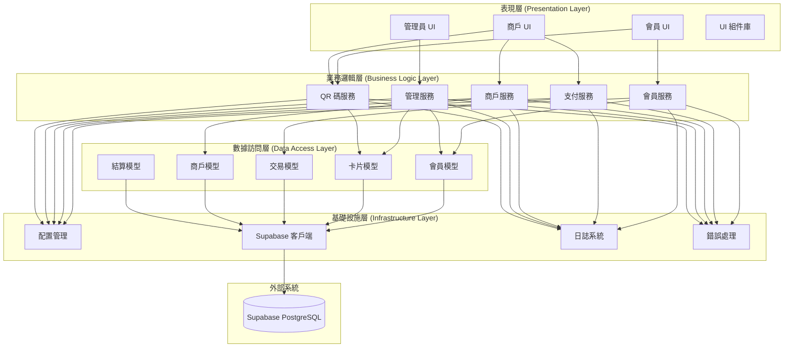

# MPS Python CLI 應用架構設計

## 📁 項目結構設計

```
mps_cli/
├── main.py                     # 主入口點
├── requirements.txt            # 依賴包列表
├── .env.example               # 環境變量示例
├── README.md                  # CLI 使用說明
├── config/
│   ├── __init__.py
│   ├── settings.py            # 配置管理
│   ├── supabase_client.py     # Supabase 客戶端封裝
│   └── constants.py           # 常量定義
├── models/
│   ├── __init__.py
│   ├── base.py                # 基礎模型類
│   ├── member.py              # 會員數據模型
│   ├── card.py                # 卡片數據模型
│   ├── transaction.py         # 交易數據模型
│   ├── merchant.py            # 商戶數據模型
│   └── settlement.py          # 結算數據模型
├── services/
│   ├── __init__.py
│   ├── base_service.py        # 基礎服務類
│   ├── member_service.py      # 會員業務服務
│   ├── payment_service.py     # 支付業務服務
│   ├── merchant_service.py    # 商戶業務服務
│   ├── admin_service.py       # 管理業務服務
│   └── qr_service.py          # QR 碼業務服務
├── ui/
│   ├── __init__.py
│   ├── base_ui.py             # 基礎 UI 組件
│   ├── member_ui.py           # 會員界面
│   ├── merchant_ui.py         # 商戶界面
│   ├── admin_ui.py            # 管理員界面
│   └── components/            # UI 組件
│       ├── __init__.py
│       ├── menu.py            # 菜單組件
│       ├── table.py           # 表格組件
│       ├── form.py            # 表單組件
│       └── dialog.py          # 對話框組件
├── utils/
│   ├── __init__.py
│   ├── helpers.py             # 工具函數
│   ├── validators.py          # 輸入驗證器
│   ├── formatters.py          # 數據格式化器
│   ├── error_handler.py       # 錯誤處理器
│   └── logger.py              # 日誌管理
└── tests/
    ├── __init__.py
    ├── test_services.py       # 服務層測試
    ├── test_models.py         # 模型層測試
    └── test_ui.py             # UI 層測試
```

---

## 🏗️ 架構層次設計

### 📊 架構分層圖


---

## 🔧 核心組件設計

### 1. 配置管理 (config/)

#### settings.py
```python
import os
from dataclasses import dataclass
from typing import Optional

@dataclass
class DatabaseConfig:
    url: str
    service_role_key: str
    anon_key: str
    timeout: int = 30

@dataclass
class UIConfig:
    page_size: int = 20
    qr_ttl_seconds: int = 900
    auto_refresh: bool = True
    show_colors: bool = True

@dataclass
class LogConfig:
    level: str = "INFO"
    file_path: str = "logs/mps_cli.log"
    max_size: int = 10485760  # 10MB
    backup_count: int = 5

class Settings:
    def __init__(self):
        self.database = DatabaseConfig(
            url=os.getenv("SUPABASE_URL"),
            service_role_key=os.getenv("SUPABASE_SERVICE_ROLE_KEY"),
            anon_key=os.getenv("SUPABASE_ANON_KEY")
        )
        
        self.ui = UIConfig(
            page_size=int(os.getenv("UI_PAGE_SIZE", "20")),
            qr_ttl_seconds=int(os.getenv("QR_TTL_SECONDS", "900"))
        )
        
        self.logging = LogConfig(
            level=os.getenv("LOG_LEVEL", "INFO"),
            file_path=os.getenv("LOG_FILE", "logs/mps_cli.log")
        )
    
    def validate(self) -> bool:
        """驗證配置完整性"""
        if not self.database.url:
            raise ValueError("SUPABASE_URL is required")
        if not self.database.service_role_key:
            raise ValueError("SUPABASE_SERVICE_ROLE_KEY is required")
        return True

# 全局配置實例
settings = Settings()
```

#### constants.py
```python
# 卡片類型
CARD_TYPES = {
    'standard': '標準卡',
    'prepaid': '預付卡',
    'corporate': '企業卡',
    'voucher': '優惠券卡'
}

# 卡片狀態
CARD_STATUS = {
    'active': '激活',
    'inactive': '未激活',
    'lost': '掛失',
    'expired': '過期',
    'suspended': '暫停',
    'closed': '關閉'
}

# 交易類型
TRANSACTION_TYPES = {
    'payment': '支付',
    'refund': '退款',
    'recharge': '充值'
}

# 交易狀態
TRANSACTION_STATUS = {
    'processing': '處理中',
    'completed': '已完成',
    'failed': '失敗',
    'cancelled': '已取消',
    'refunded': '已退款'
}

# 支付方式
PAYMENT_METHODS = {
    'balance': '餘額',
    'cash': '現金',
    'wechat': '微信',
    'alipay': '支付寶'
}

# 綁定角色
BIND_ROLES = {
    'owner': '擁有者',
    'admin': '管理員',
    'member': '成員',
    'viewer': '查看者'
}

# 會員狀態
MEMBER_STATUS = {
    'active': '激活',
    'inactive': '未激活',
    'suspended': '暫停',
    'deleted': '已刪除'
}

# 結算模式
SETTLEMENT_MODES = {
    'realtime': '實時結算',
    't_plus_1': 'T+1結算',
    'monthly': '月結算'
}

# 錯誤碼對應的中文提示
ERROR_MESSAGES = {
    "INSUFFICIENT_BALANCE": "餘額不足，請充值後再試",
    "QR_EXPIRED_OR_INVALID": "QR 碼已過期或無效，請重新生成",
    "MERCHANT_NOT_FOUND_OR_INACTIVE": "商戶不存在或已停用",
    "NOT_MERCHANT_USER": "您沒有此商戶的操作權限",
    "CARD_NOT_FOUND_OR_INACTIVE": "卡片不存在或未激活",
    "EXTERNAL_ID_ALREADY_BOUND": "外部身份已被其他會員綁定",
    "INVALID_BINDING_PASSWORD": "綁定密碼錯誤",
    "REFUND_EXCEEDS_REMAINING": "退款金額超過可退金額",
    "CARD_TYPE_NOT_SHAREABLE": "此類型卡片不支持共享",
    "CANNOT_REMOVE_LAST_OWNER": "不能移除最後一個擁有者",
    "UNSUPPORTED_CARD_TYPE_FOR_RECHARGE": "此卡片類型不支持充值",
    "ONLY_COMPLETED_PAYMENT_REFUNDABLE": "只能退款已完成的支付交易"
}
```

### 2. 數據模型 (models/)

#### card.py
```python
from dataclasses import dataclass
from typing import Optional
from decimal import Decimal
from .base import BaseModel

@dataclass
class Card(BaseModel):
    card_no: Optional[str] = None
    card_type: Optional[str] = None
    owner_member_id: Optional[str] = None
    name: Optional[str] = None
    balance: Optional[Decimal] = None
    points: Optional[int] = None
    level: Optional[int] = None
    discount_rate: Optional[Decimal] = None
    fixed_discount: Optional[Decimal] = None
    status: Optional[str] = None
    expires_at: Optional[str] = None
    
    def display_info(self) -> str:
        """顯示卡片信息"""
        from config.constants import CARD_TYPES, CARD_STATUS
        card_type_name = CARD_TYPES.get(self.card_type, self.card_type)
        status_name = CARD_STATUS.get(self.status, self.status)
        return f"{self.card_no} ({card_type_name}) - 餘額: ¥{self.balance:.2f} - {status_name}"
    
    def can_recharge(self) -> bool:
        """檢查是否可以充值"""
        return self.card_type in ['prepaid', 'corporate'] and self.status == 'active'
    
    def can_share(self) -> bool:
        """檢查是否可以共享"""
        return self.card_type in ['prepaid', 'corporate']

@dataclass
class QRCode(BaseModel):
    card_id: Optional[str] = None
    qr_plain: Optional[str] = None
    expires_at: Optional[str] = None
    
    def is_expired(self) -> bool:
        """檢查是否過期"""
        from datetime import datetime
        if not self.expires_at:
            return True
        expire_time = datetime.fromisoformat(self.expires_at.replace('Z', '+00:00'))
        return datetime.now() > expire_time
```

#### transaction.py
```python
from dataclasses import dataclass
from typing import Optional
from decimal import Decimal
from .base import BaseModel

@dataclass
class Transaction(BaseModel):
    tx_no: Optional[str] = None
    tx_type: Optional[str] = None
    card_id: Optional[str] = None
    merchant_id: Optional[str] = None
    raw_amount: Optional[Decimal] = None
    discount_applied: Optional[Decimal] = None
    final_amount: Optional[Decimal] = None
    points_earned: Optional[int] = None
    status: Optional[str] = None
    reason: Optional[str] = None
    payment_method: Optional[str] = None
    tag: Optional[dict] = None
    
    def display_summary(self) -> str:
        """顯示交易摘要"""
        from config.constants import TRANSACTION_TYPES, TRANSACTION_STATUS
        tx_type_name = TRANSACTION_TYPES.get(self.tx_type, self.tx_type)
        status_name = TRANSACTION_STATUS.get(self.status, self.status)
        return f"{self.tx_no} | {tx_type_name} | ¥{self.final_amount:.2f} | {status_name}"
```

### 3. 業務服務層 (services/)

#### base_service.py
```python
from abc import ABC, abstractmethod
from typing import Any, Dict, List, Optional
from config.supabase_client import supabase_client
from utils.error_handler import ErrorHandler
from utils.logger import get_logger

class BaseService(ABC):
    def __init__(self):
        self.client = supabase_client
        self.logger = get_logger(self.__class__.__name__)
        self.error_handler = ErrorHandler()
    
    def rpc_call(self, function_name: str, params: Dict[str, Any]) -> Any:
        """安全的 RPC 調用"""
        try:
            self.logger.info(f"Calling RPC: {function_name}")
            result = self.client.rpc(function_name, params)
            self.logger.info(f"RPC call successful: {function_name}")
            return result
        except Exception as e:
            self.logger.error(f"RPC call failed: {function_name}, error: {e}")
            raise self.error_handler.handle_rpc_error(e)
    
    def query_table(self, table: str, filters: Optional[Dict] = None, 
                   limit: Optional[int] = None, offset: Optional[int] = None) -> List[Dict]:
        """查詢表格數據"""
        try:
            query = self.client.query(table).select("*")
            
            if filters:
                for key, value in filters.items():
                    query = query.eq(key, value)
            
            if limit:
                query = query.limit(limit)
            
            if offset:
                query = query.offset(offset)
            
            result = query.execute()
            return getattr(result, "data", [])
            
        except Exception as e:
            self.logger.error(f"Query failed: {table}, error: {e}")
            raise self.error_handler.handle_query_error(e)
```

#### member_service.py
```python
from typing import List, Optional, Dict, Any
from .base_service import BaseService
from models.member import Member
from models.card import Card

class MemberService(BaseService):
    def create_member(self, name: str, phone: str, email: str, 
                     binding_user_org: Optional[str] = None,
                     binding_org_id: Optional[str] = None) -> str:
        """創建新會員"""
        params = {
            "p_name": name,
            "p_phone": phone,
            "p_email": email,
            "p_binding_user_org": binding_user_org,
            "p_binding_org_id": binding_org_id,
            "p_default_card_type": "standard"
        }
        
        member_id = self.rpc_call("create_member_profile", params)
        self.logger.info(f"Member created: {member_id}")
        return member_id
    
    def get_member_cards(self, member_id: str) -> List[Card]:
        """獲取會員的所有卡片"""
        # 查詢會員擁有的卡片
        owned_cards = self.query_table("member_cards", {"owner_member_id": member_id})
        
        # 查詢會員綁定的共享卡片
        bindings = self.query_table("card_bindings", {"member_id": member_id})
        shared_card_ids = [b["card_id"] for b in bindings]
        
        shared_cards = []
        for card_id in shared_card_ids:
            cards = self.query_table("member_cards", {"id": card_id})
            if cards:
                shared_cards.extend(cards)
        
        # 合併並去重
        all_cards_data = owned_cards + shared_cards
        unique_cards = {card["id"]: card for card in all_cards_data}.values()
        
        return [Card.from_dict(card_data) for card_data in unique_cards]
    
    def get_member_transactions(self, member_id: str, limit: int = 20, 
                              offset: int = 0) -> List[Dict]:
        """獲取會員交易記錄"""
        params = {
            "p_member_id": member_id,
            "p_limit": limit,
            "p_offset": offset
        }
        
        return self.rpc_call("get_member_transactions", params)
    
    def bind_card(self, card_id: str, member_id: str, role: str = "member",
                 binding_password: Optional[str] = None) -> bool:
        """綁定卡片到會員"""
        params = {
            "p_card_id": card_id,
            "p_member_id": member_id,
            "p_role": role,
            "p_binding_password": binding_password
        }
        
        return self.rpc_call("bind_member_to_card", params)
    
    def unbind_card(self, card_id: str, member_id: str) -> bool:
        """解綁會員卡片"""
        params = {
            "p_card_id": card_id,
            "p_member_id": member_id
        }
        
        return self.rpc_call("unbind_member_from_card", params)
```

#### payment_service.py
```python
from typing import Dict, Any, Optional
from decimal import Decimal
from .base_service import BaseService
import uuid

class PaymentService(BaseService):
    def charge_by_qr(self, merchant_code: str, qr_plain: str, amount: Decimal,
                    tag: Optional[Dict] = None, external_order_id: Optional[str] = None) -> Dict:
        """掃碼支付"""
        idempotency_key = f"payment-{uuid.uuid4()}"
        
        params = {
            "p_merchant_code": merchant_code,
            "p_qr_plain": qr_plain,
            "p_raw_amount": float(amount),
            "p_idempotency_key": idempotency_key,
            "p_tag": tag or {"source": "cli"},
            "p_external_order_id": external_order_id
        }
        
        result = self.rpc_call("merchant_charge_by_qr", params)
        return result[0] if result else {}
    
    def refund_transaction(self, merchant_code: str, original_tx_no: str, 
                          refund_amount: Decimal, reason: Optional[str] = None) -> Dict:
        """退款交易"""
        params = {
            "p_merchant_code": merchant_code,
            "p_original_tx_no": original_tx_no,
            "p_refund_amount": float(refund_amount),
            "p_tag": {"reason": reason or "", "source": "cli"}
        }
        
        result = self.rpc_call("merchant_refund_tx", params)
        return result[0] if result else {}
    
    def recharge_card(self, card_id: str, amount: Decimal, payment_method: str = "wechat",
                     tag: Optional[Dict] = None, external_order_id: Optional[str] = None) -> Dict:
        """充值卡片"""
        idempotency_key = f"recharge-{uuid.uuid4()}"
        
        params = {
            "p_card_id": card_id,
            "p_amount": float(amount),
            "p_payment_method": payment_method,
            "p_tag": tag or {"source": "cli"},
            "p_idempotency_key": idempotency_key,
            "p_external_order_id": external_order_id
        }
        
        result = self.rpc_call("user_recharge_card", params)
        return result[0] if result else {}
    
    def get_transaction_detail(self, tx_no: str) -> Dict:
        """獲取交易詳情"""
        params = {"p_tx_no": tx_no}
        return self.rpc_call("get_transaction_detail", params)
```

#### qr_service.py
```python
from typing import Dict, Optional
from .base_service import BaseService

class QRService(BaseService):
    def rotate_qr(self, card_id: str, ttl_seconds: int = 900) -> Dict:
        """生成/刷新 QR 碼"""
        params = {
            "p_card_id": card_id,
            "p_ttl_seconds": ttl_seconds
        }
        
        result = self.rpc_call("rotate_card_qr", params)
        return result[0] if result else {}
    
    def validate_qr(self, qr_plain: str) -> str:
        """驗證 QR 碼"""
        params = {"p_qr_plain": qr_plain}
        return self.rpc_call("validate_qr_plain", params)
    
    def revoke_qr(self, card_id: str) -> bool:
        """撤銷 QR 碼"""
        params = {"p_card_id": card_id}
        return self.rpc_call("revoke_card_qr", params)
    
    def batch_rotate_qr(self, ttl_seconds: int = 300) -> int:
        """批量輪換 QR 碼"""
        params = {"p_ttl_seconds": ttl_seconds}
        return self.rpc_call("cron_rotate_qr_tokens", params)
```

### 4. UI 組件庫 (ui/components/)

#### menu.py
```python
from typing import List, Callable, Optional
import os

class Menu:
    def __init__(self, title: str, options: List[str], handlers: List[Callable]):
        self.title = title
        self.options = options
        self.handlers = handlers
        
        if len(options) != len(handlers):
            raise ValueError("Options and handlers must have the same length")
    
    def display(self):
        """顯示菜單"""
        self.clear_screen()
        self.show_header()
        self.show_options()
    
    def clear_screen(self):
        """清屏"""
        os.system('cls' if os.name == 'nt' else 'clear')
    
    def show_header(self):
        """顯示標題"""
        width = max(len(self.title) + 4, 40)
        print("┌" + "─" * (width - 2) + "┐")
        print(f"│{self.title:^{width - 2}}│")
        print("├" + "─" * (width - 2) + "┤")
    
    def show_options(self):
        """顯示選項"""
        for i, option in enumerate(self.options, 1):
            print(f"│ {i}. {option:<35} │")
        print("└" + "─" * 38 + "┘")
    
    def get_choice(self) -> int:
        """獲取用戶選擇"""
        while True:
            try:
                choice = int(input(f"請選擇 (1-{len(self.options)}): "))
                if 1 <= choice <= len(self.options):
                    return choice
                print(f"❌ 請選擇 1-{len(self.options)}")
            except ValueError:
                print("❌ 請輸入有效數字")
            except KeyboardInterrupt:
                print("\n👋 再見！")
                exit(0)
    
    def run(self):
        """運行菜單"""
        while True:
            self.display()
            choice = self.get_choice()
            
            try:
                # 執行對應的處理函數
                result = self.handlers[choice - 1]()
                
                # 如果返回 False，退出菜單
                if result is False:
                    break
                    
            except Exception as e:
                print(f"❌ 操作失敗: {e}")
                input("按任意鍵繼續...")
```

#### table.py
```python
from typing import List, Dict, Any, Optional

class Table:
    def __init__(self, headers: List[str], data: List[Dict[str, Any]], 
                 title: Optional[str] = None):
        self.headers = headers
        self.data = data
        self.title = title
        self.col_widths = self._calculate_column_widths()
    
    def _calculate_column_widths(self) -> List[int]:
        """計算列寬"""
        widths = [len(header) for header in self.headers]
        
        for row in self.data:
            for i, header in enumerate(self.headers):
                value = str(row.get(header, ""))
                widths[i] = max(widths[i], len(value))
        
        # 最小寬度 8，最大寬度 30
        return [max(8, min(30, width)) for width in widths]
    
    def display(self, page_size: Optional[int] = None, page: int = 0):
        """顯示表格"""
        if self.title:
            self._show_title()
        
        self._show_header()
        
        # 分頁處理
        start_idx = page * page_size if page_size else 0
        end_idx = start_idx + page_size if page_size else len(self.data)
        page_data = self.data[start_idx:end_idx]
        
        if not page_data:
            self._show_empty_message()
        else:
            self._show_data(page_data)
        
        self._show_footer()
        
        # 分頁信息
        if page_size and len(self.data) > page_size:
            total_pages = (len(self.data) + page_size - 1) // page_size
            print(f"第 {page + 1} 頁，共 {total_pages} 頁 (總計 {len(self.data)} 筆)")
    
    def _show_title(self):
        """顯示標題"""
        total_width = sum(self.col_widths) + len(self.headers) * 3 + 1
        print("┌" + "─" * (total_width - 2) + "┐")
        print(f"│{self.title:^{total_width - 2}}│")
        print("├" + "─" * (total_width - 2) + "┤")
    
    def _show_header(self):
        """顯示表頭"""
        header_line = "│"
        separator_line = "├"
        
        for i, (header, width) in enumerate(zip(self.headers, self.col_widths)):
            header_line += f" {header:<{width}} │"
            separator_line += "─" * (width + 2) + "┼" if i < len(self.headers) - 1 else "─" * (width + 2) + "┤"
        
        if not self.title:
            total_width = sum(self.col_widths) + len(self.headers) * 3 + 1
            print("┌" + "─" * (total_width - 2) + "┐")
        
        print(header_line)
        print(separator_line)
    
    def _show_data(self, data: List[Dict[str, Any]]):
        """顯示數據行"""
        for row in data:
            line = "│"
            for header, width in zip(self.headers, self.col_widths):
                value = str(row.get(header, ""))
                # 截斷過長的文本
                if len(value) > width:
                    value = value[:width-3] + "..."
                line += f" {value:<{width}} │"
            print(line)
    
    def _show_empty_message(self):
        """顯示空數據消息"""
        total_width = sum(self.col_widths) + len(self.headers) * 3 + 1
        message = "暫無數據"
        print(f"│{message:^{total_width - 2}}│")
    
    def _show_footer(self):
        """顯示表格底部"""
        total_width = sum(self.col_widths) + len(self.headers) * 3 + 1
        print("└" + "─" * (total_width - 2) + "┘")
```

#### form.py
```python
from typing import Dict, Any, List, Optional, Callable
from utils.validators import Validator

class FormField:
    def __init__(self, name: str, label: str, field_type: str = "text",
                 required: bool = True, validator: Optional[Callable] = None,
                 options: Optional[List[str]] = None):
        self.name = name
        self.label = label
        self.field_type = field_type
        self.required = required
        self.validator = validator
        self.options = options

class Form:
    def __init__(self, title: str, fields: List[FormField]):
        self.title = title
        self.fields = fields
        self.validator = Validator()
    
    def display_and_collect(self) -> Dict[str, Any]:
        """顯示表單並收集數據"""
        print("┌" + "─" * (len(self.title) + 4) + "┐")
        print(f"│  {self.title}  │")
        print("└" + "─" * (len(self.title) + 4) + "┘")
        
        data = {}
        
        for field in self.fields:
            while True:
                value = self._get_field_value(field)
                
                # 檢查必填項
                if field.required and not value:
                    print(f"❌ {field.label} 為必填項")
                    continue
                
                # 驗證輸入
                if value and field.validator:
                    if not field.validator(value):
                        print(f"❌ {field.label} 格式不正確")
                        continue
                
                data[field.name] = value
                break
        
        return data
    
    def _get_field_value(self, field: FormField) -> Any:
        """獲取字段值"""
        if field.field_type == "select":
            return self._get_select_value(field)
        elif field.field_type == "number":
            return self._get_number_value(field)
        elif field.field_type == "decimal":
            return self._get_decimal_value(field)
        elif field.field_type == "password":
            import getpass
            return getpass.getpass(f"{field.label}: ")
        else:
            return input(f"{field.label}: ")
    
    def _get_select_value(self, field: FormField) -> str:
        """獲取選擇項值"""
        if not field.options:
            return input(f"{field.label}: ")
        
        print(f"\n{field.label}:")
        for i, option in enumerate(field.options, 1):
            print(f"  {i}. {option}")
        
        while True:
            try:
                choice = int(input("請選擇: "))
                if 1 <= choice <= len(field.options):
                    return field.options[choice - 1]
                print(f"❌ 請選擇 1-{len(field.options)}")
            except ValueError:
                print("❌ 請輸入有效數字")
    
    def _get_number_value(self, field: FormField) -> int:
        """獲取數字值"""
        while True:
            try:
                value = input(f"{field.label}: ")
                if not value and not field.required:
                    return None
                return int(value)
            except ValueError:
                print("❌ 請輸入有效的整數")
    
    def _get_decimal_value(self, field: FormField) -> float:
        """獲取小數值"""
        while True:
            try:
                value = input(f"{field.label}: ")
                if not value and not field.required:
                    return None
                return float(value)
            except ValueError:
                print("❌ 請輸入有效的數字")
```

### 5. 工具函數 (utils/)

#### validators.py
```python
import re
from typing import Any

class Validator:
    @staticmethod
    def validate_phone(phone: str) -> bool:
        """驗證手機號"""
        pattern = r'^1[3-9]\d{9}$'
        return bool(re.match(pattern, phone))
    
    @staticmethod
    def validate_email(email: str) -> bool:
        """驗證郵箱"""
        pattern = r'^[a-zA-Z0-9._%+-]+@[a-zA-Z0-9.-]+\.[a-zA-Z]{2,}$'
        return bool(re.match(pattern, email))
    
    @staticmethod
    def validate_amount(amount: Any) -> bool:
        """驗證金額"""
        try:
            value = float(amount)
            return value > 0
        except (ValueError, TypeError):
            return False
    
    @staticmethod
    def validate_card_id(card_id: str) -> bool:
        """驗證卡片 ID 格式"""
        # UUID 格式驗證
        pattern = r'^[0-9a-f]{8}-[0-9a-f]{4}-[0-9a-f]{4}-[0-9a-f]{4}-[0-9a-f]{12}$'
        return bool(re.match(pattern, card_id, re.IGNORECASE))
    
    @staticmethod
    def validate_tx_no(tx_no: str) -> bool:
        """驗證交易號格式"""
        # PAY/REF/RCG + 10位數字
        pattern = r'^(PAY|REF|RCG)\d{10}$'
        return bool(re.match(pattern, tx_no))
```

#### error_handler.py
```python
from config.constants import ERROR_MESSAGES
import logging

class ErrorHandler:
    def __init__(self):
        self.logger = logging.getLogger(__name__)
    
    def handle_rpc_error(self, error: Exception) -> Exception:
        """處理 RPC 錯誤"""
        error_str = str(error)
        
        # 查找已知錯誤碼
        for code, message in ERROR_MESSAGES.items():
            if code in error_str:
                self.logger.warning(f"Business error: {code}")
                return Exception(message)
        
        # 未知錯誤
        self.logger.error(f"Unknown error: {error_str}")
        return Exception(f"系統錯誤: {error_str}")
    
    def handle_query_error(self, error: Exception) -> Exception:
        """處理查詢錯誤"""
        error_str = str(error)
        self.logger.error(f"Query error: {error_str}")
        return Exception("數據查詢失敗，請稍後重試")
    
    def handle_validation_error(self, field: str, value: Any) -> Exception:
        """處理驗證錯誤"""
        self.logger.warning(f"Validation error: {field} = {value}")
        return Exception(f"{field} 格式不正確")
```

#### formatters.py
```python
from datetime import datetime
from decimal import Decimal
from typing import Any, Optional

class Formatter:
    @staticmethod
    def format_currency(amount: Any) -> str:
        """格式化貨幣"""
        if amount is None:
            return "¥0.00"
        try:
            return f"¥{float(amount):,.2f}"
        except (ValueError, TypeError):
            return "¥0.00"
    
    @staticmethod
    def format_datetime(dt: Any) -> str:
        """格式化日期時間"""
        if not dt:
            return ""
        
        if isinstance(dt, str):
            try:
                dt = datetime.fromisoformat(dt.replace('Z', '+00:00'))
            except ValueError:
                return dt
        
        if isinstance(dt, datetime):
            return dt.strftime("%Y-%m-%d %H:%M:%S")
        
        return str(dt)
    
    @staticmethod
    def format_percentage(value: Any) -> str:
        """格式化百分比"""
        if value is None:
            return "0%"
        try:
            return f"{float(value) * 100:.1f}%"
        except (ValueError, TypeError):
            return "0%"
    
    @staticmethod
    def format_card_no(card_no: str) -> str:
        """格式化卡號（部分遮蔽）"""
        if not card_no or len(card_no) < 8:
            return card_no
        return card_no[:4] + "****" + card_no[-4:]
    
    @staticmethod
    def truncate_text(text: str, max_length: int = 20) -> str:
        """截斷文本"""
        if len(text) <= max_length:
            return text
        return text[:max_length - 3] + "..."
```

---

## 🎯 主要界面設計

### 👤 會員界面 (ui/member_ui.py)

```python
from services.member_service import MemberService
from services.payment_service import PaymentService
from services.qr_service import QRService
from ui.components.menu import Menu
from ui.components.table import Table
from ui.components.form import Form, FormField
from utils.formatters import Formatter
from utils.validators import Validator

class MemberUI:
    def __init__(self):
        self.member_service = MemberService()
        self.payment_service = PaymentService()
        self.qr_service = QRService()
        self.current_member_id = None
    
    def start(self):
        """啟動會員界面"""
        # 會員登入
        if not self._member_login():
            return
        
        # 主菜單
        options = [
            "查看我的卡片",
            "生成付款 QR 碼", 
            "充值卡片",
            "查看交易記錄",
            "綁定新卡片",
            "查看積分等級",
            "退出系統"
        ]
        
        handlers = [
            self._show_my_cards,
            self._generate_qr,
            self._recharge_card,
            self._view_transactions,
            self._bind_new_card,
            self._view_points_level,
            lambda: False  # 退出
        ]
        
        menu = Menu("MPS 會員系統", options, handlers)
        menu.run()
    
    def _member_login(self) -> bool:
        """會員登入"""
        print("┌─────────────────────────────────────┐")
        print("│            會員系統登入             │")
        print("└─────────────────────────────────────┘")
        
        member_id = input("請輸入會員 ID: ")
        
        # 驗證會員存在性（查詢 member_profiles 表）
        try:
            members = self.member_service.query_table("member_profiles", {"id": member_id})
            if not members:
                print("❌ 會員不存在")
                return False
            
            member = members[0]
            if member["status"] != "active":
                print("❌ 會員狀態異常，無法登入")
                return False
            
            self.current_member_id = member_id
            print(f"✅ 登入成功！歡迎 {member['name']}")
            input("按任意鍵繼續...")
            return True
            
        except Exception as e:
            print(f"❌ 登入失敗: {e}")
            return False
    
    def _show_my_cards(self):
        """顯示我的卡片"""
        try:
            cards = self.member_service.get_member_cards(self.current_member_id)
            
            if not cards:
                print("📝 您還沒有任何卡片")
                input("按任意鍵返回...")
                return
            
            # 準備表格數據
            headers = ["卡號", "類型", "餘額", "積分", "等級", "狀態"]
            data = []
            
            for card in cards:
                data.append({
                    "卡號": card.card_no,
                    "類型": card.card_type,
                    "餘額": Formatter.format_currency(card.balance),
                    "積分": str(card.points or 0),
                    "等級": str(card.level or 0),
                    "狀態": card.status
                })
            
            table = Table(headers, data, "我的卡片")
            table.display()
            input("按任意鍵返回...")
            
        except Exception as e:
            print(f"❌ 查詢失敗: {e}")
            input("按任意鍵返回...")
    
    def _generate_qr(self):
        """生成付款 QR 碼"""
        try:
            # 獲取可用卡片
            cards = self.member_service.get_member_cards(self.current_member_id)
            active_cards = [card for card in cards if card.status == "active"]
            
            if not active_cards:
                print("❌ 沒有可用的激活卡片")
                input("按任意鍵返回...")
                return
            
            # 選擇卡片
            print("請選擇要生成 QR 碼的卡片:")
            for i, card in enumerate(active_cards, 1):
                print(f"{i}. {card.display_info()}")
            
            while True:
                try:
                    choice = int(input(f"請選擇 (1-{len(active_cards)}): "))
                    if 1 <= choice <= len(active_cards):
                        selected_card = active_cards[choice - 1]
                        break
                    print(f"❌ 請選擇 1-{len(active_cards)}")
                except ValueError:
                    print("❌ 請輸入有效數字")
            
            # 生成 QR 碼
            qr_result = self.qr_service.rotate_qr(selected_card.id)
            
            print("┌─────────────────────────────────────┐")
            print("│            付款 QR 碼               │")
            print("├─────────────────────────────────────┤")
            print(f"│ 卡片: {selected_card.card_no:<25} │")
            print(f"│ 類型: {selected_card.card_type:<25} │")
            print(f"│ 餘額: {Formatter.format_currency(selected_card.balance):<25} │")
            print("├─────────────────────────────────────┤")
            print(f"│ QR 碼: {qr_result['qr_plain']:<23} │")
            print(f"│ 過期時間: {Formatter.format_datetime(qr_result['qr_expires_at']):<21} │")
            print("├─────────────────────────────────────┤")
            print("│ 🔔 請向商戶出示此 QR 碼進行支付     │")
            print("│ ⏰ QR 碼將在 15 分鐘後自動過期      │")
            print("└─────────────────────────────────────┘")
            input("按任意鍵返回...")
            
        except Exception as e:
            print(f"❌ QR 碼生成失敗: {e}")
            input("按任意鍵返回...")
    
    def _recharge_card(self):
        """充值卡片"""
        try:
            # 獲取可充值卡片
            cards = self.member_service.get_member_cards(self.current_member_id)
            rechargeable_cards = [card for card in cards if card.can_recharge()]
            
            if not rechargeable_cards:
                print("❌ 沒有可充值的卡片（只有預付卡和企業卡支持充值）")
                input("按任意鍵返回...")
                return
            
            # 選擇卡片
            print("請選擇要充值的卡片:")
            for i, card in enumerate(rechargeable_cards, 1):
                print(f"{i}. {card.display_info()}")
            
            while True:
                try:
                    choice = int(input(f"請選擇 (1-{len(rechargeable_cards)}): "))
                    if 1 <= choice <= len(rechargeable_cards):
                        selected_card = rechargeable_cards[choice - 1]
                        break
                    print(f"❌ 請選擇 1-{len(rechargeable_cards)}")
                except ValueError:
                    print("❌ 請輸入有效數字")
            
            # 充值表單
            fields = [
                FormField("amount", "充值金額", "decimal", True, Validator.validate_amount),
                FormField("payment_method", "支付方式", "select", True, 
                         options=["wechat", "alipay", "bank"])
            ]
            
            form = Form("卡片充值", fields)
            form_data = form.display_and_collect()
            
            # 確認充值
            print(f"\n充值信息確認:")
            print(f"卡片: {selected_card.card_no}")
            print(f"金額: {Formatter.format_currency(form_data['amount'])}")
            print(f"支付方式: {form_data['payment_method']}")
            
            if not input("確認充值？(y/n): ").lower() == 'y':
                print("❌ 充值已取消")
                input("按任意鍵返回...")
                return
            
            # 執行充值
            result = self.payment_service.recharge_card(
                selected_card.id,
                Decimal(str(form_data['amount'])),
                form_data['payment_method']
            )
            
            print("┌─────────────────────────────────────┐")
            print("│              充值成功               │")
            print("├─────────────────────────────────────┤")
            print(f"│ 交易號: {result['tx_no']:<23} │")
            print(f"│ 充值金額: {Formatter.format_currency(result['amount']):<21} │")
            print("└─────────────────────────────────────┘")
            input("按任意鍵返回...")
            
        except Exception as e:
            print(f"❌ 充值失敗: {e}")
            input("按任意鍵返回...")
```

### 🏪 商戶界面 (ui/merchant_ui.py)

```python
from services.merchant_service import MerchantService
from services.payment_service import PaymentService
from ui.components.menu import Menu
from ui.components.table import Table
from utils.formatters import Formatter
from decimal import Decimal

class MerchantUI:
    def __init__(self):
        self.merchant_service = MerchantService()
        self.payment_service = PaymentService()
        self.current_merchant_code = None
    
    def start(self):
        """啟動商戶界面"""
        # 商戶登入
        if not self._merchant_login():
            return
        
        # 主菜單
        options = [
            "掃碼收款",
            "退款處理",
            "查看今日交易",
            "查看交易記錄", 
            "生成結算報表",
            "查看結算歷史",
            "退出系統"
        ]
        
        handlers = [
            self._scan_and_charge,
            self._process_refund,
            self._view_today_transactions,
            self._view_transaction_history,
            self._generate_settlement,
            self._view_settlement_history,
            lambda: False  # 退出
        ]
        
        menu = Menu("MPS 商戶 POS", options, handlers)
        menu.run()
    
    def _merchant_login(self) -> bool:
        """商戶登入"""
        print("┌─────────────────────────────────────┐")
        print("│            商戶 POS 登入            │")
        print("└─────────────────────────────────────┘")
        
        merchant_code = input("請輸入商戶代碼: ")
        
        # 驗證商戶存在性
        try:
            merchants = self.merchant_service.query_table("merchants", {"code": merchant_code})
            if not merchants:
                print("❌ 商戶代碼不存在")
                return False
            
            merchant = merchants[0]
            if not merchant.get("active", False):
                print("❌ 商戶已停用")
                return False
            
            self.current_merchant_code = merchant_code
            print(f"✅ 登入成功！商戶: {merchant['name']}")
            input("按任意鍵繼續...")
            return True
            
        except Exception as e:
            print(f"❌ 登入失敗: {e}")
            return False
    
    def _scan_and_charge(self):
        """掃碼收款"""
        print("┌─────────────────────────────────────┐")
        print("│              掃碼收款               │")
        print("└─────────────────────────────────────┘")
        
        # 輸入 QR 碼
        qr_plain = input("請輸入掃描到的 QR 碼: ")
        if not qr_plain:
            print("❌ QR 碼不能為空")
            input("按任意鍵返回...")
            return
        
        # 輸入金額
        while True:
            try:
                amount = float(input("請輸入收款金額: "))
                if amount <= 0:
                    print("❌ 金額必須大於 0")
                    continue
                break
            except ValueError:
                print("❌ 請輸入有效的數字")
        
        # 確認收款
        print(f"\n收款信息確認:")
        print(f"金額: {Formatter.format_currency(amount)}")
        
        if not input("確認收款？(y/n): ").lower() == 'y':
            print("❌ 收款已取消")
            input("按任意鍵返回...")
            return
        
        try:
            # 執行收款
            result = self.payment_service.charge_by_qr(
                self.current_merchant_code,
                qr_plain,
                Decimal(str(amount))
            )
            
            print("┌─────────────────────────────────────┐")
            print("│              收款成功               │")
            print("├─────────────────────────────────────┤")
            print(f"│ 交易號: {result['tx_no']:<23} │")
            print(f"│ 原金額: {Formatter.format_currency(amount):<23} │")
            print(f"│ 折扣率: {Formatter.format_percentage(result['discount']):<23} │")
            print(f"│ 實收金額: {Formatter.format_currency(result['final_amount']):<21} │")
            print("└─────────────────────────────────────┘")
            input("按任意鍵返回...")
            
        except Exception as e:
            print(f"❌ 收款失敗: {e}")
            input("按任意鍵返回...")
```

---

## 📋 功能實現清單

### 🎯 第一階段實現 (MVP)

| 功能模組 | 具體功能 | 對應 RPC | 實現複雜度 | 預估工時 |
|----------|----------|----------|------------|----------|
| **基礎架構** | 配置管理 | - | 簡單 | 4小時 |
| | Supabase 客戶端 | - | 簡單 | 4小時 |
| | 錯誤處理 | - | 中等 | 6小時 |
| | UI 組件庫 | - | 中等 | 8小時 |
| **會員功能** | 查看卡片 | 查詢表 | 簡單 | 4小時 |
| | 生成 QR 碼 | `rotate_card_qr` | 簡單 | 4小時 |
| | 卡片充值 | `user_recharge_card` | 中等 | 6小時 |
| **商戶功能** | 掃碼收款 | `merchant_charge_by_qr` | 中等 | 8小時 |
| | 退款處理 | `merchant_refund_tx` | 中等 | 6小時 |
| **管理功能** | 創建會員 | `create_member_profile` | 簡單 | 4小時 |
| | 凍結卡片 | `freeze_card` | 簡單 | 3小時 |

**第一階段總計**: 約 57 小時

### 🚀 第二階段實現 (完整功能)

| 功能模組 | 具體功能 | 對應 RPC | 實現複雜度 | 預估工時 |
|----------|----------|----------|------------|----------|
| **查詢功能** | 交易記錄查詢 | `get_*_transactions` | 中等 | 8小時 |
| | 交易詳情查詢 | `get_transaction_detail` | 簡單 | 4小時 |
| **結算功能** | 生成結算 | `generate_settlement` | 中等 | 6小時 |
| | 結算歷史 | `list_settlements` | 簡單 | 4小時 |
| **高級管理** | 積分調整 | `update_points_and_level` | 簡單 | 4小時 |
| | 批量 QR 輪換 | `cron_rotate_qr_tokens` | 簡單 | 3小時 |
| | 會員暫停 | `admin_suspend_member` | 簡單 | 3小時 |
| **UI 增強** | 分頁顯示 | - | 中等 | 6小時 |
| | 數據篩選 | - | 中等 | 6小時 |

**第二階段總計**: 約 44 小時

---

## 🛠️ 技術實現要點

### 1. 依賴包 (requirements.txt)
```
supabase==2.3.4
python-dotenv==1.0.0
rich==13.7.0
click==8.1.7
pydantic==2.5.2
```

### 2. 環境配置 (.env.example)
```bash
# Supabase 配置
SUPABASE_URL=https://your-project.supabase.co
SUPABASE_SERVICE_ROLE_KEY=your-service-role-key
SUPABASE_ANON_KEY=your-anon-key

# UI 配置
UI_PAGE_SIZE=20
QR_TTL_SECONDS=900
SHOW_COLORS=true

# 日誌配置
LOG_LEVEL=INFO
LOG_FILE=logs/mps_cli.log

# 測試配置
TEST_MEMBER_ID=test-member-uuid
TEST_MERCHANT_CODE=TEST001
```

### 3. 主入口 (main.py)
```python
#!/usr/bin/env python3
import os
import sys
from pathlib import Path

# 添加項目根目錄到 Python 路徑
project_root = Path(__file__).parent
sys.path.insert(0, str(project_root))

from config.settings import settings
from ui.member_ui import MemberUI
from ui.merchant_ui import MerchantUI
from ui.admin_ui import AdminUI
from utils.logger import setup_logging

def main():
    """主入口函數"""
    try:
        # 設置日誌
        setup_logging()
        
        # 驗證配置
        settings.validate()
        
        # 顯示歡迎界面
        show_welcome()
        
        # 選擇角色
        role = select_role()
        
        # 啟動對應界面
        if role == "member":
            MemberUI().start()
        elif role == "merchant":
            MerchantUI().start()
        elif role == "admin":
            AdminUI().start()
        else:
            print("👋 再見！")
            
    except KeyboardInterrupt:
        print("\n👋 再見！")
    except Exception as e:
        print(f"❌ 系統錯誤: {e}")
        sys.exit(1)

def show_welcome():
    """顯示歡迎界面"""
    os.system('cls' if os.name == 'nt' else 'clear')
    print("╔═══════════════════════════════════════╗")
    print("║        歡迎使用 MPS 系統              ║")
    print("║     Member Payment System             ║")
    print("╚═══════════════════════════════════════╝")
    print()

def select_role() -> str:
    """選擇用戶角色"""
    roles = {
        "1": ("member", "會員用戶"),
        "2": ("merchant", "商戶用戶"), 
        "3": ("admin", "管理員")
    }
    
    print("請選擇您的角色:")
    for key, (role, name) in roles.items():
        print(f"{key}. {name}")
    
    while True:
        choice = input("請選擇 (1-3): ")
        if choice in roles:
            return roles[choice][0]
        print("❌ 請選擇 1-3")

if __name__ == "__main__":
    main()
```

---

## 🎯 開發實施計劃

### 📅 開發時程規劃

#### 第 1 週：基礎架構
- 搭建項目結構
- 實現配置管理和 Supabase 客戶端
- 創建基礎 UI 組件
- 實現錯誤處理和日誌系統

#### 第 2 週：會員功能
- 實現會員服務層
- 創建會員 UI 界面
- 實現查看卡片、生成 QR 碼功能
- 實現卡片充值功能

#### 第 3 週：商戶功能
- 實現支付服務層
- 創建商戶 UI 界面
- 實現掃碼收款功能
- 實現退款處理功能

#### 第 4 週：管理功能
- 實現管理服務層
- 創建管理員 UI 界面
- 實現會員管理、卡片管理功能
- 完善錯誤處理和用戶體驗

#### 第 5 週：測試與優化
- 編寫單元測試
- 進行集成測試
- 性能優化
- 文檔完善

### 🔧 技術風險與應對

| 風險項目 | 風險等級 | 影響 | 應對策略 |
|----------|----------|------|----------|
| Supabase 連接不穩定 | 中 | 功能不可用 | 實現重連機制和錯誤重試 |
| RPC 調用失敗 | 中 | 操作失敗 | 完善錯誤處理和用戶提示 |
| 數據格式不一致 | 低 | 顯示異常 | 加強數據驗證和格式化 |
| 用戶輸入錯誤 | 低 | 操作失敗 | 實現輸入驗證和確認機制 |

### 📊 成功指標

#### 功能指標
- 所有 RPC 函數調用成功率 > 95%
- 用戶操作錯誤率 < 5%
- 界面響應時間 < 2 秒

#### 用戶體驗指標
- 操作流程直觀易懂
- 錯誤提示清晰友好
- 數據展示格式統一

這個架構設計完全基於現有的 RPC 功能，提供了清晰的分層結構和實用的文字 UI，能夠滿足三個角色的基本業務需求。